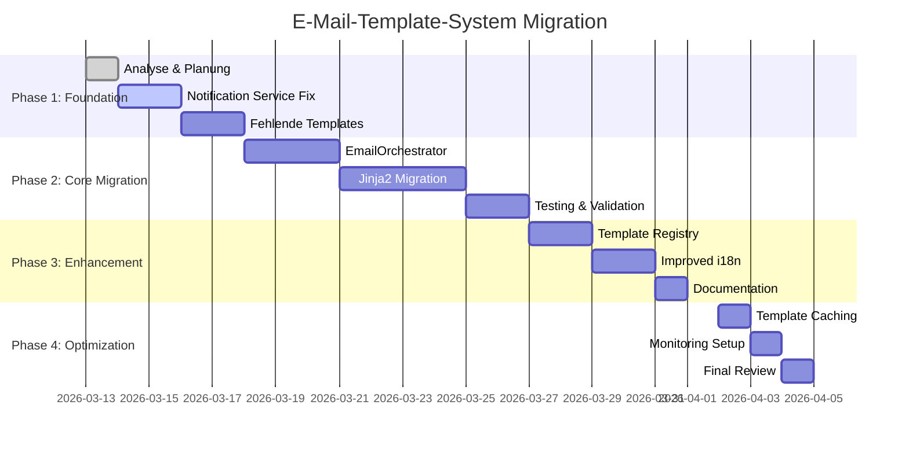

# E-Mail-Template-System Analyse und Implementierungsplan

## Aktueller Status (Stand: 2026-03-13)

### Bestehendes System
1. **Template-Engine**: `backend/app/utils/template_engine.py`
   - Unterstützt Jinja2-ähnliche Syntax (`{{ variable }}`)
   - Internationalisierung (en, de)
   - Automatischer Fallback auf Englisch
   - HTML-zu-Text-Konvertierung

2. **E-Mail-Service**: `backend/app/services/email_service.py`
   - Zentrale SMTP-Logik
   - Konfiguration über Environment-Variablen
   - Entwicklungsmodus (Logging statt Senden)

3. **Vorhandene Templates**:
   - `verification/` - E-Mail-Verifizierung
   - `password_reset/` - Passwort-Reset
   - `newsletter_welcome/` - Newsletter-Anmeldung
   - `team/invitation_sent/` - Team-Einladung
   - `team/invitation_accepted/` - Einladung angenommen
   - `team/member_added/` - Teammitglied hinzugefügt
   - `project/created/` - Projekt erstellt

4. **Services die Templates nutzen**:
   - `email_verification_service.py` - Verifizierungs-E-Mails ✓
   - `email_auth_service.py` - Passwort-Reset-E-Mails ✓
   - `email_service.py` - Newsletter-Willkommens-E-Mails ✓

## Identifizierte Lücken

### 1. Unvollständige Template-Nutzung
- **`notification_service.py`**: Hat Platzhalter-Implementierung, sendet keine echten E-Mails
- **Team-Service-Benachrichtigungen**: Verwendet `notification_service`, daher keine E-Mails
- **Projekt-Benachrichtigungen**: Keine E-Mail-Versendung für Kommentare, Updates, etc.

### 2. Fehlende Templates
- **Hackathon Templates**:
  - `hackathon/registered/` - Verzeichnis existiert, aber leer
  - `hackathon/started/` - Verzeichnis existiert, aber leer
- **Projekt Templates**:
  - `project/commented/` - Verzeichnis existiert, aber leer
- **Team Templates**:
  - `team/created/` - Verzeichnis existiert, aber leer

### 3. Template-Engine Einschränkungen
- Keine Template-Vererbung (außer Basis-Template)
- Keine Schleifen oder Bedingungen in Templates
- Keine Filter-Unterstützung (nur grundlegende `{{ variable|filter }}` Syntax)
- Kein Caching von geladenen Templates

### 4. Internationalisierung
- Subjects und Titles sind in `translations.py` hartkodiert
- Keine dynamische Sprachdetektion basierend auf User-Preferences
- Fehlende Übersetzungen für neue Template-Typen

### 5. Code-Konsistenz
- Keine einheitliche Schnittstelle für E-Mail-Versand
- Verschiedene Services rufen `email_service.send_email()` direkt auf
- Keine Validierung von Template-Variablen
- Keine Dokumentation der verfügbaren Variablen pro Template

## Verbesserungsbedarf

### Hochprioritär
1. **`notification_service.py`** vollständig implementieren
2. **Fehlende Templates** erstellen (hackathon, project/commented, team/created)
3. **Template-Engine erweitern** um Schleifen und Bedingungen

### Mittelprioritär
4. **Internationalisierung verbessern** mit dynamischer Sprachdetektion
5. **Template-Caching** für Performance
6. **Template-Validierung** und Dokumentation

### Niedrigprioritär
7. **Template-Editor** im Admin-Bereich
8. **E-Mail-Vorschau** Endpoint
9. **E-Mail-Tracking** und Analytics

## Risikoanalyse

### Technische Risiken
1. **Abwärtskompatibilität**: Bestehende E-Mail-Funktionen müssen weiterhin arbeiten
2. **Performance**: Template-Loading bei jedem Aufruf könnte langsam sein
3. **Internationalisierung**: Fehlende Übersetzungen könnten zu leeren Subjects führen

### Organisatorische Risiken
1. **Team-Koordination**: Frontend muss möglicherweise angepasst werden
2. **Testing**: Umfassende Tests für alle E-Mail-Typen erforderlich
3. **Dokumentation**: Entwickler müssen neues System verstehen

## Erfolgskriterien
1. Alle E-Mail-Typen verwenden Template-System
2. Keine hartkodierten HTML-Inhalte in Python-Code
3. Internationalisierung für alle unterstützten Sprachen
4. Konsistente API für E-Mail-Versand
5. Dokumentierte Template-Variablen
6. Performance-Verbesserung durch Caching

# Konsolidierungsplan für E-Mail-Sende-Logik

## Ziel
Zentrale, einheitliche Schnittstelle für alle E-Mail-Operationen im Backend.

## Aktuelle Architektur
```
┌─────────────────┐    ┌──────────────────┐    ┌────────────────────┐
│  Various        │    │  EmailService    │    │  TemplateEngine    │
│  Services       │───▶│  (SMTP Logic)    │───▶│  (Rendering)       │
│  (Auth, Team,   │    │                  │    │                    │
│   Notification) │    └──────────────────┘    └────────────────────┘
└─────────────────┘           │                         │
                              │                         │
                      ┌───────▼─────────┐     ┌────────▼────────┐
                      │  SMTP Server    │     │  Template Files │
                      │  (External)     │     │  (File System)  │
                      └──────────────────┘     └─────────────────┘
```

## Probleme mit aktueller Architektur
1. **Direkte Abhängigkeiten**: Services rufen `EmailService.send_email()` direkt auf
2. **Keine Abstraktion**: Template-Rendering-Logik ist in jedem Service dupliziert
3. **Keine Validierung**: Template-Variablen werden nicht validiert
4. **Schlechte Testbarkeit**: SMTP-Abhängigkeit macht Unit-Tests schwierig

## Vorgeschlagene Architektur
```
┌─────────────────┐    ┌──────────────────────────┐    ┌────────────────────┐
│  Various        │    │  EmailOrchestrator       │    │  TemplateEngine    │
│  Services       │───▶│  (Facade Pattern)        │───▶│  (Enhanced)        │
│                 │    │  - Variable Validation   │    │  - Caching         │
│                 │    │  - Template Selection    │    │  - Inheritance     │
│                 │    │  - Language Resolution   │    │  - Conditionals    │
└─────────────────┘    └──────────────────────────┘    └────────────────────┘
                              │                                   │
                      ┌───────▼─────────┐               ┌────────▼────────┐
                      │  EmailService   │               │  Template Files │
                      │  (SMTP Abstraction)│           │  (File System)  │
                      │  - Mockable      │               └─────────────────┘
                      │  - Retry Logic   │
                      └──────────────────┘
                              │
                      ┌───────▼─────────┐
                      │  SMTP Adapter   │
                      │  (SMTP, SendGrid,│
                      │   AWS SES, etc.) │
                      └──────────────────┘
```

## Implementierungsschritte

### Phase 1: EmailOrchestrator erstellen
```python
# backend/app/services/email_orchestrator.py
class EmailOrchestrator:
    """Central facade for all email operations."""
    
    def __init__(self):
        self.template_engine = template_engine
        self.email_service = email_service
        self.validator = EmailTemplateValidator()
    
    def send_template_email(
        self,
        template_name: str,
        to_email: str,
        language: str = "en",
        variables: Dict[str, Any] = None,
        context: Optional[EmailContext] = None
    ) -> bool:
        """Send email using template with validation."""
        # 1. Validate template exists
        # 2. Validate required variables
        # 3. Resolve language (user preference, fallback)
        # 4. Render template
        # 5. Send via email_service
        pass
    
    def send_notification_email(
        self,
        notification_type: str,
        user_id: int,
        language: str = "en",
        variables: Dict[str, Any] = None
    ) -> bool:
        """Send notification email based on type."""
        # Map notification_type to template_name
        pass
```

### Phase 2: Template-Validierung hinzufügen
```python
# backend/app/utils/template_validator.py
class EmailTemplateValidator:
    """Validate template variables and requirements."""
    
    TEMPLATE_REQUIREMENTS = {
        "verification": ["user_name", "verification_url"],
        "password_reset": ["user_name", "reset_url"],
        "team/invitation_sent": ["team_name", "inviter_name", "accept_url"],
        # ... etc
    }
    
    def validate(self, template_name: str, variables: Dict[str, Any]) -> bool:
        """Validate variables for template."""
        pass
```

### Phase 3: Sprachauflösung verbessern
```python
# backend/app/utils/language_resolver.py
class LanguageResolver:
    """Resolve language for email based on user preferences."""
    
    def resolve_for_user(self, user_id: int) -> str:
        """Get user's preferred language from database."""
        pass
    
    def resolve_from_request(self, request) -> str:
        """Get language from HTTP request headers."""
        pass
```

### Phase 4: Services migrieren
1. **`notification_service.py`**: Umstellung auf `EmailOrchestrator`
2. **`team_service.py`**: Direkte E-Mail-Aufrufe durch Orchestrator ersetzen
3. **`project_service.py`**: Eventuelle E-Mail-Funktionen integrieren
4. **`hackathon_service.py`**: Neue E-Mail-Funktionen hinzufügen

### Phase 5: Testing-Infrastruktur
1. **Mock EmailService** für Unit-Tests
2. **Integration Tests** für Template-Rendering
3. **E2E Tests** für komplette E-Mail-Pipeline

## Vorteile der Konsolidierung
1. **Einheitliche API**: Alle Services verwenden dieselbe Schnittstelle
2. **Bessere Wartbarkeit**: Änderungen nur an einer Stelle
3. **Verbessertes Testing**: Mockable Komponenten
4. **Erweiterbarkeit**: Einfache Hinzufügung neuer E-Mail-Provider
5. **Observability**: Zentriertes Logging und Monitoring

# Migrationsplan für hartkodierte Inhalte

## Aktuelle Situation
Glücklicherweise wurden **keine hartkodierten HTML-Inhalte** in Python-Dateien gefunden. Das bestehende System verwendet bereits Templates für:
- E-Mail-Verifizierung
- Passwort-Reset
- Newsletter-Willkommen

## Migrationsbedarf
Trotzdem gibt es Migrationsbedarf für:

### 1. Notification Service Platzhalter
**Aktuell**: `notification_service.py` hat nur Logging-Placeholder
**Ziel**: Vollständige Template-basierte E-Mail-Benachrichtigungen

```python
# Vorher (aktuell)
logger.info(f"Email notification would be sent to user {user_id}")

# Nachher (Ziel)
email_orchestrator.send_notification_email(
    notification_type=notification_type,
    user_id=user_id,
    language=language,
    variables=variables
)
```

### 2. Fehlende Templates erstellen
**Leere Verzeichnisse** müssen mit Templates gefüllt werden:

| Template-Verzeichnis | Zweck | Priorität |
|----------------------|-------|-----------|
| `hackathon/registered/` | Bestätigung der Hackathon-Registrierung | Hoch |
| `hackathon/started/` | Benachrichtigung bei Hackathon-Start | Mittel |
| `project/commented/` | Benachrichtigung bei neuen Kommentaren | Hoch |
| `team/created/` | Bestätigung der Team-Erstellung | Mittel |

### 3. Template-Engine erweitern
**Aktuelle Einschränkungen**:
- Keine Schleifen (``)
- Keine Bedingungen (``)
- Keine Template-Vererbung (außer Basis-Template)

**Migrationsansatz**:
1. **Option A**: Auf Jinja2 migrieren (empfohlen)
2. **Option B**: Eigene Engine erweitern

## Migrationsstrategie

### Phase 1: Bestandsaufnahme und Testing
1. **Bestandsanalyse**: Alle E-Mail-sendenden Funktionen dokumentieren
2. **Test-Suite**: Bestehende E-Mail-Funktionen testen
3. **Template-Inventar**: Alle vorhandenen Templates validieren

### Phase 2: Template-Engine Migration
```python
# Vorher: Eigene Template-Engine
from app.utils.template_engine import template_engine

# Nachher: Jinja2-basierte Engine
from app.utils.jinja2_engine import email_renderer
```

**Vorteile von Jinja2**:
- Bewährte Technologie
- Volle Feature-Set (Schleifen, Bedingungen, Vererbung)
- Gute Performance mit Caching
- Umfangreiche Dokumentation

### Phase 3: Notification Service Migration
1. **Templates erstellen** für alle Notification-Typen
2. **Service umschreiben** zur Nutzung von `EmailOrchestrator`
3. **Integrationstests** durchführen

### Phase 4: Neue E-Mail-Typen hinzufügen
1. **Hackathon-E-Mails**: Registrierung, Start, Erinnerungen
2. **Projekt-E-Mails**: Kommentare, Updates, Einladungen
3. **Team-E-Mails**: Erstellung, Einladungen, Updates

## Risikominimierung

### 1. Parallelbetrieb
- Alte und neue Implementierung parallel betreiben
- Feature-Flag für Migration
- A/B Testing der E-Mail-Templates

### 2. Rollback-Plan
- Alle Änderungen in kleinen, reversiblen Schritten
- Git-Tags für jeden Migrationsschritt
- Database-Backup vor Migration

### 3. Monitoring
- E-Mail-Sendestatistiken vor/nach Migration vergleichen
- Error-Rates überwachen
- User-Feedback sammeln

## Erfolgsmetriken
1. **100% Template-Abdeckung**: Alle E-Mail-Typen verwenden Templates
2. **0 hartkodierte HTML-Inhalte**: Keine HTML-Strings in Python-Code
3. **Performance**: Keine Verschlechterung der E-Mail-Latenz
4. **Internationalisierung**: Alle Templates in EN/DE verfügbar
5. **Developer Experience**: Einfache API für neue E-Mail-Typen

# Template-Schnittstelle und Variablen-Übergabe

## Design-Prinzipien
1. **Type Safety**: Type hints für alle Template-Variablen
2. **Validation**: Kompilierzeit-Validierung wo möglich
3. **Documentation**: Selbst-dokumentierende Schnittstellen
4. **Extensibility**: Einfache Erweiterung für neue Template-Typen

## Core Interfaces

### 1. EmailTemplate Interface
```python
from typing import Protocol, TypedDict
from dataclasses import dataclass

class EmailTemplate(Protocol):
    """Protocol for all email templates."""
    
    template_name: str
    required_variables: List[str]
    optional_variables: List[str]
    
    def validate_variables(self, variables: Dict[str, Any]) -> bool:
        """Validate that all required variables are present."""
        pass

@dataclass
class TemplateMetadata:
    """Metadata for a template."""
    name: str
    description: str
    category: str  # "auth", "notification", "marketing"
    version: str = "1.0"
```

### 2. Template Variable Definitions
```python
class TemplateVariables(TypedDict, total=False):
    """Base type for all template variables."""
    current_year: int
    site_name: str
    site_url: str

class VerificationVariables(TemplateVariables):
    """Variables for verification email."""
    user_name: str
    verification_url: str
    expiration_hours: int

class TeamInvitationVariables(TemplateVariables):
    """Variables for team invitation."""
    team_name: str
    inviter_name: str
    accept_url: str
    decline_url: str
    team_description: Optional[str]
```

### 3. Email Context
```python
@dataclass
class EmailContext:
    """Context for email sending."""
    user_id: Optional[int]
    user_email: str
    language: str = "en"
    priority: str = "normal"  # "low", "normal", "high"
    category: str = "transactional"  # "transactional", "notification", "marketing"
    metadata: Dict[str, Any] = field(default_factory=dict)
```

## API Design

### Primary Interface: EmailOrchestrator
```python
class EmailOrchestrator:
    """Main interface for sending emails."""
    
    def send_template(
        self,
        template: Type[EmailTemplate],
        variables: Dict[str, Any],
        context: EmailContext
    ) -> SendResult:
        """
        Send email using a typed template.
        
        Args:
            template: Template class (e.g., VerificationTemplate)
            variables: Template variables (type-checked)
            context: Email context including recipient
            
        Returns:
            SendResult with status and message ID
        """
        pass
    
    def send_notification(
        self,
        notification_type: str,
        user_id: int,
        data: Dict[str, Any]
    ) -> SendResult:
        """
        Send notification email based on type.
        
        Args:
            notification_type: Type of notification
            user_id: Recipient user ID
            data: Notification data
            
        Returns:
            SendResult with status
        """
        pass
```

### Template Registry
```python
class TemplateRegistry:
    """Registry for all available templates."""
    
    def __init__(self):
        self._templates: Dict[str, Type[EmailTemplate]] = {}
    
    def register(self, template: Type[EmailTemplate]) -> None:
        """Register a template."""
        self._templates[template.template_name] = template
    
    def get(self, name: str) -> Type[EmailTemplate]:
        """Get template by name."""
        return self._templates[name]
    
    def list_templates(self) -> List[TemplateMetadata]:
        """List all available templates with metadata."""
        pass

# Global registry
template_registry = TemplateRegistry()
```

## Template Definition Examples

### 1. Verification Email Template
```python
@template_registry.register
class VerificationTemplate:
    template_name = "verification"
    required_variables = ["user_name", "verification_url"]
    optional_variables = ["expiration_hours"]
    
    @classmethod
    def validate_variables(cls, variables: Dict[str, Any]) -> bool:
        return all(var in variables for var in cls.required_variables)
    
    @classmethod
    def get_metadata(cls) -> TemplateMetadata:
        return TemplateMetadata(
            name="verification",
            description="Email verification for new users",
            category="auth"
        )
```

### 2. Team Invitation Template
```python
@template_registry.register
class TeamInvitationTemplate:
    template_name = "team/invitation_sent"
    required_variables = ["team_name", "inviter_name", "accept_url"]
    optional_variables = ["team_description", "decline_url", "message"]
    
    @classmethod
    def validate_variables(cls, variables: Dict[str, Any]) -> bool:
        # Custom validation logic
        if "team_name" in variables and len(variables["team_name"]) > 100:
            raise ValueError("Team name too long")
        return True
```

## Variable Resolution Pipeline

### 1. Variable Sources
```
┌─────────────────────────────────────────────┐
│           Variable Resolution               │
├─────────────────────────────────────────────┤
│ 1. Required Variables (from caller)         │
│ 2. Optional Variables (defaults)            │
│ 3. Context Variables (user, request)        │
│ 4. Global Variables (site_name, current_year)│
│ 5. System Variables (timestamp, environment) │
└─────────────────────────────────────────────┘
```

### 2. Resolution Order
```python
def resolve_variables(
    template: Type[EmailTemplate],
    provided_vars: Dict[str, Any],
    context: EmailContext
) -> Dict[str, Any]:
    """Resolve all template variables."""
    variables = {}
    
    # 1. Global variables
    variables.update(get_global_variables())
    
    # 2. Context variables
    variables.update(get_context_variables(context))
    
    # 3. Provided variables (override globals/context)
    variables.update(provided_vars)
    
    # 4. Default values for optional variables
    variables.update(get_default_variables(template))
    
    return variables
```

## Error Handling

### Validation Errors
```python
class TemplateValidationError(ValueError):
    """Raised when template variables are invalid."""
    
    def __init__(self, template_name: str, missing_vars: List[str]):
        self.template_name = template_name
        self.missing_vars = missing_vars
        super().__init__(
            f"Template {template_name} missing required variables: {missing_vars}"
        )

class VariableTypeError(TypeError):
    """Raised when variable has wrong type."""
    pass
```

### Usage Example
```python
# Sending a verification email
try:
    result = email_orchestrator.send_template(
        template=VerificationTemplate,
        variables={
            "user_name": "John Doe",
            "verification_url": "https://example.com/verify?token=abc123",
            "expiration_hours": 24
        },
        context=EmailContext(
            user_email="john@example.com",
            language="en"
        )
    )
    
    if result.success:
        logger.info(f"Email sent: {result.message_id}")
    else:
        logger.error(f"Failed to send email: {result.error}")
        
except TemplateValidationError as e:
    logger.error(f"Template validation failed: {e}")
except VariableTypeError as e:
    logger.error(f"Variable type error: {e}")
```

## Benefits
1. **Type Safety**: Compile-time checking of template variables
2. **Self-Documenting**: Template requirements are explicit
3. **Validation**: Early detection of missing/invalid variables
4. **Discoverability**: Developers can explore available templates
5. **Testability**: Easy to mock and test template rendering

# Sicherstellungsmechanismen für zukünftige E-Mail-Funktionen

## Problemstellung
Wie stellen wir sicher, dass alle zukünftigen E-Mail-Funktionen das Template-System nutzen und nicht in alte Muster zurückfallen?

## Lösungsansätze

### 1. Architektur-Enforcement
```python
# backend/app/architecture/enforcement.py
class EmailArchitectureEnforcer:
    """Enforce email architecture rules."""
    
    @staticmethod
    def validate_no_inline_html(code: str) -> bool:
        """Check for inline HTML in Python code."""
        html_patterns = [
            r'<!DOCTYPE html>',
            r'<html.*?>',
            r'<body.*?>',
            r'<p.*?>.*?</p>',
            r'<a.*?href.*?>.*?</a>'
        ]
        
        for pattern in html_patterns:
            if re.search(pattern, code, re.DOTALL | re.IGNORECASE):
                return False
        return True
    
    @staticmethod
    def validate_email_send_calls(ast_tree) -> bool:
        """Validate that email sends use EmailOrchestrator."""
        # AST analysis to find direct EmailService calls
        pass
```

### 2. Pre-commit Hooks
```yaml
# .pre-commit-config.yaml
repos:
  - repo: local
    hooks:
      - id: check-email-architecture
        name: Check email architecture compliance
        entry: python -m app.architecture.enforcement
        language: system
        files: \.py$
        stages: [commit]
```

### 3. Code Review Checklist
**Email Template Compliance Checklist**:
- [ ] Uses `EmailOrchestrator.send_template()` or `send_notification()`
- [ ] Template is registered in `TemplateRegistry`
- [ ] All required variables are documented
- [ ] Internationalization support (EN/DE)
- [ ] Template files exist in `templates/emails/`
- [ ] Tests cover template rendering
- [ ] Error handling for missing variables

### 4. Template Discovery and Documentation
```python
# Automated template documentation generator
class TemplateDocumentationGenerator:
    """Generate documentation for all templates."""
    
    def generate_markdown(self) -> str:
        """Generate markdown documentation."""
        docs = "# Email Templates Reference\n\n"
        
        for template_name, template_cls in template_registry._templates.items():
            docs += f"## {template_name}\n\n"
            docs += f"**Description**: {template_cls.get_metadata().description}\n\n"
            docs += "### Required Variables\n\n"
            for var in template_cls.required_variables:
                docs += f"- `{var}`\n"
            
            if template_cls.optional_variables:
                docs += "\n### Optional Variables\n\n"
                for var in template_cls.optional_variables:
                    docs += f"- `{var}`\n"
            
            docs += "\n---\n\n"
        
        return docs
```

## Entwickler-Workflow für neue E-Mail-Typen

### Schritt 1: Template erstellen
```
1. Template-Verzeichnis anlegen: `templates/emails/new_type/`
2. HTML-Templates erstellen: `en.html`, `de.html`
3. Übersetzungen hinzufügen: `translations.py`
```

### Schritt 2: Template-Klasse definieren
```python
@template_registry.register
class NewTypeTemplate:
    template_name = "new_type"
    required_variables = ["var1", "var2"]
    optional_variables = ["optional_var"]
    
    @classmethod
    def validate_variables(cls, variables):
        # Custom validation
        pass
```

### Schritt 3: Integration testen
```python
# tests/test_new_type_email.py
def test_new_type_email():
    """Test new email type."""
    result = email_orchestrator.send_template(
        template=NewTypeTemplate,
        variables={"var1": "value1", "var2": "value2"},
        context=EmailContext(user_email="test@example.com")
    )
    assert result.success
```

### Schritt 4: Dokumentation aktualisieren
```bash
# Automatisch Dokumentation generieren
python -m app.templates.docs_generator > docs/email_templates.md
```

## Quality Gates

### 1. CI/CD Pipeline Checks
```yaml
# .github/workflows/email-checks.yml
name: Email Architecture Checks
on: [push, pull_request]

jobs:
  email-checks:
    runs-on: ubuntu-latest
    steps:
      - uses: actions/checkout@v3
      - name: Check for inline HTML
        run: python -m app.architecture.enforcement --check-html
      - name: Validate template coverage
        run: python -m app.architecture.enforcement --check-coverage
      - name: Generate template documentation
        run: python -m app.templates.docs_generator --verify
```

### 2. Test Coverage Requirements
- **Unit Tests**: 100% coverage für Template-Klassen
- **Integration Tests**: E2E Tests für jeden E-Mail-Typ
- **Regression Tests**: Bestehende E-Mails weiterhin funktionsfähig

### 3. Monitoring und Alerting
```python
# Monitoring for email architecture violations
class EmailArchitectureMonitor:
    """Monitor email architecture compliance."""
    
    def detect_violations(self):
        """Detect architecture violations at runtime."""
        # Log direct EmailService usage
        # Alert on missing template usage
        # Track template coverage metrics
```

## Schulung und Onboarding

### 1. Developer Guide
**`docs/email_development.md`**:
```markdown
# E-Mail-Entwicklung Leitfaden

## Grundprinzipien
1. **Nie HTML in Python-Code** - Immer Templates verwenden
2. **Immer Internationalisierung** - EN/DE Templates bereitstellen
3. **Immer Validierung** - Required variables prüfen

## Schnellstart
1. Template erstellen: `python scripts/create_template.py --name new_type`
2. Template-Klasse definieren: Siehe Beispiele
3. Testen: `pytest tests/test_new_type_email.py`
4. Dokumentieren: `python -m app.templates.docs_generator`
```

### 2. Code Examples Repository
```python
# examples/email_examples.py
"""
Example implementations for common email patterns.
"""
# Verification email example
# Notification email example
# Marketing email example
```

### 3. Pair Programming Sessions
- **Architecture Review**: Vor Implementierung
- **Code Review**: Nach Implementierung
- **Retrospective**: Nach Go-Live

## Erfolgsmetriken und KPIs

### 1. Compliance Metriken
- **Template Coverage**: % der E-Mails die Templates verwenden (Ziel: 100%)
- **Internationalization Rate**: % der Templates mit EN/DE (Ziel: 100%)
- **Validation Rate**: % der E-Mails mit Variablen-Validierung (Ziel: 100%)

### 2. Quality Metriken
- **Test Coverage**: % Code-Coverage für Email-Module (Ziel: >90%)
- **Bug Rate**: E-Mail-bezogene Bugs pro Monat (Ziel: <5)
- **Performance**: Durchschnittliche Render-Zeit (Ziel: <100ms)

### 3. Developer Experience
- **Onboarding Time**: Zeit bis neue Developer erste E-Mail senden (Ziel: <2h)
- **Satisfaction**: Developer-Umfrage zur E-Mail-API (Ziel: >4/5)
- **Documentation Quality**: Docs page views vs. support tickets

## Fallback- und Eskalationsmechanismen

### 1. Wenn etwas schief geht
```python
class EmailFallbackHandler:
    """Handle email system failures."""
    
    def handle_template_not_found(self, template_name: str):
        """Fallback when template is missing."""
        # 1. Log critical error
        # 2. Send alert to engineering
        # 3. Use generic fallback template
        # 4. Track for follow-up
        
    def handle_rendering_error(self, error: Exception):
        """Handle template rendering errors."""
        # 1. Capture error context
        # 2. Fallback to text-only email
        # 3. Notify developers
```

### 2. Eskalationsmatrix
| Problem | Erste Reaktion | Eskalation | Endgültige Lösung |
|---------|----------------|------------|-------------------|
| Template nicht gefunden | Fallback template | Team-Lead benachrichtigen | Template erstellen |
| Rendering Error | Text-only Email | Developer alert | Bug fix |
| Performance Issue | Caching aktivieren | Architecture review | Optimization |
| Internationalization Lücke | Englisch verwenden | Übersetzung anfordern | Template aktualisieren |

## Langfristige Wartung

### 1. Template Lifecycle Management
```python
class TemplateLifecycleManager:
    """Manage template lifecycle."""
    
    def deprecate_template(self, template_name: str, replacement: str):
        """Deprecate a template."""
        # 1. Mark as deprecated
        # 2. Log usage
        # 3. Notify consumers
        # 4. Schedule removal
        
    def migrate_template(self, old_name: str, new_name: str):
        """Migrate from old to new template."""
        # 1. Create compatibility layer
        # 2. Update consumers
        # 3. Remove old template
```

### 2. Regelmäßige Audits
- **Quartalsaudit**: Template-Coverage und Compliance
- **Jährlicher Review**: Architecture und Best Practices
- **Continous Feedback**: Developer-Umfragen und Verbesserungen

## Zusammenfassung
Durch diese Sicherstellungsmechanismen wird gewährleistet, dass:
1. **Alle neuen E-Mail-Funktionen** das Template-System nutzen
2. **Developer einfach** neue E-Mail-Typen hinzufügen können
3. **Qualität und Konsistenz** über die Zeit erhalten bleiben
4. **Probleme früh erkannt** und behoben werden
5. **Das System wartbar** und erweiterbar bleibt

# Prioritäten und Zeitplan

## Prioritätsmatrix

### P0: Kritisch (muss sofort angegangen werden)
1. **Notification Service Migration** - Aktuelle Platzhalter ersetzen
   - **Impact**: Hohe Nutzerbetroffenheit
   - **Risiko**: Mittelmäßig
   - **Aufwand**: Mittel (2-3 Tage)

2. **Fehlende Templates erstellen** - Hackathon, Project/Comment, Team/Created
   - **Impact**: Funktionale Lücken schließen
   - **Risiko**: Niedrig
   - **Aufwand**: Gering (1-2 Tage)

### P1: Hoch (sollte im nächsten Sprint angegangen werden)
3. **EmailOrchestrator implementieren** - Zentrale Schnittstelle
   - **Impact**: Architekturreinheit
   - **Risiko**: Mittel (Breaking Changes)
   - **Aufwand**: Hoch (3-5 Tage)

4. **Template-Engine auf Jinja2 migrieren** - Feature-Vollständigkeit
   - **Impact**: Developer Experience
   - **Risiko**: Hoch (Rendering-Änderungen)
   - **Aufwand**: Hoch (4-6 Tage)

### P2: Mittel (kann in späteren Sprints angegangen werden)
5. **Template Registry und Validation** - Type Safety
   - **Impact**: Code-Qualität
   - **Risiko**: Niedrig
   - **Aufwand**: Mittel (2-3 Tage)

6. **Internationalisierung verbessern** - Dynamische Sprachdetektion
   - **Impact**: Nutzererfahrung
   - **Risiko**: Mittel
   - **Aufwand**: Mittel (2-3 Tage)

### P3: Niedrig (nice-to-have)
7. **Template Caching** - Performance-Optimierung
   - **Impact**: Performance
   - **Risiko**: Niedrig
   - **Aufwand**: Gering (1 Tag)

8. **Admin Template Editor** - UI für Template-Bearbeitung
   - **Impact**: Operational Efficiency
   - **Risiko**: Hoch
   - **Aufwand**: Hoch (5-7 Tage)

## Zeitplan (Gantt-Chart)



## Detaillierter Implementierungsplan

### Woche 1: Foundation (2026-03-14 bis 2026-03-18)
**Ziel**: Kritische Lücken schließen

| Tag | Aufgabe | Verantwortlich | Deliverable |
|-----|---------|----------------|-------------|
| Montag | Notification Service analysieren | Backend Dev | Analyse-Dokument |
| Dienstag | Notification Service implementieren | Backend Dev | Funktionierender Service |
| Mittwoch | Hackathon Templates erstellen | Frontend Dev | HTML Templates |
| Donnerstag | Project/Comment Templates | Frontend Dev | HTML Templates |
| Freitag | Team/Created Templates | Frontend Dev | HTML Templates |

### Woche 2-3: Core Migration (2026-03-18 bis 2026-03-25)
**Ziel**: Zentrale Architektur etablieren

| Tag | Aufgabe | Verantwortlich | Deliverable |
|-----|---------|----------------|-------------|
| Montag-Mittwoch | EmailOrchestrator implementieren | Backend Dev | API-Schnittstelle |
| Donnerstag-Freitag | Jinja2 Integration | Backend Dev | Rendering Engine |
| Montag-Dienstag | Migration bestehender Services | Backend Dev | Migrierter Code |
| Mittwoch-Donnerstag | Testing & Validation | QA Engineer | Test-Suite |

### Woche 4: Enhancement (2026-03-27 bis 2026-03-31)
**Ziel**: Developer Experience verbessern

| Tag | Aufgabe | Verantwortlich | Deliverable |
|-----|---------|----------------|-------------|
| Montag-Dienstag | Template Registry | Backend Dev | Registry System |
| Mittwoch-Donnerstag | Improved i18n | Backend Dev | Sprachdetektion |
| Freitag | Dokumentation | Tech Writer | Developer Guide |

### Woche 5: Optimization (2026-04-02 bis 2026-04-04)
**Ziel**: Performance und Monitoring

| Tag | Aufgabe | Verantwortlich | Deliverable |
|-----|---------|----------------|-------------|
| Montag | Template Caching | Backend Dev | Cache-System |
| Dienstag | Monitoring Setup | DevOps | Dashboards |
| Mittwoch | Final Review | Team | Go/No-Go Entscheidung |

## Ressourcenbedarf

### Personal
- **Backend Developer**: 1 Person (vollzeit)
- **Frontend Developer**: 0.5 Person (teilzeit für Templates)
- **QA Engineer**: 0.25 Person (Testing)
- **Tech Writer**: 0.25 Person (Dokumentation)

### Infrastruktur
- **Testing Environment**: Separate SMTP Server für Tests
- **Monitoring**: New Relic / Datadog Integration
- **CI/CD**: Erweiterte Pipeline für Template-Validation

## Risikomanagement

### Identifizierte Risiken
1. **Rendition Differences**: Jinja2 könnte andere Outputs produzieren
   - **Mitigation**: Side-by-side Vergleich vor Migration
   - **Fallback**: Alte Engine als Fallback behalten

2. **Performance Regression**: Neue Architektur könnte langsamer sein
   - **Mitigation**: Performance-Tests vor/nach Migration
   - **Fallback**: Caching früh implementieren

3. **Developer Adoption**: Entwickler nutzen alte Patterns weiter
   - **Mitigation**: Schulungen, Code Reviews, Pre-commit Hooks
   - **Fallback**: Architektur-Enforcement Tools

### Erfolgskriterien pro Phase
**Phase 1 (Foundation)**:
- ✅ Alle Notification-Types senden echte E-Mails
- ✅ Fehlende Templates sind implementiert
- ✅ Keine Regression in bestehenden E-Mails

**Phase 2 (Core Migration)**:
- ✅ EmailOrchestrator wird von allen Services genutzt
- ✅ Jinja2 Rendering ist konsistent mit alter Engine
- ✅ Test-Coverage >90% für Email-Module

**Phase 3 (Enhancement)**:
- ✅ Template Registry enthält alle Templates
- ✅ Sprachdetektion funktioniert basierend auf User-Preferences
- ✅ Developer Guide ist vollständig

**Phase 4 (Optimization)**:
- ✅ Template-Rendering <100ms p95
- ✅ Monitoring zeigt keine Critical Issues
- ✅ Team gibt Go für Production

## Rollout-Strategie

### Staged Rollout
1. **Canary Deployment**: 10% der Traffic
   - Monitoring auf Fehlerraten
   - A/B Testing der E-Mail-Templates

2. **Gradual Increase**: 25% → 50% → 75% → 100%
   - Jeweils 24h zwischen Steps
   - Rollback möglich bei Problemen

3. **Feature Flags**: Pro E-Mail-Type
   - Individuell aktivierbar
   - Schnelles Disable bei Problemen

### Kommunikationsplan
- **Intern**: Daily Standups, Weekly Demos
- **Stakeholder**: Weekly Status Reports
- **Endnutzer**: Transparent (keine Änderung der UX)

## Erfolgsmessung

### Quantitative Metriken
1. **Template Coverage**: 100% aller E-Mail-Types
2. **Performance**: <100ms Rendering Time (p95)
3. **Error Rate**: <0.1% Failed Emails
4. **Developer Velocity**: <2h für neuen E-Mail-Type

### Qualitative Metriken
1. **Developer Satisfaction**: Survey Score >4/5
2. **Code Review Feedback**: Weniger Architecture Comments
3. **Operational Overhead**: Reduzierte Support-Tickets

## Next Steps
1. **Plan Review** mit Tech Lead und Team
2. **Ressourcen-Zuteilung** bestätigen
3. **Detailed Technical Specs** für jede Phase
4. **Kick-off Meeting** mit allen Beteiligten