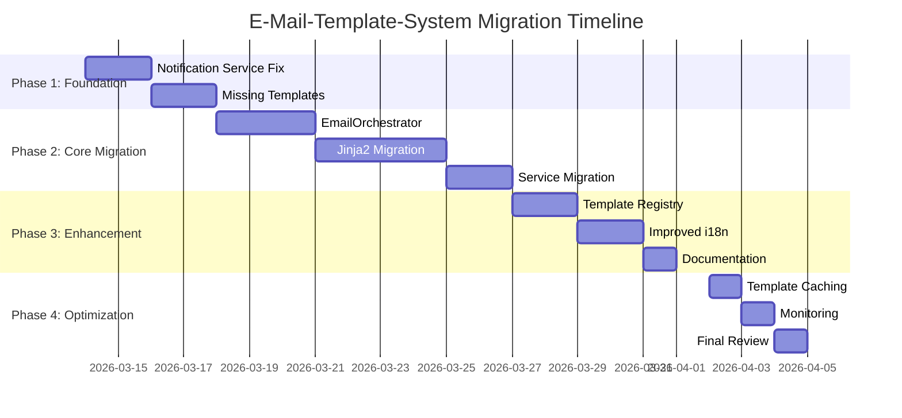

# E-Mail-Template-System: Implementierungsplan

## Zusammenfassung

### Aktueller Status
Das Backend verfügt bereits über ein gut strukturiertes E-Mail-Template-System mit:
- Template-Engine in `backend/app/utils/template_engine.py`
- Zentrale E-Mail-Logik in `backend/app/services/email_service.py`
- Vorhandene Templates für Verifizierung, Passwort-Reset, Newsletter, Team und Projekt-E-Mails
- Internationalisierung (EN/DE) Unterstützung

### Identifizierte Hauptprobleme
1. **Notification Service** sendet keine echten E-Mails (nur Platzhalter)
2. **Fehlende Templates** für Hackathon, Project/Comment, Team/Created
3. **Keine zentrale Schnittstelle** - Services rufen EmailService direkt auf
4. **Template-Engine Einschränkungen** - Keine Schleifen/Bedingungen

## Implementierungsplan

### Phase 1: Foundation (Woche 1)
**Ziel**: Kritische Lücken schließen

#### 1.1 Notification Service Migration
- **Aufgabe**: `notification_service.py` vollständig implementieren
- **Deliverable**: Echte E-Mail-Benachrichtigungen für alle Notification-Types
- **Zeitaufwand**: 2-3 Tage
- **Risiko**: Mittel

#### 1.2 Fehlende Templates erstellen
- **Aufgabe**: Templates für Hackathon, Project/Comment, Team/Created
- **Deliverable**: HTML Templates in EN/DE
- **Zeitaufwand**: 1-2 Tage
- **Risiko**: Niedrig

### Phase 2: Core Migration (Woche 2-3)
**Ziel**: Zentrale Architektur etablieren

#### 2.1 EmailOrchestrator implementieren
- **Aufgabe**: Zentrale Facade für alle E-Mail-Operationen
- **Deliverable**: `EmailOrchestrator` Klasse mit Template-Validation
- **Zeitaufwand**: 3-5 Tage
- **Risiko**: Mittel (Breaking Changes)

#### 2.2 Jinja2 Migration
- **Aufgabe**: Template-Engine von Custom zu Jinja2 migrieren
- **Deliverable**: Jinja2-basierte Rendering Engine
- **Zeitaufwand**: 4-6 Tage
- **Risiko**: Hoch (Rendering-Änderungen)

#### 2.3 Services migrieren
- **Aufgabe**: Alle Services auf EmailOrchestrator umstellen
- **Deliverable**: Konsolidierte E-Mail-Logik
- **Zeitaufwand**: 2-3 Tage
- **Risiko**: Mittel

### Phase 3: Enhancement (Woche 4)
**Ziel**: Developer Experience verbessern

#### 3.1 Template Registry
- **Aufgabe**: Zentrale Registry für Template-Definitionen
- **Deliverable**: `TemplateRegistry` mit Type Safety
- **Zeitaufwand**: 2-3 Tage
- **Risiko**: Niedrig

#### 3.2 Improved Internationalization
- **Aufgabe**: Dynamische Sprachdetektion basierend auf User-Preferences
- **Deliverable**: Automatische Sprachauflösung
- **Zeitaufwand**: 2-3 Tage
- **Risiko**: Mittel

#### 3.3 Dokumentation
- **Aufgabe**: Developer Guide und API-Dokumentation
- **Deliverable**: Vollständige Dokumentation
- **Zeitaufwand**: 1 Tag
- **Risiko**: Niedrig

### Phase 4: Optimization (Woche 5)
**Ziel**: Performance und Monitoring

#### 4.1 Template Caching
- **Aufgabe**: Caching für häufig verwendete Templates
- **Deliverable**: Performance-Optimierung
- **Zeitaufwand**: 1 Tag
- **Risiko**: Niedrig

#### 4.2 Monitoring Setup
- **Aufgabe**: Dashboards für E-Mail-Metriken
- **Deliverable**: Observability
- **Zeitaufwand**: 1 Tag
- **Risiko**: Niedrig

#### 4.3 Final Review
- **Aufgabe**: Go/No-Go Entscheidung
- **Deliverable**: Production Release
- **Zeitaufwand**: 1 Tag
- **Risiko**: Niedrig

## Technische Spezifikationen

### EmailOrchestrator API
```python
class EmailOrchestrator:
    def send_template(
        self,
        template: Type[EmailTemplate],
        variables: Dict[str, Any],
        context: EmailContext
    ) -> SendResult:
        pass
    
    def send_notification(
        self,
        notification_type: str,
        user_id: int,
        data: Dict[str, Any]
    ) -> SendResult:
        pass
```

### Template Definition
```python
@template_registry.register
class VerificationTemplate:
    template_name = "verification"
    required_variables = ["user_name", "verification_url"]
    optional_variables = ["expiration_hours"]
```

### Email Context
```python
@dataclass
class EmailContext:
    user_id: Optional[int]
    user_email: str
    language: str = "en"
    priority: str = "normal"
    category: str = "transactional"
```

## Sicherstellungsmechanismen

### 1. Architecture Enforcement
- Pre-commit Hooks für Template-Compliance
- CI/CD Pipeline Checks
- Code Review Checklist

### 2. Developer Workflow
- Standardisierter Prozess für neue E-Mail-Types
- Template Generator Script
- Automated Documentation

### 3. Quality Gates
- 100% Template Coverage Requirement
- Internationalization Requirement (EN/DE)
- Test Coverage >90%

## Ressourcenbedarf

### Personal
- **Backend Developer**: 1 Person (vollzeit, 5 Wochen)
- **Frontend Developer**: 0.5 Person (teilzeit, 1 Woche für Templates)
- **QA Engineer**: 0.25 Person (Testing, 2 Wochen)
- **Tech Writer**: 0.25 Person (Dokumentation, 1 Woche)

### Infrastruktur
- Testing SMTP Server
- Monitoring Tools (New Relic/Datadog)
- CI/CD Pipeline Erweiterungen

## Risikomanagement

### Hauptrisiken
1. **Rendition Differences**: Jinja2 vs. Custom Engine
   - **Mitigation**: Side-by-side Testing
   - **Fallback**: Alte Engine als Backup

2. **Performance Regression**
   - **Mitigation**: Performance Benchmarks
   - **Fallback**: Early Caching Implementation

3. **Developer Adoption**
   - **Mitigation**: Training, Code Reviews, Tools
   - **Fallback**: Architecture Enforcement

### Rollout-Strategie
1. **Canary Deployment**: 10% Traffic
2. **Gradual Increase**: 25% → 50% → 75% → 100%
3. **Feature Flags**: Per Email-Type toggleable

## Erfolgsmetriken

### Quantitative
- **Template Coverage**: 100% aller E-Mail-Types
- **Performance**: <100ms Rendering Time (p95)
- **Error Rate**: <0.1% Failed Emails
- **Developer Velocity**: <2h für neuen E-Mail-Type

### Qualitative
- **Developer Satisfaction**: Survey Score >4/5
- **Code Quality**: Weniger Architecture Comments in Reviews
- **Operational Overhead**: Reduzierte Support-Tickets

## Zeitplan



## Next Steps

### Unmittelbar (Diese Woche)
1. [ ] Plan mit Tech Lead reviewen
2. [ ] Ressourcen-Zuteilung bestätigen
3. [ ] Kick-off Meeting mit Team
4. [ ] Detailed Technical Specs für Phase 1

### Kurzfristig (Nächste Woche)
5. [ ] Notification Service Analyse beginnen
6. [ ] Template Designs für fehlende E-Mail-Types
7. [ ] Testing Strategy definieren

### Mittelfristig (2-3 Wochen)
8. [ ] EmailOrchestrator Spezifikation finalisieren
9. [ ] Jinja2 Migration Proof-of-Concept
10. [ ] Rollout-Plan für Staging Environment

## Approvals Required

- [ ] **Technical Lead**: Architecture Review
- [ ] **Product Owner**: Business Impact Assessment
- [ ] **Engineering Manager**: Resource Allocation
- [ ] **DevOps**: Infrastructure Requirements

## Kontaktinformationen

- **Projektverantwortlicher**: [Name einfügen]
- **Technischer Lead**: [Name einfügen]
- **Backend Entwickler**: [Name einfügen]
- **Frontend Entwickler**: [Name einfügen]

## Dokumentenhistorie

| Version | Datum | Autor | Änderungen |
|---------|-------|-------|------------|
| 1.0 | 2026-03-13 | Kilo Code | Initiale Version |
| 1.1 | 2026-03-13 | Kilo Code | Zeitplan und Ressourcen hinzugefügt |

---

**Genehmigt von**:

- [ ] ___________________________ (Technical Lead)
- [ ] ___________________________ (Product Owner)  
- [ ] ___________________________ (Engineering Manager)

**Datum der Genehmigung**: ___________________

**Geplantes Startdatum**: 2026-03-14
**Geplantes Enddatum**: 2026-04-04