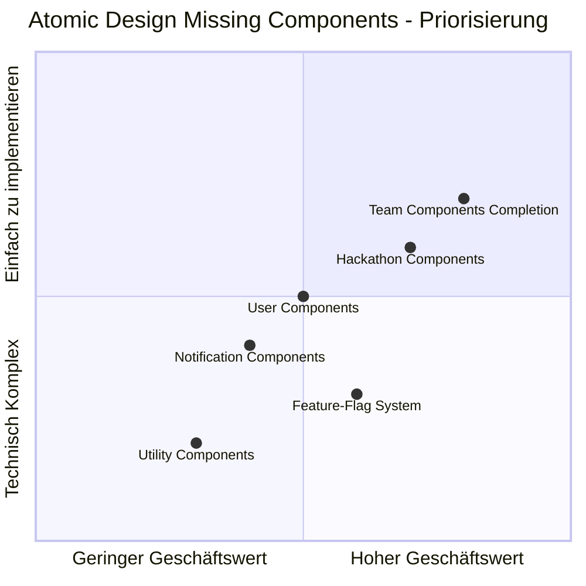
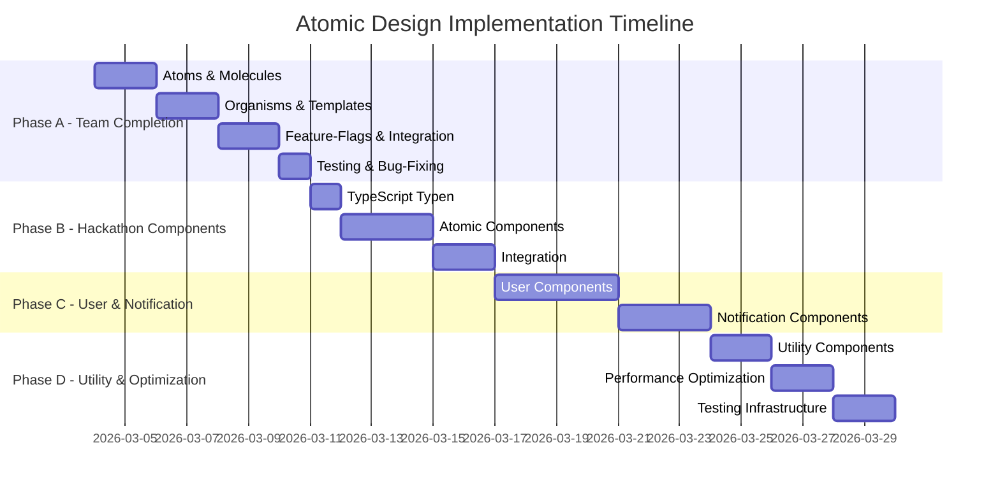

# Atomic Design Missing Components Analysis

## Übersicht
Diese Analyse identifiziert fehlende Atomic Design-Komponenten im Hackathon-Dashboard Frontend basierend auf dem ursprünglichen Refactoring-Plan.

## Aktueller Stand

### ✅ Abgeschlossene Phasen
1. **Phase 1: Layout Components** - Vollständig implementiert
2. **Phase 2: Project Components** - Vollständig implementiert
3. **Phase 3: Team Components** - Teilweise implementiert

### 🔄 In Arbeit
- **Phase 3 Completion**: Fehlende Team-Komponenten
- **Feature-Flag System**: Erweiterung für alle Atomic Design-Phasen

### ❌ Noch nicht begonnen
- **Phase 4: User Components**
- **Phase 5: Notification Components**  
- **Phase 6: Utility Components**
- **Hackathon Components** (Teil von Phase 3 im ursprünglichen Plan)

## Detaillierte Analyse fehlender Komponenten

### 1. Team Components (Phase 3 - Teilweise fehlend)

#### Atoms (4 fehlen)
- `TeamInviteButton.vue` - Button zum Einladen von Mitgliedern
- `TeamSettingsButton.vue` - Button für Team-Einstellungen
- `TeamVisibilityBadge.vue` - Badge für Team-Sichtbarkeit (Public/Private)
- `TeamRoleBadge.vue` - Badge für Team-Rollen (Owner, Admin, Member)

#### Molecules (5 fehlen)
- `TeamCardHeader.vue` - Header für Team-Karten mit Titel und Status
- `TeamCardContent.vue` - Content-Bereich für Team-Karten
- `TeamCardFooter.vue` - Footer für Team-Karten mit Aktionen
- `TeamMemberItem.vue` - Einzelnes Team-Mitglied mit Aktionen
- `TeamInvitationItem.vue` - Einzelne Team-Einladung mit Aktionen

#### Organisms (3 fehlen)
- `TeamDetailsHeader.vue` - Header für Team-Detail-Seiten
- `TeamDetailsSidebar.vue` - Sidebar für Team-Detail-Seiten
- `TeamMembersList.vue` - Liste von Team-Mitgliedern mit Verwaltungsfunktionen

#### Templates (1 fehlt)
- `TeamDetailsTemplate.vue` - Template für Team-Detail-Seiten

#### Wrapper Components (1 fehlt)
- `TeamDetailAtomicWrapper.vue` - Wrapper für Team-Detail-Seiten

### 2. Hackathon Components (Komplett fehlend)

#### Atoms (Geplant)
- `HackathonStatusBadge.vue`
- `HackathonDateBadge.vue`
- `HackathonParticipantCount.vue`

#### Molecules (Geplant)
- `HackathonCardHeader.vue`
- `HackathonCardContent.vue`
- `HackathonCardFooter.vue`

#### Organisms (Geplant)
- `HackathonCard.vue`
- `HackathonList.vue`
- `HackathonDetailsHeader.vue`

#### Templates (Geplant)
- `HackathonsPageTemplate.vue`
- `HackathonDetailsTemplate.vue`

### 3. User Components (Komplett fehlend)

#### Atoms
- `UserAvatar.vue`
- `UserName.vue`
- `UserRoleBadge.vue`

#### Molecules
- `UserCardHeader.vue`
- `UserCardContent.vue`
- `UserStats.vue`

#### Organisms
- `UserCard.vue`
- `UserList.vue`
- `UserProfileHeader.vue`

### 4. Notification Components (Komplett fehlend)

#### Atoms
- `NotificationBadge.vue`
- `NotificationIcon.vue`

#### Molecules
- `NotificationItem.vue`
- `NotificationActions.vue`

#### Organisms
- `NotificationList.vue`
- `NotificationSettingsPanel.vue`

### 5. Utility Components (Komplett fehlend)

#### Atoms/Molecules
- `StatsCard.vue`
- `LanguageSwitcher.vue` (existiert bereits, aber nicht als Atomic Design)
- `ThemeToggle.vue` (existiert bereits, aber nicht als Atomic Design)

## Feature-Flag System Analyse

### Aktuelle Implementierung
```typescript
// frontend3/app/config/feature-flags.ts
interface FeatureFlags {
  atomicTeamInvitations: boolean      // Nur Team-Einladungen
  improvedUserSearch: boolean
  realTimeInvitations: boolean
  newTeamManagementUI: boolean
}
```

### Erforderliche Erweiterung
```typescript
interface FeatureFlags {
  // Atomic Design Phasen
  atomicLayoutComponents: boolean     // Phase 1
  atomicProjectComponents: boolean    // Phase 2  
  atomicTeamComponents: boolean       // Phase 3
  atomicHackathonComponents: boolean  // Phase 3 (Hackathon)
  atomicUserComponents: boolean       // Phase 4
  atomicNotificationComponents: boolean // Phase 5
  atomicUtilityComponents: boolean    // Phase 6
  
  // Bestehende Flags
  improvedUserSearch: boolean
  realTimeInvitations: boolean
  newTeamManagementUI: boolean
}
```

## Priorisierungsmatrix

### Hohe Priorität (Sofort)
1. **Team Components Completion** - Fehlende Team-Komponenten implementieren
2. **Feature-Flag System Erweiterung** - Atomic Design Flags hinzufügen
3. **Team Detail Pages Integration** - Wrapper und Templates integrieren

### Mittlere Priorität (Nächste 2 Wochen)
4. **Hackathon Components** - Grundlegende Hackathon-Komponenten
5. **User Components** - Benutzerprofil-Komponenten
6. **Notification Components** - Benachrichtigungs-Komponenten

### Niedrige Priorität (Langfristig)
7. **Utility Components** - Statistik- und Utility-Komponenten
8. **Performance Optimierung** - Lazy Loading und Bundle-Optimierung
9. **Testing Infrastructure** - Unit und Integration Tests

## Implementierungsplan

### Phase A: Team Components Completion (1 Woche)
1. **Tag 1**: Fehlende Atoms und Molecules implementieren
2. **Tag 2**: Fehlende Organisms und Templates implementieren
3. **Tag 3**: Wrapper Component und Feature-Flags erweitern
4. **Tag 4**: Integration in bestehende Team-Seiten
5. **Tag 5**: Testing und Bug-Fixing

### Phase B: Feature-Flag System (2 Tage)
1. **Tag 1**: Feature-Flag Interface erweitern
2. **Tag 2**: Hook und Utility-Funktionen aktualisieren

### Phase C: Hackathon Components (1 Woche)
1. **Tag 1-2**: TypeScript-Typen und Atoms
2. **Tag 3-4**: Molecules und Organisms
3. **Tag 5**: Templates und Integration

### Phase D: User & Notification Components (1,5 Wochen)
1. **Woche 1**: User Components implementieren
2. **Woche 1.5**: Notification Components implementieren

## Technische Anforderungen

### TypeScript-Typen
- Erweiterung der bestehenden `team-types.ts`
- Neue Dateien: `hackathon-types.ts`, `user-types.ts`, `notification-types.ts`

### Composables
- `useHackathons.ts` - Hackathon-Datenverwaltung
- `useUserProfile.ts` - Benutzerprofil-Logik
- `useNotifications.ts` - Benachrichtigungs-Logik

### Testing Strategy
- Unit Tests für alle neuen Komponenten
- Integration Tests für Templates
- E2E Tests für vollständige Workflows

## Risikoanalyse

### Risiko 1: Inkompatibilität mit bestehenden Datenstrukturen
- **Mitigation**: TypeScript-Typen basierend auf Backend-APIs
- **Fallback**: Feature-Flags für einfache Deaktivierung

### Risiko 2: Performance-Einbußen
- **Mitigation**: Lazy Loading von Komponenten
- **Optimierung**: Effiziente Reaktivität mit Vue 3

### Risiko 3: UI-Inkonsistenzen
- **Mitigation**: Wiederverwendung von Design-System-Komponenten
- **Konsistenz**: Gleiche CSS-Variablen und Utility-Klassen

## Erfolgskriterien

### Technische Kriterien
- [ ] Build ohne TypeScript-Fehler
- [ ] Linting bestanden
- [ ] Feature-Flags funktionieren korrekt
- [ ] Responsive Design auf allen Geräten
- [ ] Accessibility (WCAG 2.1 Compliance)

### Funktionale Kriterien
- [ ] Alle fehlenden Team-Komponenten implementiert
- [ ] Feature-Flag System erweitert
- [ ] Hackathon Components Grundgerüst
- [ ] User Components Grundgerüst
- [ ] Notification Components Grundgerüst

## Atomic Design Architektur - Mermaid Diagramme

### Gesamtübersicht der Atomic Design-Hierarchie
```mermaid
graph TD
    A[Atomic Design System] --> B[Atoms]
    A --> C[Molecules]
    A --> D[Organisms]
    A --> E[Templates]
    A --> F[Pages]
    
    B --> B1[Button]
    B --> B2[Input]
    B --> B3[Avatar]
    B --> B4[Badge]
    
    C --> C1[FormField]
    C --> C2[SearchBar]
    C --> C3[CardHeader]
    C --> C4[CardFooter]
    
    D --> D1[ProjectCard]
    D --> D2[TeamCard]
    D --> D3[UserProfile]
    D --> D4[NotificationList]
    
    E --> E1[ProjectsPageTemplate]
    E --> E2[TeamsPageTemplate]
    E --> E3[HackathonsPageTemplate]
    
    F --> F1[/projects/index.vue]
    F --> F2[/teams/index.vue]
    F --> F3[/hackathons/index.vue]
```

### Fehlende Komponenten - Priorisierungsmatrix


### Implementierungsphasen - Timeline


### Komponentenabhängigkeiten
```mermaid
graph LR
    A[TeamBadge Atom] --> B[TeamCardHeader Molecule]
    C[TeamMemberAvatar Atom] --> B
    D[TeamJoinButton Atom] --> B
    
    B --> E[TeamCard Organism]
    F[TeamCardContent Molecule] --> E
    G[TeamCardFooter Molecule] --> E
    
    E --> H[TeamList Organism]
    I[TeamDetailsHeader Organism] --> J[TeamDetailsTemplate]
    K[TeamDetailsSidebar Organism] --> J
    
    J --> L[TeamDetailAtomicWrapper]
    L --> M[/teams/id/index.vue Page]
```

## Nächste Schritte

1. **Genehmigung**: Diesen Plan mit Stakeholdern besprechen
2. **Phase A starten**: Team Components Completion
3. **Testing**: Umfassende Tests durchführen
4. **Rollout**: Schrittweise Aktivierung über Feature-Flags
5. **Monitoring**: Performance und Fehler überwachen

## Verantwortlichkeiten

### Frontend Team
- Implementierung der fehlenden Komponenten
- Erweiterung des Feature-Flag Systems
- Testing und Qualitätssicherung

### Design Team
- Konsistenz mit bestehendem Design System
- Design-Review der neuen Komponenten
- Accessibility-Review

### QA Team
- Regressionstesting
- Performance-Testing
- User Acceptance Testing

---

**Analyse erstellt am**: 2026-03-03  
**Aktueller Stand**: Phase 3 teilweise implementiert  
**Nächste Phase**: Team Components Completion  
**Priorität**: Hoch