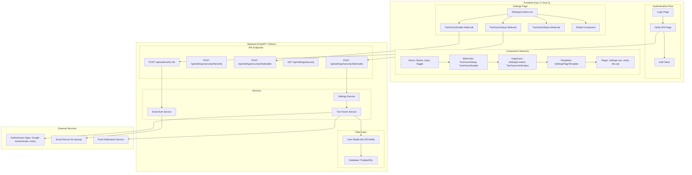
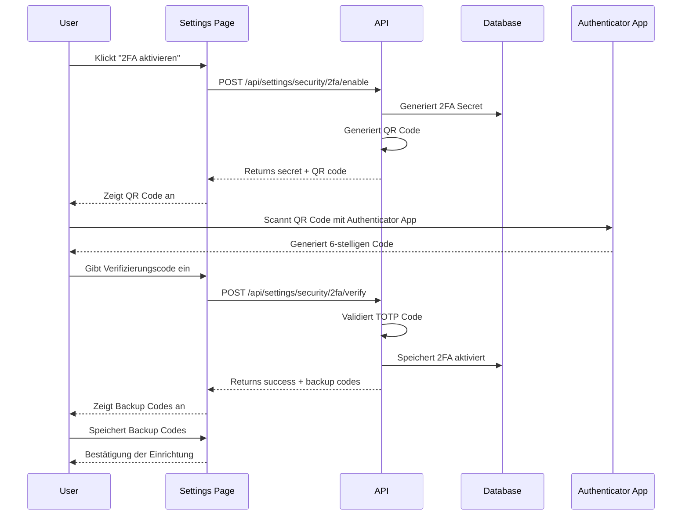
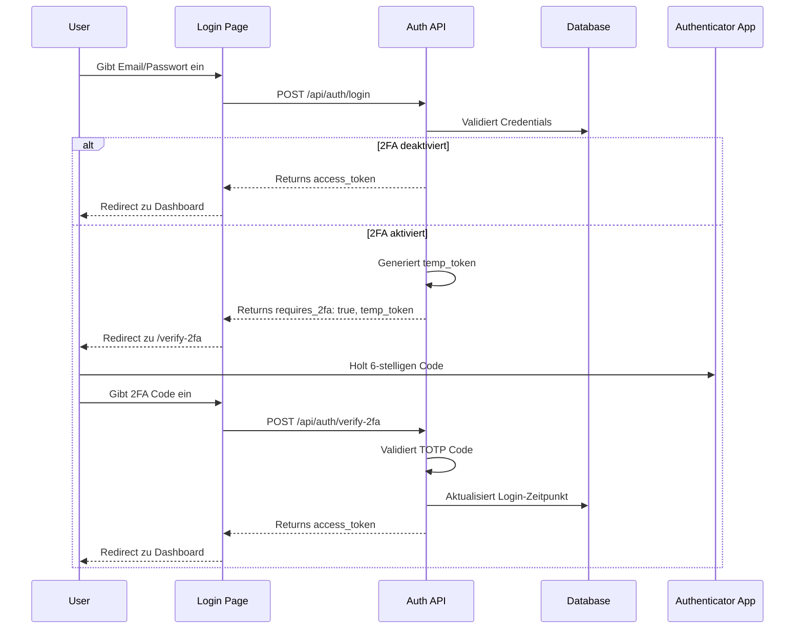
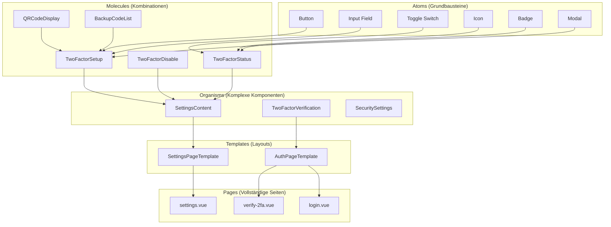
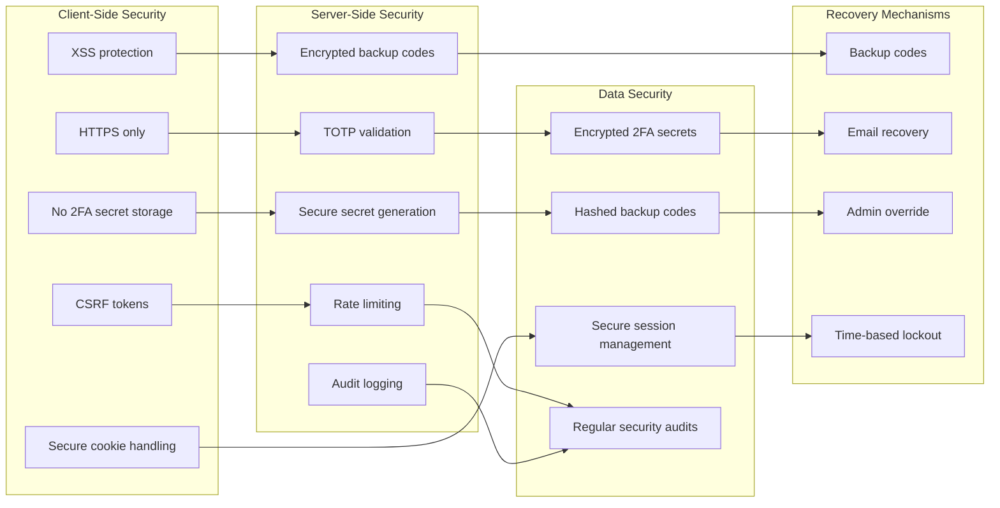

# 2FA-Architektur-Diagramm

## System-Übersicht

## 2FA-Einrichtungs-Flow

## 2FA-Login-Flow

## Komponenten-Hierarchie (Atomic Design)

## Datenfluss bei 2FA-Operationen

```mermaid
flowchart TD
    Start[User Action] --> ActionType{Action Type}
    
    ActionType -->|Enable 2FA| EnableFlow
    ActionType -->|Disable 2FA| DisableFlow
    ActionType -->|Login with 2FA| LoginFlow
    ActionType -->|View Backup Codes| BackupFlow
    
    subgraph EnableFlow[2FA Activation Flow]
        E1[User clicks Enable] --> E2[API: Generate Secret]
        E2 --> E3[Frontend: Show QR Code]
        E3 --> E4[User scans with Auth App]
        E4 --> E5[User enters verification code]
        E5 --> E6[API: Verify TOTP]
        E6 --> E7[DB: Store 2FA enabled]
        E7 --> E8[Frontend: Show backup codes]
        E8 --> E9[Success]
    end
    
    subgraph DisableFlow[2FA Deactivation Flow]
        D1[User clicks Disable] --> D2[Frontend: Password confirmation]
        D2 --> D3[API: Verify password]
        D3 --> D4[DB: Remove 2FA data]
        D4 --> D5[Frontend: Success message]
        D5 --> D6[Success]
    end
    
    subgraph LoginFlow[2FA Login Flow]
        L1[User enters credentials] --> L2[API: Check 2FA status]
        L2 -->|2FA enabled| L3[API: Return temp_token]
        L3 --> L4[Frontend: Redirect to verify-2fa]
        L4 --> L5[User enters 2FA code]
        L5 --> L6[API: Verify code with temp_token]
        L6 --> L7[API: Issue access_token]
        L7 --> L8[Frontend: Redirect to dashboard]
        L8 --> L9[Success]
        
        L2 -->|2FA disabled| L10[API: Issue access_token directly]
        L10 --> L8
    end
    
    subgraph BackupFlow[Backup Code Management]
        B1[User clicks View Backup Codes] --> B2[Frontend: Show modal]
        B2 --> B3[User can copy/download]
        B3 --> B4[Frontend: Close modal]
        B4 --> B5[Success]
    end
    
    EnableFlow --> End[Operation Complete]
    DisableFlow --> End
    LoginFlow --> End
    BackupFlow --> End
```

## Sicherheits-Architektur

Diese Diagramme zeigen die vollständige Architektur der 2FA-Implementierung, von der Benutzeroberfläche bis zur Datenbank, einschließlich aller Sicherheitsaspekte und Wiederherstellungsmechanismen.