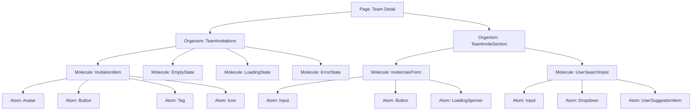

# Atomic Design Plan für Team-Einladungen

## Übersicht

Dieser Plan beschreibt die Atomic Design Struktur für Team-Einladungen im Hackathon Dashboard. Ziel ist die Extraktion der Inline-Komponenten aus `frontend3/app/pages/teams/[id]/index.vue` in eine hierarchische Komponentenstruktur gemäß Atomic Design Prinzipien.

## Aktueller Zustand

Die Team-Detailseite enthält zwei Hauptbereiche für Einladungen:

1. **Invite Section** (Zeilen 43-92): Nur sichtbar für Team-Owner, wenn das Team nicht voll ist.
   - Input-Feld mit Autocomplete für Benutzernamen
   - Button "Invite"
   - Benutzervorschläge als Dropdown
   - Hilfetext

2. **Team Invitations List** (Zeilen 95-175): Sichtbar für alle Teammitglieder.
   - Header mit Anzahl ausstehender Einladungen
   - Loading State
   - Empty State (keine ausstehenden Einladungen)
   - Liste der ausstehenden Einladungen mit:
     - Avatar des eingeladenen Benutzers
     - Benutzername (mit Link zum Profil)
     - Einladungsdatum und Einlader
     - Status "Pending"
     - Cancel-Button für Team-Owner

## Atomic Design Hierarchie



## Komponenten-Spezifikation

### Atoms (bereits vorhanden)

- `Button` (`atoms/Button.vue`)
- `Input` (`atoms/Input.vue`)
- `Avatar` (`atoms/Avatar.vue`)
- `Tag` (`atoms/Tag.vue`)
- `LoadingSpinner` (`atoms/LoadingSpinner.vue`)
- `Icon` (SVG-Icons, können als Atom extrahiert werden)

### Neue Molecules

#### 1. `InvitationItem.vue`
**Verwendungszweck**: Einzelnes Einladungselement in der Liste.

**Props**:
```typescript
interface InvitationItemProps {
  invitation: {
    id: number
    invited_user?: {
      id: number
      username: string
      avatar_url?: string
      name?: string
    }
    inviter?: {
      id: number
      username: string
    }
    created_at: string
    status: 'pending' | 'accepted' | 'declined' | 'cancelled'
  }
  showCancelButton?: boolean
  formatDate?: (dateString: string) => string
}
```

**Events**:
- `cancel: (invitationId: number) => void`

**Slots**:
- `avatar`: Custom Avatar
- `actions`: Custom Actions

**Verwendungsort**: `TeamInvitations` Organism

#### 2. `InviteUserForm.vue`
**Verwendungszweck**: Formular zum Einladen eines Benutzers.

**Props**:
```typescript
interface InviteUserFormProps {
  teamId: number
  maxMembers?: number
  currentMemberCount?: number
  disabled?: boolean
}
```

**Events**:
- `invite-sent: (userId: number) => void`
- `error: (errorMessage: string) => void`

**State**:
- `username`: Ref<string>
- `searching`: Ref<boolean>
- `inviting`: Ref<boolean>
- `suggestions`: Ref<User[]>

**Verwendungsort**: `TeamInviteSection` Organism

#### 3. `UserSearchInput.vue`
**Verwendungszweck**: Input mit Autocomplete für Benutzersuche.

**Props**:
```typescript
interface UserSearchInputProps {
  query: string
  suggestions: User[]
  loading?: boolean
  placeholder?: string
  minChars?: number
}
```

**Events**:
- `update:query: (query: string) => void`
- `select: (user: User) => void`
- `search: (query: string) => void`

**Slots**:
- `suggestion-item`: Custom Suggestion Item

**Verwendungsort**: `InviteUserForm` Molecule

### Neue Organisms

#### 1. `TeamInvitations.vue`
**Verwendungszweck**: Liste der ausstehenden Team-Einladungen.

**Props**:
```typescript
interface TeamInvitationsProps {
  teamId: number
  isTeamOwner: boolean
  showHeader?: boolean
  autoLoad?: boolean
}
```

**Events**:
- `invitation-cancelled: (invitationId: number) => void`
- `loaded: (invitations: Invitation[]) => void`

**State** (intern):
- `invitations`: Ref<Invitation[]>
- `loading`: Ref<boolean>
- `error`: Ref<string | null>

**Slots**:
- `header`: Custom Header
- `empty-state`: Custom Empty State
- `loading-state`: Custom Loading State
- `invitation-item`: Custom Invitation Item

**Verwendungsort**: `teams/[id]/index.vue` (Team-Detailseite)

#### 2. `TeamInviteSection.vue`
**Verwendungszweck**: Sektion zum Einladen neuer Teammitglieder.

**Props**:
```typescript
interface TeamInviteSectionProps {
  teamId: number
  isTeamOwner: boolean
  isTeamFull: boolean
  currentMemberCount?: number
  maxMembers?: number
}
```

**Events**:
- `invite-sent: (userId: number) => void`
- `error: (errorMessage: string) => void`

**Slots**:
- `before-form`: Content vor dem Formular
- `after-form`: Content nach dem Formular
- `help-text`: Custom Hilfetext

**Verwendungsort**: `teams/[id]/index.vue` (Team-Detailseite)

### Composables

#### `useTeamInvitations.ts`
**Zweck**: Logik für das Abrufen und Verwalten von Team-Einladungen.

**Funktionen**:
- `fetchInvitations(teamId: number)`
- `cancelInvitation(invitationId: number)`
- `sendInvitation(teamId: number, userId: number)`
- `searchUsers(query: string)`

**State**:
- `invitations: Ref<Invitation[]>`
- `loading: Ref<boolean>`
- `error: Ref<string | null>`
- `searchResults: Ref<User[]>`

#### `useUserSearch.ts`
**Zweck**: Logik für die Benutzersuche mit Autocomplete.

**Funktionen**:
- `search(query: string)`
- `debouncedSearch(query: string)`
- `clearResults()`

**State**:
- `results: Ref<User[]>`
- `loading: Ref<boolean>`
- `error: Ref<string | null>`

## Migrationsstrategie

### Schritt 1: Composables erstellen
1. `useTeamInvitations.ts` im `composables/` Verzeichnis erstellen
2. `useUserSearch.ts` im `composables/` Verzeichnis erstellen
3. Types für `Invitation` und `User` definieren

### Schritt 2: Molecules erstellen
1. `InvitationItem.vue` im `molecules/` Verzeichnis erstellen
2. `InviteUserForm.vue` im `molecules/` Verzeichnis erstellen
3. `UserSearchInput.vue` im `molecules/` Verzeichnis erstellen

### Schritt 3: Organisms erstellen
1. `TeamInvitations.vue` im `organisms/teams/` Verzeichnis erstellen
2. `TeamInviteSection.vue` im `organisms/teams/` Verzeichnis erstellen

### Schritt 4: Integration in Team-Detailseite
1. Inline-Code in `teams/[id]/index.vue` identifizieren
2. Neue Komponenten mit Feature-Flag integrieren
3. Testing durchführen
4. Feature-Flag entfernen und alten Code löschen

## Erfolgskriterien

### Quantitative:
- Reduzierung der Zeilen in `teams/[id]/index.vue` um ~80 Zeilen
- Wiederverwendbarkeit der neuen Komponenten in anderen Kontexten (z.B. Admin-Bereich)
- Keine Regressionen in der Einladungsfunktionalität

### Qualitative:
- Klare Trennung der Verantwortlichkeiten
- Bessere Testbarkeit (jede Komponente kann isoliert getestet werden)
- Verbesserte Developer Experience durch konsistente APIs
- Barrierefreiheit (Accessibility) gewährleistet

## Zeitplan

### Tag 1: Composables und Types
- `useTeamInvitations.ts` und `useUserSearch.ts` erstellen
- TypeScript-Typen definieren
- Unit-Tests schreiben

### Tag 2: Molecules
- `InvitationItem.vue` erstellen
- `InviteUserForm.vue` erstellen
- `UserSearchInput.vue` erstellen
- Storybook Stories (falls vorhanden)

### Tag 3: Organisms
- `TeamInvitations.vue` erstellen
- `TeamInviteSection.vue` erstellen
- Integrationstests

### Tag 4: Migration
- Feature-Flag in Team-Detailseite einbauen
- Schrittweise Migration testen
- Manuelles Testing aller Einladungsfunktionen

### Tag 5: Optimierung und Dokumentation
- Performance-Optimierungen (Debouncing, Caching)
- Dokumentation der Komponenten-APIs
- Code-Review und finale Anpassungen

## Risiken und Mitigation

| Risiko | Wahrscheinlichkeit | Auswirkung | Mitigation |
|--------|-------------------|------------|------------|
| Breaking Changes | Mittel | Hoch | Feature-Flags, schrittweise Migration, umfassende Tests |
| Performance-Einbußen | Niedrig | Mittel | Debouncing bei Suche, Pagination bei vielen Einladungen |
| Design-Inkonsistenzen | Niedrig | Niedrig | Verwendung bestehender Design Tokens |
| Komplexität zu hoch | Mittel | Mittel | Iterative Entwicklung, frühzeitiges Feedback |

## Nächste Schritte

1. **Genehmigung dieses Plans** durch den Benutzer
2. **Start mit Composable-Implementierung**
3. **Regelmäßige Reviews** während der Entwicklung
4. **Integration in bestehende CI/CD Pipeline**

---
**Status**: Plan erstellt  
**Empfohlener Start**: Mit Composable-Implementierung  
**Erwarteter Abschluss**: 5 Tage bei Vollzeit-Entwicklung