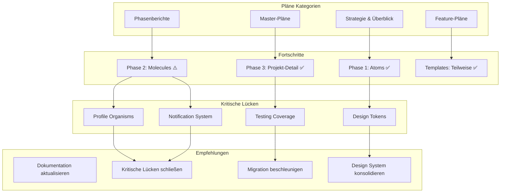

# Umfassende Analyse aller Atomic Design Pläne

## Einleitung

Diese Analyse untersucht alle Atomic Design-bezogenen Pläne und Dokumente im `plans/`-Verzeichnis, um den aktuellen Stand der Atomic Design-Implementierung im Hackathon-Dashboard zu bewerten, Fortschritte zu dokumentieren und verbleibende Lücken zu identifizieren.

## Identifizierte Atomic Design Pläne

Die folgenden 17 Pläne wurden als Atomic Design-bezogen identifiziert:

### 1. Strategie- und Überblickspläne
- `atomic_design_analysis_plan.md` - Initiale Analyse
- `atomic_design_comprehensive_implementation_plan.md` - 6-Wochen Roadmap
- `atomic_design_gap_analysis_report.md` - Detaillierte Lückenanalyse
- `atomic_design_implementation_plan.md` - Hackathon-spezifischer Plan
- `atomic_design_implementation_summary.md` - Implementierungszusammenfassung
- `atomic_design_roadmap.md` - Strategische Roadmap

### 2. Phasen- und Abschlussberichte
- `atomic_design_phase2_plan.md` - Plan für Phase 2
- `ATOMIC_DESIGN_REFACTORING_PHASE1_COMPLETE.md` - Abschluss Phase 1
- `ATOMIC_DESIGN_REFACTORING_PHASE2_COMPLETE.md` - Abschluss Phase 2
- `ATOMIC_DESIGN_REFACTORING_PHASE3_PROJECT_DETAIL_COMPLETE.md` - Abschluss Phase 3 (Projekt-Detail)

### 3. Master- und Refactoring-Pläne
- `atomic-design-refactoring-master-plan.md` - 12-Wochen Master-Plan
- `atomic-design-refactoring-prioritization.md` - Priorisierungsliste
- `atomic-design-structure-definition.md` - Strukturdefinition

### 4. Feature-spezifische Pläne
- `hackathon_atomic_design_plan.md` - Hackathon-spezifischer Plan
- `TEAM_INVITATIONS_ATOMIC_DESIGN_PLAN.md` - Team-Einladungen
- `TEAM_INVITATIONS_COMPONENT_SPECIFICATION.md` - Komponentenspezifikation
- `TEAM_INVITATIONS_IMPLEMENTATION_PLAN.md` - Implementierungsplan

## Zusammenfassung der wichtigsten Erkenntnisse

### Fortschritte und Erfolge

#### Phase 1: Atoms (Abgeschlossen ✅)
- **Erfolgreich implementiert**: Button, Input, LoadingSpinner Atoms
- **Barrel-Exports**: Saubere Import-Syntax (`@/components/atoms`)
- **Testumgebung**: Demo-Seiten (`/test-atoms`, `/test-button`)
- **Qualitätsmerkmale**: TypeScript-First, Accessibility, Dark Mode, Responsive Design

#### Phase 2: Molecules & Organisms (Teilweise abgeschlossen)
- **Laut Phase 2 Abschlussbericht**: 
  - Molecules: FormField, SearchBar, Pagination, Alert
  - Organisms: Header, Footer, Sidebar
  - Kritische Seiten refaktorieren: Projekt-Detail, Profil, Erstellungs-Seiten

#### Phase 3: Projekt-Detail (Abgeschlossen ✅)
- **Spezifischer Fokus**: Projekt-Detail-Seite mit Kommentar-Sektion
- **Erfolgreiche Integration**: Atomic Design Komponenten in komplexer Seite

### Gemeinsame Themen und wiederkehrende Probleme

#### 1. Fehlende Atomic Design Ebenen (in allen Plänen erwähnt)
- **Atoms**: Icon, Skeleton, Alert, Tooltip, ProgressBar, Divider, Chip, AvatarGroup, DateDisplay, TimeDisplay
- **Molecules**: DateRangePicker, FileUpload, RichTextEditor, DataTable, Accordion, Tabs, Breadcrumb, Stepper, Rating, Carousel, Timeline
- **Organisms**: UserProfileOrganism, DashboardWidget, CalendarOrganism, TimelineOrganism, GalleryOrganism, ChatOrganism, NotificationCenter, SearchResultsOrganism, FilterSidebarOrganism, WizardOrganism
- **Templates**: HackathonDetailTemplate, HackathonListTemplate, HackathonFormTemplate, UserProfileTemplate, DashboardTemplate, SettingsTemplate

#### 2. Strukturelle Inkonsistenzen
- **Komponenten außerhalb der Hierarchie**: 30+ Komponenten in Root-Level oder Feature-Verzeichnissen
- **Feature-Silos**: `home/`, `projects/`, `users/` Verzeichnisse statt Atomic Design-Struktur
- **Duplikate**: Mehrfache Implementierungen gleicher Funktionalität (z.B. HackathonEditForm, ProjectListCard)

#### 3. Direkte HTML-Nutzung in Pages
- **Betroffene Pages**: `index.vue`, `hackathons/index.vue`, `profile.vue`, `notifications.vue`, `teams/[id]/index.vue`
- **Häufige Patterns**: Loading States, Error States, Section Headers, Buttons/Links, Forms, Icons, Cards

#### 4. TypeScript und Props-Konsistenz
- **Inkonsistente Props-Schnittstellen**: Gleiche Daten unterschiedlich benannt
- **Fehlende TypeScript Interfaces**: Für viele Komponenten
- **Any-Typen**: In einigen Komponenten
- **Fehlende Default Values**: Für optionale Props

### Aktueller Status vs. Planungsstand

#### Implementierte vs. geplante Komponenten (Stand: Analyse der Frontend-Struktur)

**Bereits implementierte "fehlende" Komponenten:**
- ✅ `Icon.vue`, `ProgressBar.vue`, `Tooltip.vue`, `Skeleton.vue`, `Alert.vue`
- ✅ `HackathonDateDisplay.vue`, `HackathonStatusBadge.vue`
- ✅ `DateRangePicker.vue`, `FileUpload.vue`
- ✅ `HackathonFilterBar.vue`, `HackathonSearchInput.vue`, `HackathonSortOptions.vue`, `HackathonLocation.vue`
- ✅ `MemberCard.vue`, `NotificationItem.vue`
- ✅ `TeamMembers.vue`, `TeamProjectsPanel.vue`, `NotificationCenter.vue`
- ✅ `HackathonDetailTemplate.vue`, `HackathonListTemplate.vue`, `HackathonFormTemplate.vue`
- ✅ `useTeamMembers.ts` Composable

**Weiterhin fehlende Komponenten (laut `MISSING_COMPONENTS_SPECIFICATION.md`):**
- ❌ `ProfileOverview.vue`, `UserProjects.vue`, `UserTeams.vue`
- ❌ `HackathonInfo.vue`, `HackathonProjects.vue`
- ❌ `NotificationList.vue`, `NotificationFilters.vue`
- ❌ `EditProjectForm.vue`
- ❌ `useUserProfile.ts`, `useNotifications.ts`, `useHackathonData.ts` Composables

**Neue, in Plänen nicht erwähnte Lücken:**
- ❌ `Divider`, `Chip`, `AvatarGroup`, `DateDisplay`, `TimeDisplay`, `Rating`, `Stepper`, `Breadcrumb` Atoms
- ❌ `RichTextEditor`, `DataTable`, `TimeRangePicker`, `MultiSelect`, `ColorPicker`, `Accordion`, `Tabs`, `Carousel`, `Timeline` Molecules
- ❌ `DashboardWidget`, `CalendarOrganism`, `GalleryOrganism`, `ChatOrganism`, `SearchResultsOrganism`, `FilterSidebarOrganism`, `WizardOrganism`, `AdminDashboard` Organisms
- ❌ `UserProfileTemplate`, `DashboardTemplate`, `SettingsTemplate`, `AdminTemplate`, `ErrorTemplate` Templates

## Zeitliche Entwicklung der Pläne

### Phase 1 (Frühe Planung → Abschluss)
- **Initiale Analyse**: Identifikation grundlegender Lücken
- **Phase 1 Planung**: Fokus auf essentielle Atoms
- **Phase 1 Implementierung**: Erfolgreich abgeschlossen (Button, Input, LoadingSpinner)

### Phase 2 (Planung → Teilweise Implementierung)
- **Ursprünglicher Plan**: Molecules & Organisms
- **Aktueller Stand**: Viele Molecules implementiert (DateRangePicker, FileUpload, etc.)
- **Organisms**: Teilweise implementiert (TeamMembers, NotificationCenter)

### Phase 3 (Spezifische Fokussierung)
- **Projekt-Detail-Seite**: Erfolgreich refaktorisiert
- **Andere Seiten**: Noch nicht vollständig migriert

## Widersprüche und veraltete Informationen

### 1. Veraltete Lückenanalysen
- **Problem**: `atomic_design_gap_analysis_report.md` listet Komponenten als fehlend, die bereits implementiert sind
- **Beispiele**: Icon, ProgressBar, Tooltip, Skeleton, Alert, Hackathon-Templates
- **Empfehlung**: Dokumentation aktualisieren

### 2. Inkonsistente Priorisierungen
- **Unterschiedliche Prioritäten** zwischen verschiedenen Plänen
- **Beispiel**: `atomic-design-refactoring-prioritization.md` vs. `MISSING_COMPONENTS_SPECIFICATION.md`
- **Empfehlung**: Einheitliche Priorisierung erstellen

### 3. Fehlende Gesamtübersicht
- **Kein zentrales Dokument** zeigt aktuellen Stand aller Atomic Design-Komponenten
- **Empfehlung**: Atomic Design Inventory erstellen

## Kritische Lücken und Risiken

### 1. Unvollständige Migration
- **Risiko**: Pages verwenden weiterhin direkte HTML statt Atomic Design-Komponenten
- **Auswirkung**: Inkonsistente UI, höhere Wartungskosten
- **Priorität**: Hoch

### 2. Fehlende Design System Integration
- **Risiko**: Atoms haben keine konsistenten Design Tokens
- **Auswirkung**: Schwierige Theme-Erweiterungen, Inkonsistenzen
- **Priorität**: Mittel

### 3. Unzureichende Dokumentation
- **Risiko**: Entwickler wissen nicht, welche Komponenten verfügbar sind
- **Auswirkung**: Redundante Entwicklung, inkorrekte Nutzung
- **Priorität**: Mittel

### 4. Testing Lücken
- **Risiko**: Neue Komponenten nicht ausreichend getestet
- **Auswirkung**: Regressionsrisiko, Qualitätsprobleme
- **Priorität**: Hoch

## Empfehlungen und nächste Schritte

### Kurzfristig (nächste 2 Wochen)
1. **Dokumentation aktualisieren**
   - `atomic_design_gap_analysis_report.md` auf aktuellen Stand bringen
   - `MISSING_COMPONENTS_SPECIFICATION.md` bereinigen
   - Atomic Design Inventory erstellen

2. **Kritische Lücken schließen**
   - `ProfileOverview.vue`, `UserProjects.vue`, `UserTeams.vue` implementieren
   - `useUserProfile.ts`, `useNotifications.ts` Composables erstellen
   - `Divider` und `Chip` Atoms hinzufügen

3. **Migration beschleunigen**
   - Eine Page pro Woche auf Atomic Design migrieren
   - Feature Flags für schrittweise Rollout verwenden

### Mittelfristig (nächste 1-2 Monate)
1. **Design System konsolidieren**
   - Design Tokens definieren
   - Theme-Switching verbessern
   - Storybook Integration

2. **Erweiterte Komponenten**
   - `RichTextEditor` und `DataTable` implementieren
   - `DashboardWidget` und `CalendarOrganism` erstellen
   - Admin-spezifische Komponenten

3. **Testing verbessern**
   - Test Coverage auf >80% erhöhen
   - Visual Regression Tests einrichten
   - E2E Tests für kritische Journeys

### Langfristig (3+ Monate)
1. **Vollständige Atomic Design Konformität**
   - 100% der Komponenten in korrekter Hierarchie
   - 0 direkte HTML in Pages
   - <5% Code Duplication

2. **Developer Experience optimieren**
   - Automatische Komponenten-Generierung
   - Design System Dokumentation
   - Performance Monitoring

3. **Community und Beitrag**
   - Open Source Komponenten-Bibliothek
   - Beitrag zu Vue/Atomic Design Community
   - Konferenzbeiträge oder Blog-Posts

## Mermaid Diagramm: Atomic Design Planungs-Übersicht

## Fazit

Die Atomic Design-Transformation des Hackathon-Dashboards hat signifikante Fortschritte gemacht, mit erfolgreich abgeschlossenen Phasen für Atoms und spezifischen Seiten. Die umfangreiche Planungsdokumentation zeigt ein hohes Maß an strategischem Denken und methodischem Vorgehen.

Allerdings bestehen weiterhin Herausforderungen:
1. **Veraltete Dokumentation**: Viele Pläne reflektieren nicht den aktuellen Implementierungsstand
2. **Inkonsistente Priorisierung**: Unterschiedliche Fokussierungen zwischen Plänen
3. **Unvollständige Migration**: Viele Pages verwenden noch direkte HTML

Die höchste Priorität sollte die Aktualisierung der Dokumentation und die Schließung der kritischsten Lücken (Profile-Organisms, Notification-System) haben. Mit einem koordinierten, iterativen Ansatz kann das Atomic Design-System innerhalb der nächsten 2-3 Monate vollständig implementiert und konsolidiert werden.

---
**Analyse durchgeführt am**: 2026-03-08  
**Basierend auf**: 17 Atomic Design-bezogenen Plänen  
**Nächstes Review**: 2026-03-15  
**Empfohlene Aktion**: Dokumentation aktualisieren und kritische Lücken priorisieren