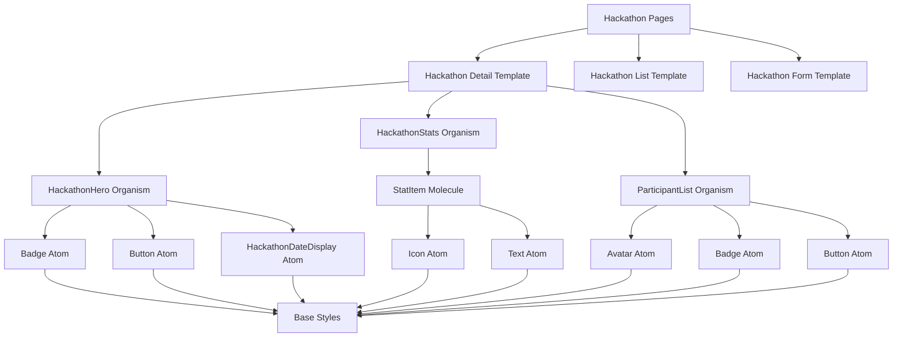

# Atomic Design Analyse und Verbesserungsplan

## Analyseergebnisse für http://localhost:3001/

### Aktueller Status
✅ **Atomic Design wird bereits verwendet** - Das Projekt hat eine klare Struktur:
- `app/components/atoms/` - 15+ Atom-Komponenten
- `app/components/molecules/` - 25+ Molekül-Komponenten  
- `app/components/organisms/` - 20+ Organismus-Komponenten

### Identifizierte Probleme

#### 1. Inkonsistente Verzeichnisstruktur
- **Problem**: Hackathon-Komponenten sind auf zwei Orte verteilt
  - `components/hackathons/` (2 Komponenten)
  - `components/organisms/hackathons/` (10 Komponenten)
- **Beispiel**: `HackathonProjectCard.vue` existiert in beiden Verzeichnissen

#### 2. Mangelnde Wiederverwendung von Atomic Design-Komponenten
- **Problem**: Organismen verwenden oft direkte HTML statt vorhandener Atoms/Molecules
- **Beispiel**: `HackathonHero.vue` verwendet keine `Badge`- oder `Button`-Atoms
- **Beispiel**: `HackathonStats.vue` verwendet keine `StatItem`-Molecules konsistent

#### 3. Fehlende Hackathon-spezifische Atomic Design-Ebenen
- **Problem**: Keine Hackathon-spezifische Atoms/Molecules
- **Beispiel**: Kein `HackathonBadge`, `HackathonStatus`, `HackathonDate` als Atoms
- **Beispiel**: Kein `HackathonFilter`, `HackathonSearch` als Molecules

#### 4. Doppelte und redundante Komponenten
- **Problem**: Gleiche Funktionalität in verschiedenen Komponenten
- **Beispiel**: `HackathonListCard.vue` vs `HackathonProjectCard.vue` mit ähnlicher Struktur

## Verbesserungsplan

### Phase 1: Konsolidierung und Bereinigung
1. **Migration von Komponenten**
   - Verschiebe `components/hackathons/` → `components/organisms/hackathons/`
   - Entferne doppelte Komponenten
   - Aktualisiere Import-Statements in Pages

2. **Atomic Design Refactoring**
   - Identifiziere wiederverwendbare Patterns in Organismen
   - Extrahiere gemeinsame Patterns zu neuen Atoms/Molecules
   - Erstelle Hackathon-spezifische Atomic Design-Komponenten

### Phase 2: Erweiterung der Atomic Design-Hierarchie
1. **Neue Hackathon-Atoms erstellen**
   - `HackathonStatusBadge.vue` - Status-Badge für Hackathons
   - `HackathonDateDisplay.vue` - Formatierte Datumsanzeige
   - `HackathonLocation.vue` - Virtual/Physical Location-Anzeige

2. **Neue Hackathon-Molecules erstellen**
   - `HackathonFilterBar.vue` - Filter für Hackathon-Liste
   - `HackathonSearchInput.vue` - Suchfunktion für Hackathons
   - `HackathonSortOptions.vue` - Sortieroptionen

3. **Verbesserung bestehender Organismen**
   - `HackathonHero` - Integriere `Badge`, `Button` Atoms
   - `HackathonStats` - Verwende `StatItem` Molecules
   - `ParticipantList` - Verwende `Avatar`, `Badge` Atoms

### Phase 3: Templates und Pages Refactoring
1. **Templates definieren**
   - Hackathon Detail Template
   - Hackathon List Template
   - Hackathon Create/Edit Template

2. **Pages optimieren**
   - Reduziere direkte HTML in Pages
   - Verwende Atomic Design-Komponenten konsistent
   - Implementiere Feature Flags für schrittweise Migration

## Mermaid Diagramm: Atomic Design-Hierarchie für Hackathons

## Priorisierte Aktionsliste

### Hochpriorität (Sofort)
1. Doppelte Komponenten konsolidieren
2. Verzeichnisstruktur bereinigen
3. Kritische Wiederverwendungsprobleme beheben

### Mittelpriorität (Nächste Woche)
1. Hackathon-spezifische Atoms/Molecules erstellen
2. Organismen mit Atomic Design-Komponenten refactoren
3. Templates definieren

### Niedrigpriorität (Langfristig)
1. Vollständige Migration aller Pages
2. Performance-Optimierung
3. Dokumentation und Guidelines

## Erfolgskriterien

1. **Konsistenz**: Alle Hackathon-Komponenten im korrekten Verzeichnis
2. **Wiederverwendung**: 80% der Organismen verwenden Atomic Design-Komponenten
3. **Reduzierte Duplikation**: Keine doppelten Komponenten mehr
4. **Erweiterbarkeit**: Neue Hackathon-Features können leicht hinzugefügt werden
5. **Wartbarkeit**: Code ist besser testbar und dokumentiert

## Nächste Schritte

1. Bestätige diesen Plan mit dem Entwicklungsteam
2. Beginne mit Phase 1 (Konsolidierung)
3. Implementiere Feature Flags für schrittweise Migration
4. Überwache Auswirkungen auf Performance und UX
5. Dokumentiere Änderungen und Best Practices