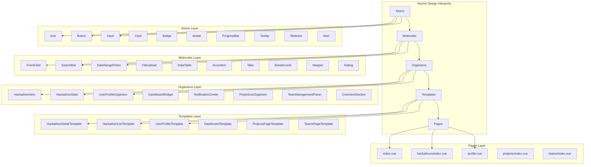

# Atomic Design Gap Analysis Report

## Zusammenfassung

Basierend auf einer umfassenden Analyse aller Vue-Komponenten im Frontend wurden signifikante Lücken in der Atomic Design-Implementierung identifiziert. Das Projekt verfügt über eine gute Grundstruktur, benötigt jedoch erhebliche Verbesserungen für vollständige Atomic Design-Konformität.

## Aktueller Status

### Vorhandene Atomic Design Struktur
✅ **Atoms**: 15+ Komponenten in `components/atoms/`
✅ **Molecules**: 25+ Komponenten in `components/molecules/`  
✅ **Organisms**: 20+ Komponenten in `components/organisms/`
✅ **Templates**: 3 Templates in `components/templates/`

### Probleme und Lücken

## 1. Fehlende Atomic Design Ebenen

### Atoms (Grundlegende UI-Elemente)
**Fehlende kritische Atoms:**
1. **Icon** - Konsistente Icon-Darstellung (aktuell: direkte SVG in Komponenten)
2. **DateDisplay** - Allgemeine Datumsanzeige
3. **TimeDisplay** - Zeit-Anzeige
4. **ProgressBar** - Fortschrittsbalken
5. **Tooltip** - Tooltip-Komponente
6. **AvatarGroup** - Gruppe von Avataren
7. **Chip** - Kleine Chip-Komponente für Tags/Labels
8. **Skeleton** - Loading-Skeleton
9. **Alert** - Alert/Notification-Banner
10. **Divider** - Trennlinie

### Molecules (Kombination von Atoms)
**Fehlende wichtige Molecules:**
1. **DateRangePicker** - Datumsbereichsauswahl
2. **TimeRangePicker** - Zeitbereichsauswahl
3. **FileUpload** - Datei-Upload-Komponente
4. **RichTextEditor** - Rich-Text-Editor
5. **DataTable** - Tabellen-Komponente
6. **Accordion** - Aufklappbare Sektionen
7. **Tabs** - Tab-Komponente (einfachere Version von FilterTabs)
8. **Breadcrumb** - Breadcrumb-Navigation
9. **Stepper** - Schritt-für-Schritt-Assistent
10. **Rating** - Bewertungs-Komponente
11. **Carousel** - Bilderkarussell
12. **Timeline** - Timeline-Darstellung

### Organisms (Komplexe UI-Sektionen)
**Fehlende Organisms:**
1. **UserProfileOrganism** - Komplettes User-Profil
2. **DashboardWidget** - Dashboard-Widget
3. **CalendarOrganism** - Kalender-Komponente
4. **TimelineOrganism** - Timeline-Darstellung
5. **GalleryOrganism** - Bildergalerie
6. **ChatOrganism** - Chat-Komponente
7. **NotificationCenter** - Notification-Center
8. **SearchResultsOrganism** - Suchergebnisse
9. **FilterSidebarOrganism** - Filter-Sidebar
10. **WizardOrganism** - Mehrstufiger Assistent

### Templates
**Fehlende Templates:**
1. **HackathonDetailTemplate** - Hackathon-Detailseite
2. **HackathonListTemplate** - Hackathon-Listenseite
3. **HackathonFormTemplate** - Hackathon-Formular
4. **UserProfileTemplate** - User-Profilseite
5. **DashboardTemplate** - Dashboard-Seite
6. **SettingsTemplate** - Einstellungen-Seite

## 2. Inkonsistente Verzeichnisstruktur

### Komponenten außerhalb der Atomic Design Hierarchie
```
components/
├── AppFooter.vue              # → organisms/layout/
├── AppHeader.vue              # → organisms/layout/ (Wrapper)
├── AppSidebar.vue             # → organisms/layout/
├── HackathonEditForm.vue      # → organisms/hackathons/ (Duplikat)
├── ImprovedStatsCard.vue      # → molecules/ oder organisms/
├── LanguageSwitcher.vue       # → molecules/
├── MobileBottomNav.vue        # → organisms/layout/
├── NotificationContainer.vue  # → organisms/
├── NotificationSettings.vue   # → organisms/
├── TeamSelection.vue          # → organisms/teams/
```

### Feature-spezifische Verzeichnisse (sollten in Atomic Design integriert werden)
```
components/
├── home/                      # Komponenten → atoms/molecules/organisms
│   ├── HomeCtaSection.vue     # → organisms/home/
│   ├── HomeHackathonCard.vue  # → organisms/hackathons/
│   ├── HomeHero.vue           # → organisms/home/
│   ├── HomeProjectCard.vue    # → organisms/projects/
│   └── HomeStatsSection.vue   # → molecules/
├── projects/                  # Komponenten → atoms/molecules/organisms
│   ├── CreatorInfo.vue        # → molecules/projects/
│   ├── ProjectActions.vue     # → molecules/projects/
│   ├── ProjectDetailAtomicWrapper.vue  # → templates/
│   ├── ProjectHeader.vue      # → molecules/projects/
│   ├── ProjectLinks.vue       # → molecules/projects/
│   ├── ProjectListAtomicWrapper.vue    # → templates/
│   ├── ProjectListCard.vue    # → organisms/projects/ (Duplikat)
│   └── TechnologyTags.vue     # → molecules/ (Duplikat)
└── users/                     # Komponenten → atoms/molecules/organisms
    ├── UserCard.vue           # → organisms/users/
    ├── UserProfileOverview.vue # → organisms/users/
    ├── UserProfileSidebar.vue # → organisms/users/
    └── UsersPageHeader.vue    # → molecules/
```

## 3. Direkte HTML-Nutzung in Pages

### Häufige Patterns die Atomic Design Komponenten ersetzen sollten:

1. **Loading States** - Direkte `animate-pulse` divs statt `Skeleton` Atoms
2. **Error States** - Direkte HTML mit SVG-Icons statt `Alert` Atom + `ErrorState` Molecule
3. **Section Headers** - Direkte HTML statt `PageHeader` Molecule
4. **Buttons/Links** - Direkte `button`/`a` Tags statt `Button` Atom
5. **Forms** - Direkte `input`/`select`/`textarea` statt Form Atoms
6. **Icons** - Direkte SVG statt `Icon` Atom
7. **Cards** - Direkte `div` mit Tailwind-Klassen statt `Card` Atom

### Betroffene Pages:
- `pages/index.vue` - Loading/Error States, Section Headers
- `pages/hackathons/index.vue` - Suchleiste, Sortierung
- `pages/profile.vue` - Form-Elemente
- `pages/notifications.vue` - Listen-Elemente
- `pages/teams/[id]/index.vue` - Team-Details

## 4. Duplikate und Redundanzen

### Doppelte Komponenten:
1. `HackathonEditForm.vue` - Existiert in root und `organisms/hackathons/`
2. `ProjectListCard.vue` - Existiert in `projects/` und `organisms/projects/`
3. `TechnologyTags.vue` - Existiert in `projects/` und `molecules/`
4. `TeamManagement.vue` und `TeamManagement.vue.backup` - Backup-Datei

### Ähnliche Komponenten mit unterschiedlicher Implementierung:
1. `StatItem.vue` (Molecule) vs `ImprovedStatsCard.vue` (root)
2. `Card.vue` (Atom) vs direkte card-divs in Pages
3. `Button.vue` (Atom) vs direkte button-Elemente

## 5. TypeScript und Props-Konsistenz

### Probleme:
1. **Inkonsistente Props-Schnittstellen** - Gleiche Daten unterschiedlich benannt
2. **Fehlende TypeScript Interfaces** - Für viele Komponenten
3. **Any-Typen** - In einigen Komponenten
4. **Fehlende Default Values** - Für optionale Props

## Priorisierte Aktionsliste

### Phase 1: Kritische Lücken schließen (Woche 1-2)
1. **Essential Atoms erstellen**:
   - `Icon.vue` - Einheitliche Icon-Darstellung
   - `Skeleton.vue` - Loading States
   - `Alert.vue` - Error/Info/Success Messages
   - `Tooltip.vue` - Tooltips

2. **Kritische Molecules erstellen**:
   - `DateRangePicker.vue` - Für Filter
   - `FileUpload.vue` - Für Datei-Uploads
   - `RichTextEditor.vue` - Für Beschreibungen

3. **Komponenten in Atomic Design Struktur verschieben**:
   - Root-Level Komponenten → entsprechende Verzeichnisse
   - Feature-Verzeichnisse auflösen

### Phase 2: Templates und Organisms (Woche 3-4)
1. **Fehlende Templates erstellen**:
   - Hackathon Templates
   - User Profile Template
   - Dashboard Template

2. **Komplexe Organisms erstellen**:
   - `UserProfileOrganism`
   - `DashboardWidget`
   - `NotificationCenter`

3. **Pages refactoren**:
   - Direkte HTML durch Atomic Design Komponenten ersetzen
   - Templates integrieren

### Phase 3: Optimierung und Konsolidierung (Woche 5-6)
1. **Duplikate entfernen**:
   - Redundante Komponenten konsolidieren
   - Backup-Dateien bereinigen

2. **TypeScript verbessern**:
   - Einheitliche Interfaces definieren
   - Props konsolidieren
   - Type-Safety erhöhen

3. **Testing und Dokumentation**:
   - Unit Tests für neue Komponenten
   - Dokumentation der Atomic Design Struktur
   - Developer Guidelines

## Erfolgskriterien

### Quantitative Metriken:
1. **Atomic Design Coverage**: 90%+ aller Komponenten in korrekter Hierarchie
2. **Duplikation reduzieren**: < 5% (von aktuell ~15%)
3. **Direkte HTML in Pages**: < 10% (von aktuell ~40%)
4. **TypeScript Coverage**: 95%+ Type-Safety

### Qualitative Metriken:
1. **Developer Experience**: Einfacheres Onboarding, schnellere Entwicklung
2. **Code Wartbarkeit**: Bessere Struktur, einfachere Änderungen
3. **UI Konsistenz**: Einheitliches Design durch wiederverwendbare Komponenten
4. **Performance**: Bessere Bundle-Optimierung durch Komponenten-Wiederverwendung

## Risiken und Mitigation

### Technische Risiken:
1. **Breaking Changes** - Mitigation: Feature Flags, Graduelle Migration
2. **Performance Impact** - Mitigation: Bundle-Analyse, Lazy Loading
3. **Visual Regressions** - Mitigation: Visual Testing, Screenshot-Vergleiche

### Organisatorische Risiken:
1. **Team Adoption** - Mitigation: Schulungen, Pair Programming
2. **Zeitaufwand** - Mitigation: Priorisierung, Iterative Implementation
3. **Code Freeze** - Mitigation: Parallel Branches, Feature Toggles

## Nächste Schritte

1. **Plan Review** mit allen Stakeholdern
2. **Priorisierung** basierend auf Business Impact
3. **Implementation Roadmap** erstellen
4. **Development Environment** vorbereiten
5. **Iterative Implementation** starten

## Mermaid Diagramm: Ziel-Architektur



---
*Analyse durchgeführt am: 2026-03-06*
*Nächstes Review: 2026-03-13*