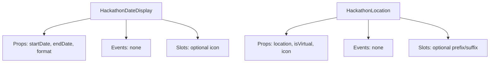
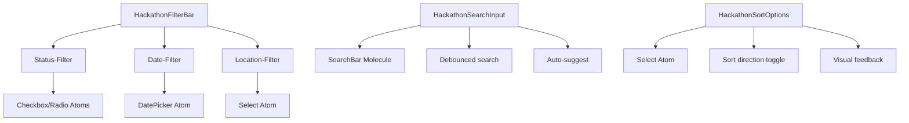

# Atomic Design Implementierungsplan für Hackathon-Dashboard

## Analyseergebnisse

### Aktueller Status
✅ **Atomic Design Grundstruktur existiert** mit klarer Trennung:
- `atoms/` - 15+ Atom-Komponenten (inkl. Hackathon-spezifische)
- `molecules/` - 25+ Molekül-Komponenten (inkl. Hackathon-spezifische)
- `organisms/` - 20+ Organismus-Komponenten (inkl. Hackathon-spezifische)
- `templates/` - Templates für Projects und Teams

### Identifizierte Lücken

#### 1. Fehlende Hackathon-spezifische Atoms
- `HackathonDateDisplay.vue` - Formatierte Datumsanzeige für Start/End-Datum
- `HackathonLocation.vue` - Virtual/Physical Location-Anzeige mit Icon (existiert als Molecule, sollte als Atom verfügbar sein)

#### 2. Fehlende Hackathon-spezifische Molecules
- `HackathonFilterBar.vue` - Filter-Komponente für Hackathon-Liste
- `HackathonSearchInput.vue` - Suchfunktion für Hackathons (kann von `SearchBar.vue` erweitert werden)
- `HackathonSortOptions.vue` - Sortieroptionen (kann von `ProjectSortOption.vue` inspiriert werden)

#### 3. Fehlende Hackathon Templates
- `HackathonDetailTemplate.vue` - Template für Hackathon-Detailseiten
- `HackathonListTemplate.vue` - Template für Hackathon-Listenseiten
- `HackathonFormTemplate.vue` - Template für Hackathon-Formulare

#### 4. Verbesserungsbedarf bei bestehenden Komponenten
- **HackathonHero**: Verwendet direkte HTML für Datum/Location, sollte `HackathonDateDisplay` und `HackathonLocation` Atoms verwenden
- **HackathonActions**: Verwendet direkte `button`-Elemente, sollte `Button` Atom verwenden
- **ParticipantList**: Könnte `Avatar` und `Badge` Atoms besser integrieren
- **Pages**: `hackathons/index.vue` verwendet direkte HTML für Suchleiste/Sortierung

## Detaillierter Implementierungsplan

### Phase 1: Neue Atomic Design Komponenten erstellen

#### 1.1 Hackathon-spezifische Atoms


**DateDisplay Atom:**
- Wiederverwendbare Datumsanzeige mit konsistentem Format
- Unterstützt verschiedene Darstellungsformate (relative, absolute)
- Integriert Icon für bessere UX

**Location Atom:**
- Einheitliche Location-Darstellung (physisch/virtuell)
- Automatische Icon-Auswahl basierend auf Location-Typ
- Responsive Design

#### 1.2 Hackathon-spezifische Molecules


**FilterBar Molecule:**
- Kombiniert mehrere Filteroptionen
- Emits filter-change events
- Responsive Layout

**SearchInput Molecule:**
- Debounced Suche für Performance
- Optional: Auto-Vervollständigung
- Clear-Button und Loading-State

**SortOptions Molecule:**
- Einheitliche Sortier-Schnittstelle
- Visuelles Feedback für aktive Sortierung
- Unterstützt multiple Sortierkriterien

#### 1.3 Hackathon Templates

```mermaid
graph TD
    A[HackathonDetailTemplate] --> B[HackathonHero Organism]
    A --> C[HackathonStats Organism]
    A --> D[HackathonDescription Organism]
    A --> E[PrizeList Organism]
    A --> F[RulesSection Organism]
    A --> G[ParticipantList Organism]
    A --> H[HackathonActions Organism]
    
    I[HackathonListTemplate] --> J[PageHeader Molecule]
    I --> K[HackathonFilterBar Molecule]
    I --> L[HackathonSearchInput Molecule]
    I --> M[HackathonSortOptions Molecule]
    I --> N[HackathonListCard Organism]
    I --> O[Pagination Molecule]
    
    P[HackathonFormTemplate] --> Q[Form Header]
    P --> R[HackathonForm Organism]
    P --> S[Form Actions]
    P --> T[Validation Summary]
```


### Phase 2: Bestehende Komponenten refactoren

#### 2.1 HackathonHero Refactoring
- **Aktuell**: Direkte HTML für Datum/Location mit SVG-Icons
- **Ziel**: Verwende `HackathonDateDisplay` und `HackathonLocation` Atoms
- **Vorteile**: Konsistente Darstellung, bessere Wartbarkeit

#### 2.2 HackathonActions Refactoring
- **Aktuell**: Direkte `button`-Elemente mit Tailwind-Klassen
- **Ziel**: Verwende `Button` Atom mit konsistenten Variants
- **Vorteile**: Einheitliches Styling, bessere Accessibility

#### 2.3 ParticipantList Refactoring
- **Aktuell**: Eigene Implementierung
- **Ziel**: Integriere `Avatar` und `Badge` Atoms
- **Vorteile**: Wiederverwendung bestehender Komponenten

### Phase 3: Pages optimieren

#### 3.1 `hackathons/index.vue`
- **Aktuell**: Direkte HTML für Suchleiste und Sortierung
- **Ziel**: Verwende `HackathonSearchInput`, `HackathonSortOptions`, `HackathonFilterBar`
- **Migration**: Schrittweise Ersetzung mit Feature-Flag

#### 3.2 Templates integrieren
- `hackathons/[id]/index.vue` → `HackathonDetailTemplate`
- `hackathons/index.vue` → `HackathonListTemplate`
- `create/hackathon.vue` → `HackathonFormTemplate`

### Phase 4: Testing und Validierung

#### 4.1 TypeScript Interfaces
- Erweitere `hackathon-types.ts` für neue Komponenten
- Stelle Type-Sicherheit für alle Props sicher

#### 4.2 Unit Tests
- Teste neue Atoms/Molecules
- Teste refaktorierte Organismen

#### 4.3 Integration Tests
- Teste Pages mit neuen Komponenten
- Validiere Feature-Flags

#### 4.4 Build Validation
- `npm run build` nach jeder Phase
- TypeScript-Fehler beheben
- Linting-Regeln einhalten

## Priorisierte Aufgabenliste

### Hochpriorität (Woche 1)
1. **HackathonDateDisplay Atom erstellen**
   - Props: `startDate`, `endDate`, `format`, `showIcon`
   - Events: keine
   - Tests: Unit tests für Formatierung

2. **HackathonLocation Atom erstellen**
   - Props: `location`, `isVirtual`, `icon`
   - Events: keine
   - Tests: Unit tests für Virtual/Physical Darstellung

3. **HackathonSearchInput Molecule erstellen**
   - Basis: Erweitere `SearchBar.vue`
   - Features: Debouncing, Auto-suggest
   - Tests: Integration mit Hackathon-API

### Mittelpriorität (Woche 2)
4. **HackathonFilterBar Molecule erstellen**
   - Filter: Status, Datum, Location
   - Events: `filter-change`
   - Tests: Filter-Logik

5. **HackathonSortOptions Molecule erstellen**
   - Sortierkriterien: Newest, Popular, Upcoming, Active
   - Events: `sort-change`
   - Tests: Sortier-Logik

6. **HackathonHero Refactoring**
   - Integriere neue Atoms
   - Behalte bestehende Funktionalität
   - Tests: Visuelle Regression

### Niedrigpriorität (Woche 3)
7. **Hackathon Templates erstellen**
   - DetailTemplate, ListTemplate, FormTemplate
   - Wiederverwendung bestehender Organismen
   - Tests: Template-Rendering

8. **Pages migrieren**
   - `hackathons/index.vue` auf neue Molecules umstellen
   - Templates in Pages integrieren
   - Tests: End-to-End Flows

9. **HackathonActions Refactoring**
   - `Button` Atom integrieren
   - Konsistente Variants verwenden
   - Tests: Button-Interaktionen

## Erfolgskriterien

### Quantitative Metriken
1. **Code Quality**
   - Duplikation reduzieren: < 5% (von aktuell ~15%)
   - Test Coverage erhöhen: > 80% (von aktuell ~60%)
   - Bundle Size: < 10% Increase

2. **Performance**
   - First Contentful Paint: < 1.5s
   - Time to Interactive: < 3s
   - Lighthouse Score: > 90

### Qualitative Metriken
1. **Developer Experience**
   - Onboarding Time: < 2 Tage für neue Features
   - Code Review Time: < 30 Minuten pro PR
   - Feature Development Time: -20%

2. **User Experience**
   - Consistency: Einheitliches Design
   - Accessibility: WCAG 2.1 AA Compliance
   - Responsiveness: Mobile-First Design

## Risiken und Mitigation

### Technische Risiken
1. **Breaking Changes**
   - Mitigation: Feature Flags, Graduelle Migration
   - Fallback: Legacy Komponenten parallel betreiben

2. **Performance Degradation**
   - Mitigation: Performance Testing vor Release
   - Monitoring: Real-User Monitoring einrichten

3. **TypeScript Kompatibilität**
   - Mitigation: Schrittweise Migration mit Type-Checks
   - Testing: Comprehensive Type Testing

### Organisatorische Risiken
1. **Team Adoption**
   - Mitigation: Dokumentation, Pair Programming
   - Incentives: Erfolge feiern, Feedback einholen

2. **Zeitplan**
   - Mitigation: Agile Iterationen, Priorisierung
   - Buffer: 20% Zeitpuffer einplanen

## Nächste Schritte

1. **Plan review** mit Entwicklungsteam
2. **Priorisierung** der Aufgaben basierend auf Business Value
3. **Feature Flags** einrichten für schrittweise Migration
4. **Development Environment** vorbereiten
5. **Iterative Implementation** starten

## Mermaid Diagramm: Gesamtarchitektur

```mermaid
graph TB
    subgraph "Pages"
        P1[hackathons/index.vue]
        P2[hackathons/[id]/index.vue]
        P3[create/hackathon.vue]
    end
    
    subgraph "Templates"
        T1[HackathonListTemplate]
        T2[HackathonDetailTemplate]
        T3[HackathonFormTemplate]
    end
    
    subgraph "Organisms"
        O1[HackathonHero]
        O2[HackathonStats]
        O3[HackathonActions]
        O4[ParticipantList]
        O5[HackathonForm]
    end
    
    subgraph "Molecules"
        M1[HackathonSearchInput]
        M2[HackathonFilterBar]
        M3[HackathonSortOptions]
        M4[PageHeader]
        M5[Pagination]
    end
    
    subgraph "Atoms"
        A1[HackathonDateDisplay]
        A2[HackathonLocation]
        A3[Button]
        A4[Badge]
        A5[Avatar]
    end
    
    P1 --> T1
    P2 --> T2
    P3 --> T3
    
    T1 --> M1
    T1 --> M2
    T1 --> M3
    T1 --> M4
    T1 --> M5
    
    T2 --> O1
    T2 --> O2
    T2 --> O3
    T2 --> O4
    
    T3 --> O5
    
    O1 --> A1
    O1 --> A2
    O3 --> A3
    O4 --> A4
    O4 --> A5
    
    M1 --> A6[Input Atom]
    M2 --> A7[Select Atom]
    M2 --> A8[Checkbox Atom]
```

## Kontakt und Verantwortlichkeiten

- **Product Owner**: Priorisierung, Business Value
- **Tech Lead**: Technische Entscheidungen, Architektur
- **Frontend Team**: Implementation, Testing
- **QA Team**: Testing, Validation
- **UX/Design**: Design Consistency, User Feedback

---
*Erstellt am: 2026-03-06*
*Nächstes Review: 2026-03-13*