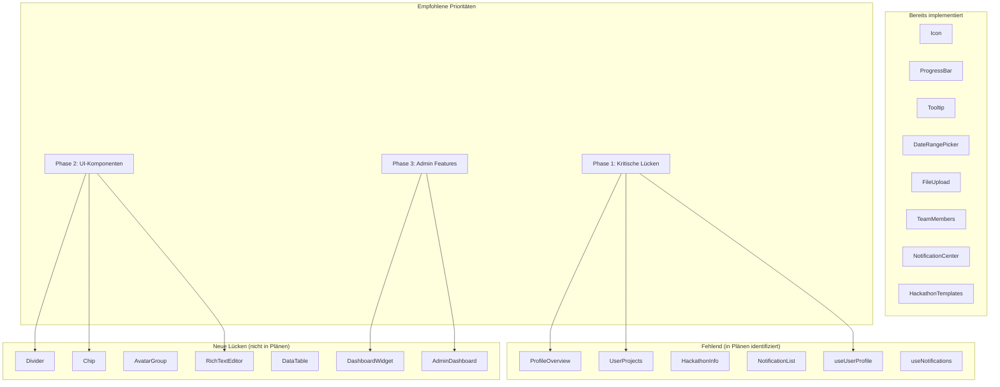

# Analyse fehlender Atomic Design Implementierungen

## Zusammenfassung

Basierend auf einer umfassenden Analyse aller Pläne, Dokumente und der aktuellen Frontend-Struktur wurden sowohl bereits behobene Lücken als auch weiterhin fehlende Implementierungen identifiziert. Viele der in früheren Plänen als fehlend markierten Komponenten sind mittlerweile implementiert, jedoch bestehen weiterhin Lücken in den Bereichen Design System, Admin-Funktionen und erweiterte UI-Komponenten.

## Methodik

1. **Pläne und Dokumente analysiert**:
   - `atomic_design_gap_analysis_report.md`
   - `atomic_design_implementation_plan.md`
   - `MISSING_COMPONENTS_SPECIFICATION.md`
   - Weitere Atomic Design-bezogene Pläne im `plans/`-Verzeichnis

2. **Aktuelle Frontend-Struktur untersucht**:
   - Verzeichnisse `atoms/`, `molecules/`, `organisms/`, `templates/` in `frontend3/app/components/`
   - Composables in `frontend3/app/composables/`
   - Root-Level Komponenten

3. **Vergleich durchgeführt**:
   - Gegenüberstellung der in Plänen als fehlend identifizierten Komponenten mit existierenden Komponenten
   - Identifikation von veralteten Planungsdokumenten

## Ergebnisse

### Bereits implementierte "fehlende" Komponenten

Die folgenden Komponenten wurden in früheren Plänen als fehlend aufgeführt, sind jedoch mittlerweile implementiert:

#### Atoms
- ✅ `Icon.vue` (existiert)
- ✅ `ProgressBar.vue` (existiert)
- ✅ `Tooltip.vue` (existiert)
- ✅ `Skeleton.vue` (existiert)
- ✅ `Alert.vue` (existiert)
- ✅ `HackathonDateDisplay.vue` (existiert)
- ✅ `HackathonStatusBadge.vue` (existiert)

#### Molecules
- ✅ `DateRangePicker.vue` (existiert)
- ✅ `FileUpload.vue` (existiert)
- ✅ `HackathonFilterBar.vue` (existiert)
- ✅ `HackathonSearchInput.vue` (existiert)
- ✅ `HackathonSortOptions.vue` (existiert)
- ✅ `HackathonLocation.vue` (existiert als Molecule)
- ✅ `MemberCard.vue` (existiert)
- ✅ `NotificationItem.vue` (existiert)

#### Organisms
- ✅ `TeamMembers.vue` (existiert)
- ✅ `TeamProjectsPanel.vue` (existiert als TeamProjectsPanel)
- ✅ `NotificationCenter.vue` (existiert)

#### Templates
- ✅ `HackathonDetailTemplate.vue` (existiert)
- ✅ `HackathonListTemplate.vue` (existiert)
- ✅ `HackathonFormTemplate.vue` (existiert)

#### Composables
- ✅ `useTeamMembers.ts` (existiert)

### Weiterhin fehlende Komponenten (in Plänen identifiziert)

Die folgenden Komponenten wurden in `MISSING_COMPONENTS_SPECIFICATION.md` als benötigt aufgeführt, fehlen jedoch noch:

#### Organisms
1. **ProfileOverview.vue** - Übersicht der Benutzerstatistiken und Informationen
2. **UserProjects.vue** - Liste der Projekte des Benutzers
3. **UserTeams.vue** - Liste der Teams des Benutzers
4. **HackathonInfo.vue** - Detaillierte Informationen über einen Hackathon
5. **HackathonProjects.vue** - Projekte im Hackathon
6. **NotificationList.vue** - Liste von Benachrichtigungen mit Filter- und Sortieroptionen
7. **NotificationFilters.vue** - Filter- und Sortieroptionen für Benachrichtigungen
8. **EditProjectForm.vue** - Formular zur Bearbeitung eines bestehenden Projekts

#### Composables
1. **useUserProfile.ts** - Logik für Benutzerprofil-Daten
2. **useNotifications.ts** - Logik für Benachrichtigungen
3. **useHackathonData.ts** - Logik für Hackathon-Daten

### Neue, in Plänen nicht erwähnte Lücken

#### Atoms (Grundlegende UI-Elemente)
1. **Divider** - Trennlinie für visuelle Trennung
2. **Chip** - Kleine Chip-Komponente für Tags/Labels (unterschiedlich zu `Tag.vue`)
3. **AvatarGroup** - Gruppe von Avataren mit Überlappung
4. **DateDisplay** - Allgemeine Datumsanzeige (nicht hackathon-spezifisch)
5. **TimeDisplay** - Zeit-Anzeige
6. **Rating** - Bewertungs-Sterne/Symbole
7. **Stepper** - Schritt-Indikator
8. **Breadcrumb** - Breadcrumb-Navigation (als Atom/Molecule)

#### Molecules (Kombination von Atoms)
1. **RichTextEditor** - Rich-Text-Editor für Beschreibungen
2. **DataTable** - Tabellen-Komponente mit Sortierung, Pagination
3. **TimeRangePicker** - Zeitbereichsauswahl
4. **MultiSelect** - Mehrfachauswahl-Dropdown
5. **ColorPicker** - Farbauswahl-Komponente
6. **Accordion** - Aufklappbare Sektionen
7. **Tabs** - Einfache Tab-Komponente (unterschiedlich zu `FilterTabs`)
8. **Carousel** - Bilderkarussell
9. **Timeline** - Timeline-Darstellung

#### Organisms (Komplexe UI-Sektionen)
1. **DashboardWidget** - Widget für Dashboard (Analytics, Statistiken)
2. **CalendarOrganism** - Kalender-Komponente für Event-Planung
3. **GalleryOrganism** - Bildergalerie mit Lightbox
4. **ChatOrganism** - Chat-Komponente für Team-Kommunikation
5. **SearchResultsOrganism** - Suchergebnisse mit Facetten
6. **FilterSidebarOrganism** - Filter-Sidebar für komplexe Filterung
7. **WizardOrganism** - Mehrstufiger Assistent für komplexe Prozesse
8. **AdminDashboard** - Admin-spezifisches Dashboard
9. **UserManagement** - Benutzerverwaltung
10. **ContentManagement** - Inhaltsverwaltung

#### Templates
1. **UserProfileTemplate** - Template für Benutzerprofilseite
2. **DashboardTemplate** - Template für Dashboard-Seite
3. **SettingsTemplate** - Template für Einstellungen-Seite
4. **AdminTemplate** - Template für Admin-Bereich
5. **ErrorTemplate** - Template für Fehlerseiten (404, 500)

#### Composables (Cross-Cutting Concerns)
1. **useFormValidation** - Formularvalidierung
2. **useLocalStorage** - LocalStorage-Integration
3. **useFetch** - Abstraktion für API-Aufrufe
4. **usePagination** - Paginierungslogik
5. **useDragAndDrop** - Drag & Drop-Funktionalität
6. **useDebounce** - Debouncing für Eingaben

#### Design System & Dokumentation
1. **Storybook Integration** - Komponentendokumentation
2. **Design Tokens** - Zentrale Design-Variablen
3. **Theme-Switching** - Erweiterte Theme-Unterstützung
4. **Accessibility Testing** - Barrierefreiheitstests

## Priorisierungsempfehlungen

### Phase 1: Kritische Lücken (hohe Auswirkung)
1. **ProfileOverview.vue** - Wichtig für Benutzerprofil
2. **UserProjects.vue** und **UserTeams.vue** - Kernfunktionalität
3. **useUserProfile.ts** und **useHackathonData.ts** - Grundlegende Datenlogik
4. **Divider** und **Chip** Atoms - Häufig benötigte UI-Elemente

### Phase 2: Erweiterte UI-Komponenten (mittlere Auswirkung)
1. **RichTextEditor** - Für Projektbeschreibungen
2. **DataTable** - Für Admin-Bereiche
3. **NotificationList.vue** und **NotificationFilters.vue** - Benachrichtigungssystem
4. **Accordion** und **Tabs** - Verbesserte Navigation

### Phase 3: Admin & Enterprise Features (geringere Priorität)
1. **AdminDashboard** und **UserManagement**
2. **CalendarOrganism** und **GalleryOrganism**
3. **WizardOrganism** für komplexe Workflows

## Technische Empfehlungen

1. **Planungsdokumente aktualisieren**:
   - `atomic_design_gap_analysis_report.md` sollte den aktuellen Stand reflektieren
   - `MISSING_COMPONENTS_SPECIFICATION.md` um bereits implementierte Komponenten bereinigen

2. **Atomic Design Konsistenz prüfen**:
   - Komponenten, die außerhalb der Hierarchie liegen (z.B. `AppFooter.vue`, `AppHeader.vue`) in entsprechende Verzeichnisse verschieben
   - Feature-spezifische Verzeichnisse (`projects/`, `users/`) in Atomic Design-Struktur integrieren

3. **TypeScript und Props-Konsistenz verbessern**:
   - Einheitliche Interfaces für ähnliche Datenstrukturen
   - Type-Safety für alle Komponenten sicherstellen

4. **Testing-Strategie erweitern**:
   - Unit Tests für neue Atoms/Molecules
   - Integrationstests für Organisms
   - Visual Regression Testing für UI-Konsistenz

## Nächste Schritte

1. **Plan Review** mit Entwicklungsteam durchführen
2. **Priorisierte Aufgabenliste** erstellen basierend auf Business Impact
3. **Implementation Roadmap** mit klaren Meilensteinen definieren
4. **Iterative Implementation** starten, beginnend mit Phase 1

## Mermaid Diagramm: Atomic Design Lücken-Übersicht

## Fazit

Die Atomic Design-Implementierung im Hackathon-Dashboard hat signifikante Fortschritte gemacht, wobei viele der ursprünglich identifizierten Lücken geschlossen wurden. Allerdings bestehen weiterhin Lücken in den Bereichen Benutzerprofil, Benachrichtigungssystem und erweiterte UI-Komponenten. Zusätzlich wurden neue Lücken identifiziert, die in den bisherigen Plänen nicht berücksichtigt wurden.

Eine priorisierte, iterative Implementation unter Berücksichtigung der Business-Anforderungen wird empfohlen, um das Design System zu vervollständigen und die Developer Experience sowie UI-Konsistenz weiter zu verbessern.

---
**Analyse durchgeführt am**: 2026-03-08  
**Nächstes Review**: 2026-03-15  
**Verantwortlich**: Architect Mode Analysis