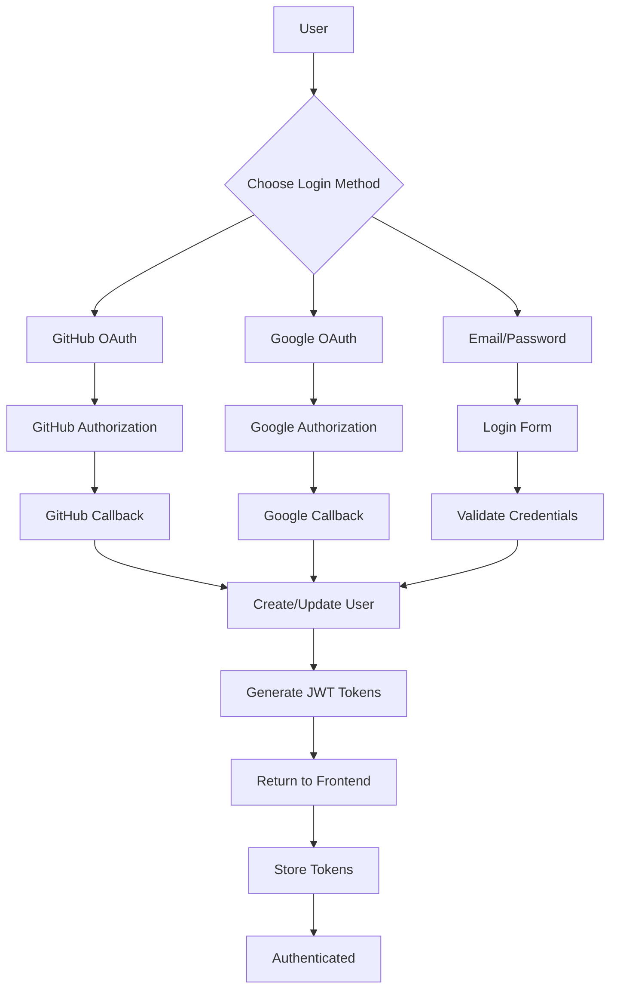
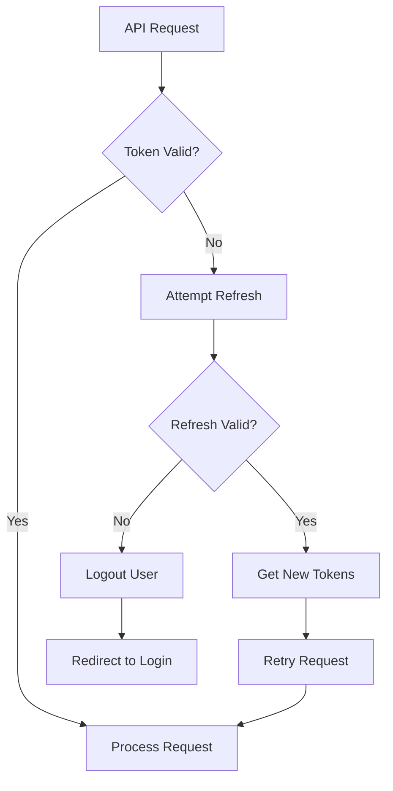

# Authentication System Implementation Summary

## Overview
Complete redesign of the authentication system to support:
1. **Google OAuth** alongside existing GitHub OAuth
2. **Email/Password authentication** with proper security
3. **Enhanced JWT system** with refresh tokens and auto-refresh

## Key Components

### 1. Database Changes
- **Users table**: Add `password_hash`, `google_id`, `email_verified`, `auth_method`, `last_login`
- **Refresh tokens table**: New table for secure refresh token storage
- **Password reset tokens table**: Optional table for password reset flow

### 2. Backend Implementation
- **Google OAuth**: New `google_oauth.py` module with complete OAuth flow
- **Email/Password**: New endpoints for registration, login, password reset
- **Enhanced JWT**: Short-lived access tokens (15min) + long-lived refresh tokens (7 days)
- **Token rotation**: Refresh tokens are rotated on each use for security

### 3. Frontend Updates
- **Auth store**: Updated to handle multiple login methods and token management
- **UI components**: Google OAuth button and email/password forms
- **Auto-refresh**: Interceptor that automatically refreshes tokens before expiration

## Implementation Plan

### Phase 1: Database Migration (Week 1)
1. Create Alembic migration for schema changes
2. Run data migration for existing users
3. Test backward compatibility

### Phase 2: Backend Implementation (Week 2)
1. Implement Google OAuth endpoints
2. Implement email/password authentication
3. Update JWT token generation with refresh tokens
4. Add token refresh and revocation endpoints

### Phase 3: Frontend Implementation (Week 3)
1. Update auth store for new authentication methods
2. Add Google OAuth button to login page
3. Create email/password login and registration forms
4. Implement token auto-refresh interceptor

### Phase 4: Testing & Deployment (Week 4)
1. Test all authentication flows
2. Security review and penetration testing
3. Update documentation
4. Deploy to production

## Security Features

1. **Password Security**: bcrypt hashing with appropriate work factor
2. **Token Security**: Refresh tokens stored hashed in database
3. **Rate Limiting**: Protection against brute force attacks
4. **Email Verification**: Required for email/password users
5. **Token Rotation**: Refresh tokens rotated on each use
6. **CSRF Protection**: State parameter in OAuth flows

## API Endpoints

### New Endpoints:
```
GET    /api/auth/google           # Initiate Google OAuth
GET    /api/auth/google/callback  # Google OAuth callback
POST   /api/auth/register         # Email/password registration
POST   /api/auth/login            # Email/password login
POST   /api/auth/refresh          # Refresh tokens (enhanced)
POST   /api/auth/logout           # Logout (revoke tokens)
POST   /api/auth/verify-email     # Verify email address
POST   /api/auth/forgot-password  # Request password reset
POST   /api/auth/reset-password   # Reset password
```

### Enhanced Endpoints:
```
POST   /api/auth/refresh          # Now supports token rotation
```

## Environment Variables

### New Variables Required:
```
# Google OAuth
GOOGLE_CLIENT_ID=your_client_id
GOOGLE_CLIENT_SECRET=your_client_secret
GOOGLE_CALLBACK_URL=http://localhost:8000/api/auth/google/callback

# JWT Settings
ACCESS_TOKEN_EXPIRE_MINUTES=15
REFRESH_TOKEN_EXPIRE_DAYS=7

# Email Settings
SMTP_HOST=smtp.gmail.com
SMTP_PORT=587
SMTP_USER=your_email@gmail.com
SMTP_PASSWORD=your_app_password
EMAIL_FROM=noreply@yourdomain.com
```

## Migration Strategy

### Backward Compatibility:
- Existing GitHub OAuth continues to work unchanged
- Current JWT tokens remain valid until expiration
- Gradual migration to new token system

### Data Migration:
- Existing users get `auth_method='github'` and `email_verified=True`
- New columns are nullable to avoid breaking changes

## Testing Strategy

### Unit Tests:
- Password hashing and verification
- Token generation and validation
- OAuth flow functions

### Integration Tests:
- Complete OAuth flows with mock providers
- Email/password registration and login
- Token refresh and rotation

### End-to-End Tests:
- User registration flow
- Login with all methods (GitHub, Google, email/password)
- Token expiration and auto-refresh
- Logout and token revocation

## Risk Mitigation

1. **Data Loss**: Full database backup before migration
2. **Downtime**: Deploy during low-traffic periods
3. **Security**: Thorough security review before production
4. **Rollback**: Prepared rollback migration if issues arise

## Success Metrics

1. ✅ Users can authenticate via GitHub, Google, or email/password
2. ✅ Tokens automatically refresh before expiration
3. ✅ Refresh tokens properly rotated and revoked
4. ✅ All existing functionality remains working
5. ✅ Security vulnerabilities addressed

## Next Steps

1. **Review this plan** and provide feedback
2. **Set up Google OAuth** in Google Cloud Console
3. **Create staging environment** for testing
4. **Begin implementation** following the phased approach

## Diagrams

### Authentication Flow:


### Token Refresh Flow:


## Questions for Review

1. Are there any specific requirements for the email/password registration form?
2. Should we implement social account linking (connect Google to existing account)?
3. What level of password strength validation is required?
4. Should email verification be mandatory before allowing login?
5. Are there any specific UI/UX requirements for the login page?

## Approval Request

Please review the complete plan in the `/plans` directory:
- `auth-redesign-plan.md` - High-level architecture
- `database-migration.md` - Database changes and migration
- `google-oauth-implementation.md` - Google OAuth details
- `authentication-implementation-summary.md` - This summary

Once approved, we can proceed with implementation in Code mode.