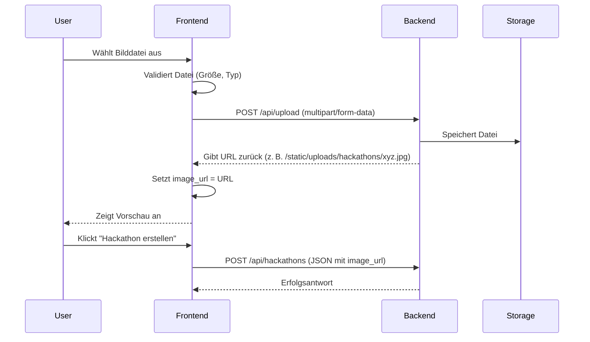

# Plan: Hackathon-Erstellungsformular – Bild-Upload-Fix

## Problem
Das Hackathon-Erstellungsformular lädt Bilder derzeit als Base64-Daten-URLs (mittels `FileReader.readAsDataURL`) und sendet diese an die API. Die Backend-Validierung lehnt Base64-Daten-URLs mit folgender Fehlermeldung ab:

> "Base64 data URLs are not allowed for image fields. Please upload the file via the upload endpoint."

## Lösung
Statt Base64-Daten zu senden, muss die Datei über den separaten Upload-Endpoint (`/api/upload`) hochgeladen werden. Die zurückgegebene URL wird dann im `image_url`-Feld des Hackathon-Erstellungsrequests verwendet.

## Betroffene Dateien
1. `frontend3/app/pages/create/hackathon.vue` – Hauptseite mit Formularlogik
2. `frontend3/app/components/organisms/forms/HackathonForm.vue` – Formularkomponente (nur UI)
3. `frontend3/app/utils/fileUpload.ts` – Bereits vorhandener Upload-Service
4. `backend/app/api/v1/uploads/routes.py` – Upload-Endpoint (bereits funktionsfähig)
5. `backend/app/domain/schemas/hackathon.py` – Validierung (keine Änderung nötig)

## Implementierungsschritte

### 1. Frontend-Logik anpassen (`hackathon.vue`)
- Importiere `uploadFile` aus `@/utils/fileUpload`
- Ersetze `handleHackathonImageUpload`:
  - Lade die Datei mit `uploadFile(file, { type: 'hackathon' })` hoch
  - Speichere die zurückgegebene URL in `hackathonForm.value.image_url`
  - Behalte eine Vorschau-URL (DataURL) für die Anzeige bei (optional)
- Füge Fehlerbehandlung hinzu (z. B. bei Netzwerkfehlern, ungültigen Dateien)
- Zeige eine Ladeanzeige während des Uploads an (optional)

### 2. UI-Verbesserungen (`HackathonForm.vue`)
- Zeige einen Upload-Fortschritt an (z. B. Spinner), während die Datei hochgeladen wird
- Zeige eine Fehlermeldung an, wenn der Upload fehlschlägt
- Erlaube das erneute Hochladen bei Fehlern

### 3. Backend-Validierung prüfen
- Stelle sicher, dass der Upload-Endpoint korrekt konfiguriert ist und Dateien im Verzeichnis `uploads/hackathons/` speichert
- Überprüfe, dass die zurückgegebene URL dem erwarteten Format entspricht (z. B. `/static/uploads/hackathons/...`)

### 4. Testen
- Lade ein Bild im Formular hoch und verifiziere, dass die URL (nicht Base64) gesendet wird
- Teste Fehlerfälle (zu große Datei, falscher Dateityp, Netzwerkausfall)
- Stelle sicher, dass das erstellte Hackathon das Bild korrekt anzeigt

### 5. Dokumentation aktualisieren
- Füge einen Kommentar im Code hinzu, der den Upload-Mechanismus erklärt
- Aktualisiere ggf. die README oder Entwicklerdokumentation

## Technische Details

### Upload-Flow


### Code-Änderungen (Auszug)

**Vorher:**
```typescript
const handleHackathonImageUpload = (event: Event) => {
  const target = event.target as HTMLInputElement
  const file = target.files?.[0]
  if (file) {
    const reader = new FileReader()
    reader.onload = (e) => {
      hackathonForm.value.image_url = e.target?.result as string
    }
    reader.readAsDataURL(file)
  }
}
```

**Nachher:**
```typescript
import { uploadFile } from '@/utils/fileUpload'

const handleHackathonImageUpload = async (event: Event) => {
  const target = event.target as HTMLInputElement
  const file = target.files?.[0]
  if (!file) return

  // Optional: Vorschau für UI (DataURL)
  const previewUrl = URL.createObjectURL(file)
  // (kann in separate Variable gespeichert werden)

  try {
    const result = await uploadFile(file, { type: 'hackathon' })
    hackathonForm.value.image_url = result.url
    uiStore.showSuccess('Bild hochgeladen', 'Das Bild wurde erfolgreich hochgeladen.')
  } catch (error) {
    uiStore.showError('Upload fehlgeschlagen', error.message)
    // Optional: input zurücksetzen
    if (target) target.value = ''
  }
}
```

## Offene Fragen
1. Soll der Upload sofort beim Dateiauswahl erfolgen oder erst beim Formularabsenden? (Empfehlung: sofort)
2. Sollen wir eine maximale Dateigröße von 10 MB beibehalten? (aktuell in `fileUpload.ts` definiert)
3. Sollen wir das Bild vor dem Upload komprimieren? (nicht im Scope)

## Risiken
- Netzwerkunterbrechung während des Uploads → Fehlerbehandlung nötig
- Parallelität: Mehrere gleichzeitige Uploads könnten konkurrieren (selten)
- Backend-Speicherplatz: Unbegrenzte Uploads könnten den Speicher füllen (bereits durch `file_upload_service` gemanaged)

## Erfolgskriterien
- Der Fehler "Base64 data URLs are not allowed" tritt nicht mehr auf.
- Hochgeladene Bilder werden im Hackathon-Detail korrekt angezeigt.
- Die Benutzererfahrung bleibt flüssig (Upload-Feedback, Fehlermeldungen).

## Nächste Schritte
1. Benutzer bestätigt den Plan.
2. Wechsel in den Code-Modus zur Implementierung.
3. Schrittweise Umsetzung gemäß Todo-Liste.