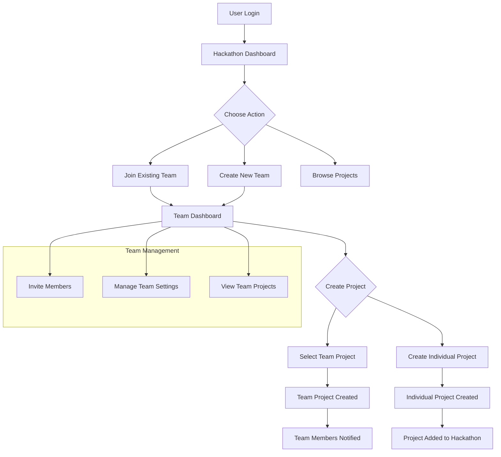

# Hackathon Team-Project Workflow Architecture

## Overview
This document outlines the comprehensive architecture for improving the hackathon team and project workflow, ensuring a seamless user experience from login to project creation.

## Current State Analysis

### Existing Architecture
- **Models**: Hackathon, Team, Project, TeamMember, TeamInvitation
- **Relationships**: 
  - Hackathon → Teams (one-to-many)
  - Hackathon → Projects (one-to-many)  
  - Team → Projects (one-to-many, optional)
  - Team → TeamMembers (one-to-many)
  - Project → User (owner, many-to-one)

### Identified Gaps
1. **Missing team filtering in project queries** - No way to get projects by team_id
2. **No team selection in project creation UI** - Users cannot associate projects with teams
3. **Limited workflow guidance** - Users navigate between separate pages without clear guidance
4. **Missing team-project relationship enforcement** - No validation that team belongs to same hackathon

## Improved User Workflow



## Backend Enhancements

### Schema Updates
1. **ProjectCreate Schema**: Add optional `team_id` field
2. **ProjectUpdate Schema**: Add optional `team_id` field  
3. **TeamWithProjects Schema**: Extend TeamWithMembers with project count and list

### New CRUD Functions
1. `get_projects_by_team(db, team_id, skip, limit)` - Get projects for a team
2. `get_teams_by_user_and_hackathon(db, user_id, hackathon_id)` - Get user's teams for hackathon
3. `validate_user_team_membership(db, user_id, team_id)` - Check if user can create projects for team
4. `validate_team_hackathon_consistency(db, team_id, hackathon_id)` - Ensure team belongs to hackathon

### New Endpoints
1. `GET /api/teams/{team_id}/projects` - Get all projects for a team
2. `GET /api/users/me/teams/{hackathon_id}` - Get user's teams for specific hackathon
3. `GET /api/hackathons/{hackathon_id}/teams/available` - Get teams user can join/create projects for

### Enhanced Validation
1. **Project Creation**: Validate user is team member if `team_id` provided
2. **Project Updates**: Allow team members (not just owner) to update team projects
3. **Consistency Check**: Ensure team belongs to same hackathon as project

## Frontend Improvements

### Component Updates
1. **Project Creation Form** (`create.vue`):
   - Add team selection dropdown after hackathon selection
   - Show "Create Team" link if user has no teams
   - Team project visibility toggle

2. **Team Page** (`teams/[id]/index.vue`):
   - Prominent "Create Project" button
   - Team projects section
   - Team statistics (members, projects, activity)

3. **Hackathon Page** (`hackathons/[id]/index.vue`):
   - Team creation/joining section
   - "Create Project with Team" workflow button
   - Teams user can join

### New Components
1. **TeamSelection.vue**: Dropdown for selecting team when creating project
2. **TeamProjects.vue**: Displays projects belonging to a team
3. **WorkflowProgress.vue**: Breadcrumb-style progress indicator

### Store Updates
1. **Team Store** (`team.ts`):
   - Add method to fetch user's teams for specific hackathon
   - Add method to fetch team projects
   - Team selection state management

2. **Project Store** (create or update):
   - Add `team_id` to project creation methods
   - Add method to fetch projects by team

## Implementation Phases

### Phase 1: Backend Foundation (Week 1)
1. Update schemas and CRUD functions
2. Add new endpoints for team-project relationships
3. Implement validation logic

### Phase 2: Frontend Core (Week 2)
1. Update project creation form with team selection
2. Enhance team page with project creation
3. Create TeamSelection component

### Phase 3: Workflow Integration (Week 3)
1. Add workflow progress indicators
2. Enhance hackathon page with team workflows
3. Update navigation and routing

### Phase 4: Polish & Testing (Week 4)
1. Test all workflows end-to-end
2. Add loading states and error handling
3. Update translations and documentation

## Database Schema

### Current Relevant Tables
```sql
projects (
    id SERIAL PRIMARY KEY,
    title VARCHAR NOT NULL,
    description TEXT,
    hackathon_id INTEGER REFERENCES hackathons(id),
    team_id INTEGER REFERENCES teams(id), -- EXISTS
    owner_id INTEGER REFERENCES users(id)
)

teams (
    id SERIAL PRIMARY KEY,
    name VARCHAR(100) NOT NULL,
    hackathon_id INTEGER REFERENCES hackathons(id) NOT NULL,
    created_by INTEGER REFERENCES users(id) NOT NULL
)

team_members (
    id SERIAL PRIMARY KEY,
    team_id INTEGER REFERENCES teams(id) NOT NULL,
    user_id INTEGER REFERENCES users(id) NOT NULL,
    role VARCHAR(20) DEFAULT 'member'
)
```

### Required Migrations
1. Ensure `team_id` column exists in `projects` table (already exists per migration)
2. Add foreign key constraint validation
3. Add index on `projects.team_id` for performance

## API Specifications

### New Endpoint Details

#### GET /api/teams/{team_id}/projects
**Response**: List of Project objects
**Query Parameters**:
- `skip`: Pagination offset (default: 0)
- `limit`: Results per page (default: 20)

#### GET /api/users/me/teams/{hackathon_id}
**Response**: List of TeamWithMembers objects
**Purpose**: Get teams user belongs to for specific hackathon

#### GET /api/hackathons/{hackathon_id}/teams/available
**Response**: List of teams user can join (open teams with capacity)
**Query Parameters**:
- `user_id`: Optional, defaults to current user

## Permission Model

### Project Creation Permissions
1. **Individual Project**: Any authenticated user can create
2. **Team Project**: User must be member of the team
3. **Team-Hackathon Consistency**: Team must belong to same hackathon as project

### Project Update Permissions
1. **Project Owner**: Full update permissions
2. **Team Members**: Can update team projects (if project belongs to their team)
3. **Others**: Read-only access

## Notification System

### Events to Notify
1. **Team Project Created**: Notify all team members (except creator)
2. **Project Added to Team**: Notify team members when existing project is assigned to team
3. **Team Member Project Activity**: Notify team when member creates/updates project

## Testing Strategy

### Backend Tests
1. Team-project relationship validation
2. Permission checks for team project creation
3. Endpoint integration tests

### Frontend Tests
1. Team selection component behavior
2. Project creation workflow
3. Team page project listing

### End-to-End Tests
1. Complete workflow: Login → Hackathon → Team → Project
2. Team collaboration scenarios
3. Permission edge cases

## Success Metrics

### Technical Metrics
1. API response times for team-project queries
2. Project creation success rate
3. Team collaboration activity

### User Experience Metrics
1. Time from login to first project creation
2. Team project creation rate vs individual projects
3. User satisfaction with workflow guidance

## Rollout Plan

### Stage 1: Backend Deployment
- Deploy schema and API changes
- Run database migrations
- Monitor for regressions

### Stage 2: Frontend Deployment  
- Deploy updated components
- A/B test new workflow vs old
- Gather user feedback

### Stage 3: Full Rollout
- Enable new workflow for all users
- Monitor metrics and user behavior
- Address any issues

## Future Enhancements

### Short-term (Next 3 months)
1. Team project templates
2. Team collaboration tools (chat, file sharing)
3. Team analytics dashboard

### Long-term (Next 6-12 months)
1. Multi-hackathon teams
2. Team project portfolios
3. Advanced team matching algorithms

## Conclusion
This architecture provides a comprehensive solution for integrating hackathon teams and projects, creating a seamless workflow that guides users from initial login through team formation to project creation and collaboration.