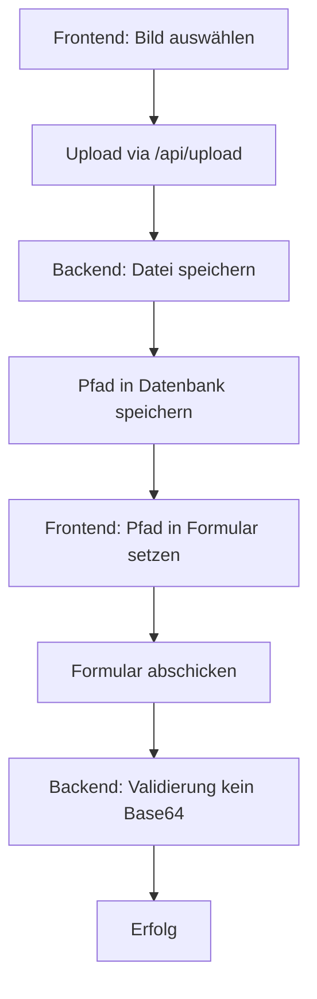

# Plan zur Refaktorierung des Bild-Upload-Systems

## Problemstellung
Auf dem Produktionssystem werden Bilder (Projektbilder, Hackathon-Bilder, Avatar-Bilder) als Base64-Strings in der Datenbank gespeichert (Feld `image_path`, `image_url`, `banner_path`). Dies führt zu einer erheblichen Datenbankgröße und Performance-Problemen.

## Aktueller Stand
- Es existiert bereits ein File-Upload-Service (`backend/app/utils/file_upload.py`) und ein Upload-Endpunkt (`/api/upload`).
- Frontend-Komponenten verwenden `uploadFile` für den Upload, setzen aber temporär Base64-Vorschau-URLs in `image_path`/`image_url`.
- Datenbankmodelle speichern Pfade als Strings.
- Ein Migration-Script (`backend/migrate_image_data.py`) kann Base64-Daten erkennen und löschen.

## Zu klärende Fragen

1. **Base64 in Produktion**: Werden aktuell noch Base64-Bilder in der Produktionsdatenbank gespeichert? Wenn ja, welche Tabellen (projects, hackathons, users) sind betroffen?

2. **Refaktorierungsziel**: Soll die Refaktorierung sicherstellen, dass:
   - Alle Bild-Uploads ausschließlich über den Datei-Upload-Endpunkt gehen?
   - Base64-Daten in `image_path`/`image_url` vom Backend abgelehnt werden?
   - Vorhandene Base64-Daten migriert werden?

3. **Migration**: Soll das Migration-Script ausgeführt werden, um vorhandene Base64-Daten zu löschen? (Achtung: Bilder gehen verloren, müssen neu hochgeladen werden.)

4. **Frontend-Änderungen**: Soll das Frontend geändert werden, um sicherzustellen, dass Bilder immer hochgeladen werden, bevor das Formular abgeschickt wird? Aktuell kann ein Base64-String im Formular verbleiben, wenn der Upload nicht abgeschlossen ist.

5. **Validierung**: Soll das Backend eine Validierung hinzufügen, die Base64-Strings in den Bildfeldern erkennt und mit einem Fehler ablehnt?

## Vorgeschlagener Aktionsplan

### Phase 1: Analyse und Vorbereitung
- [ ] Prüfung der Produktionsdatenbank auf Base64-Daten (mit `migrate_image_data.py --check`)
- [ ] Identifikation aller Frontend-Komponenten, die `image_path`/`image_url` setzen
- [ ] Review der aktuellen Upload-Logik

### Phase 2: Backend-Validierung
- [ ] Hinzufügung einer Pydantic-Validierung in den Schemas, die Base64-Strings in `image_path`, `image_url`, `banner_path` ablehnt
- [ ] Anpassung der Services, um sicherzustellen, dass nur Pfade akzeptiert werden
- [ ] Sicherstellen, dass der Upload-Endpunkt korrekte Pfade zurückgibt

### Phase 3: Frontend-Anpassungen
- [ ] Sicherstellen, dass `image_path`/`image_url` nur mit hochgeladenen Pfaden gefüllt wird
- [ ] Entfernen der Base64-Vorschau aus dem Formular-Datenmodell (optional)
- [ ] Hinzufügung einer Validierung, die verhindert, dass Formulare mit Base64-Strings abgeschickt werden

### Phase 4: Migration
- [ ] Ausführung des Migration-Scripts (nach Bestätigung)
- [ ] Sicherstellung, dass statische Dateien korrekt geserved werden

### Phase 5: Testing
- [ ] Test der Upload-Funktionalität
- [ ] Test der Validierung (Backend)
- [ ] Test der Migration (falls ausgeführt)

### Phase 6: Dokumentation
- [ ] Update der `IMAGE_UPLOAD_REFACTOR_IMPLEMENTATION.md`
- [ ] Update der API-Dokumentation

## Mermaid-Diagramm: Bild-Upload-Flow nach Refaktorierung

## Nächste Schritte
Bitte bestätigen Sie den Plan oder geben Sie Feedback zu den oben gestellten Fragen.