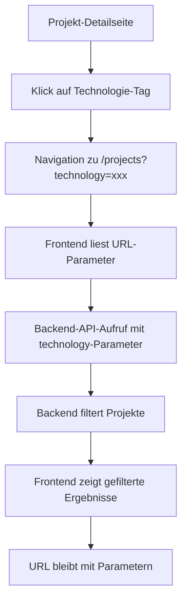

# Implementierungsplan: Tag-Suche für Hackathon-Dashboard

## Übersicht
Implementierung einer klickbaren Tag-Suche, bei der Technologie-Tags auf Projekt-Detailseiten Backend-Suchen auslösen und Ergebnisse mit URL-Änderung anzeigen.

## Phasen

### Phase 1: Backend-Erweiterungen (2-3 Stunden)

#### 1.1 Repository-Erweiterungen
- [ ] `backend/app/repositories/project_repository.py`:
  - `get_by_technology()`-Methode hinzufügen
  - `get_by_technologies()`-Methode hinzufügen (optional)
  - Tests für neue Methoden schreiben

#### 1.2 Service-Erweiterungen
- [ ] `backend/app/services/project_service.py`:
  - `get_projects_by_technology()`-Methode hinzufügen
  - `get_projects_by_technologies()`-Methode hinzufügen (optional)
  - Bestehende `get_projects()`-Methode für Filterung erweitern

#### 1.3 API-Routen-Erweiterungen
- [ ] `backend/app/api/v1/projects/routes.py`:
  - `technology`- und `technologies`-Parameter zu `GET /projects` hinzufügen
  - Filterlogik in Route implementieren
  - Dokumentation aktualisieren

#### 1.4 Tests
- [ ] Unit-Tests für neue Funktionalität
- [ ] Integrationstests für API-Endpoints
- [ ] Manuelle Tests mit Postman/curl

### Phase 2: Frontend-Erweiterungen (2-3 Stunden)

#### 2.1 Projekt-Detailseite
- [ ] `frontend3/app/pages/projects/[id]/index.vue`:
  - Technologie-Tags in klickbare Links umwandeln
  - Styling für Hover-Effekte anpassen
  - Tooltip/Hinweis für Benutzer hinzufügen

#### 2.2 Projekte-Listenseite
- [ ] `frontend3/app/pages/projects/index.vue`:
  - URL-Parameter `technology` auslesen
  - `selectedTags` mit URL synchronisieren
  - Backend-API-Integration (clientseitige Filterung ersetzen)
  - Loading-States und Error-Handling hinzufügen

#### 2.3 Wiederverwendbare Komponenten
- [ ] `frontend3/app/components/TagBadge.vue` erstellen
- [ ] In Projekt-Detail- und Listenseite integrieren

#### 2.4 Internationalisierung
- [ ] `frontend3/i18n/locales/de.json` und `en.json`:
  - Neue Übersetzungen für Tag-Suche hinzufügen

### Phase 3: Integration und Testing (1-2 Stunden)

#### 3.1 End-to-End-Tests
- [ ] Navigation von Projekt-Detail zu gefilterter Liste testen
- [ ] URL-Sharing-Funktionalität testen
- [ ] Filter-Clear-Verhalten testen

#### 3.2 Cross-Browser Testing
- [ ] Chrome, Firefox, Safari
- [ ] Mobile Responsiveness

#### 3.3 Performance Testing
- [ ] Backend-Suchperformance bei vielen Projekten
- [ ] Frontend-Ladezeiten mit Filter

### Phase 4: Deployment und Dokumentation (1 Stunde)

#### 4.1 Dokumentation
- [ ] API-Dokumentation aktualisieren
- [ ] Benutzerdokumentation (README) ergänzen
- [ ] Changelog-Eintrag

#### 4.2 Deployment
- [ ] Backend-Container bauen und deployen
- [ ] Frontend-Container bauen und deployen
- [ ] Datenbank-Migrationen (falls nötig)

## Technische Details

### Backend-API-Schnittstelle
```
GET /api/v1/projects?technology=python
GET /api/v1/projects?technologies=python,react
GET /api/v1/projects?technology=python&user=1
```

### Frontend-URL-Struktur
```
/projects/1                          # Projekt-Detail
/projects?technology=python          # Gefilterte Liste
/projects?technology=react&sort=popular  # Mit Sortierung
```

### Datenfluss


## Risiken und Mitigation

### Risiko 1: Performance bei LIKE '%value%'
- **Mitigation**: Bei Performance-Problemen Index auf `technologies` hinzufügen oder separate Tag-Tabelle einführen

### Risiko 2: Clientseitige vs. Serverseitige Filterung
- **Mitigation**: Klare Trennung - Backend für primäre Filterung, Frontend für zusätzliche Sortierung

### Risiko 3: Internationalisierung von Technologie-Namen
- **Mitigation**: Technologie-Namen sind normalerweise englisch, keine Übersetzung nötig

### Risiko 4: URL-Länge bei vielen Tags
- **Mitigation**: Einzelner Tag für erste Iteration, später Pagination/Scroll

## Erfolgskriterien

1. ✅ Technologie-Tags auf Projekt-Detailseite sind klickbar
2. ✅ Klick navigiert zu gefilterter Projekte-Liste
3. ✅ Backend filtert Projekte korrekt nach Technologie
4. ✅ URL enthält Suchparameter und ist shareable
5. ✅ Filter kann über UI oder URL entfernt werden
6. ✅ Responsive Design auf allen Geräten
7. ✅ Internationalisierung funktioniert

## Rollout-Strategie

1. **Development**: Alle Änderungen in Feature-Branch
2. **Testing**: Manuelle und automatisierte Tests
3. **Staging**: Deployment auf Staging-Umgebung
4. **Production**: Deployment nach erfolgreichem Testing

## Notfall-Rollback
- Backend: Alte API-Version beibehalten, neue Parameter optional
- Frontend: Feature-Flags für neue Funktionalität
- Datenbank: Keine destruktiven Änderungen