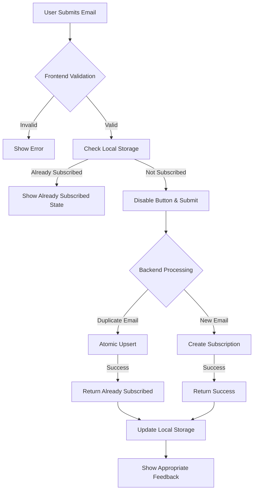

# Newsletter Duplicate Subscription Prevention Plan

## Problem Statement
Users can subscribe to the newsletter multiple times from different browser sessions, causing duplicate entries in the database and potential spam issues.

## Current Implementation Analysis

### Frontend (`AppFooter.vue`)
- Newsletter subscription form in footer
- Basic email validation
- Calls `/api/newsletter/subscribe` endpoint
- Shows notifications via UI store
- Clears email field on success (unless already subscribed)

### Backend (`main.py` & `crud.py`)
- `/api/newsletter/subscribe` endpoint
- `create_newsletter_subscription()` with basic duplicate check
- UNIQUE constraint on email field in database
- Error handling for duplicate emails returns `already_subscribed: true`

### Database (`models.py`)
- `newsletter_subscriptions` table with UNIQUE(email)
- `is_active` boolean field for soft deletion
- `subscribed_at` and `unsubscribed_at` timestamps

## Identified Gaps

### Backend Issues
1. **Race Condition Vulnerability**: Check-then-act pattern in `create_newsletter_subscription()`
2. **Reactive Error Handling**: Relies on catching UNIQUE constraint errors
3. **No Idempotency**: Same request processed multiple times creates duplicates
4. **Inconsistent State**: Reactivation logic may not handle all edge cases

### Frontend Issues
1. **No Immediate Prevention**: Button not disabled immediately on click
2. **No Client-Side Tracking**: No localStorage tracking of subscribed emails
3. **Poor UX for Already Subscribed**: Minimal feedback for already-subscribed users
4. **No Debouncing**: Rapid clicks can cause multiple requests

## Solution Architecture



## Implementation Plan

### Phase 1: Backend Idempotency & Atomic Operations

#### 1.1 Database Schema Enhancement
```sql
-- Add idempotency_key column (optional)
ALTER TABLE newsletter_subscriptions 
ADD COLUMN idempotency_key VARCHAR(64) UNIQUE;
```

#### 1.2 CRUD Function Refactor
Replace `create_newsletter_subscription()` with atomic upsert:
```python
def create_newsletter_subscription_atomic(
    db: Session,
    email: str,
    source: str = "website_footer",
    idempotency_key: Optional[str] = None
):
    # Use PostgreSQL INSERT ... ON CONFLICT DO UPDATE
    # or SQLAlchemy's on_conflict_do_update()
    pass
```

#### 1.3 Endpoint Enhancement
- Add idempotency key support via request header or body
- Implement proper upsert logic
- Return consistent response format

### Phase 2: Frontend Duplicate Prevention

#### 2.1 Enhanced Subscription Component
- Add localStorage tracking of subscribed emails
- Implement immediate button disable on click
- Add debounced submission (300ms)
- Show "Already subscribed" state for known emails

#### 2.2 Improved UX/UI
- Different visual states: default, loading, success, already subscribed
- Persistent state across page reloads
- Clear feedback messages
- Option to hide subscription form for subscribed users

### Phase 3: Comprehensive Error Handling

#### 3.1 Backend Error Responses
- Consistent error response format
- Specific error codes for duplicate subscriptions
- Proper HTTP status codes (200 for already subscribed, 201 for new)

#### 3.2 Frontend Error Handling
- Graceful handling of all error scenarios
- Retry logic with exponential backoff
- User-friendly error messages

## Technical Implementation Details

### Backend Changes

#### `crud.py` - New Atomic Function
```python
def create_newsletter_subscription_atomic(
    db: Session,
    email: str,
    source: str = "website_footer",
    idempotency_key: Optional[str] = None
) -> Tuple[models.NewsletterSubscription, bool]:
    """
    Atomically create or update newsletter subscription.
    Returns (subscription, is_new) tuple.
    """
    # Implementation using SQLAlchemy Core or raw SQL for upsert
    pass
```

#### `main.py` - Enhanced Endpoint
```python
@app.post("/api/newsletter/subscribe")
async def subscribe_to_newsletter(
    subscription: schemas.NewsletterSubscriptionCreate,
    idempotency_key: Optional[str] = Header(None),
    db: Session = Depends(get_db)
):
    subscription_obj, is_new = crud.create_newsletter_subscription_atomic(
        db=db,
        email=subscription.email,
        source=subscription.source,
        idempotency_key=idempotency_key
    )
    
    if is_new:
        # Send welcome email
        email_service.send_newsletter_welcome(subscription.email)
        return {
            "message": "Successfully subscribed to newsletter",
            "email": subscription.email,
            "already_subscribed": False,
            "subscribed_at": subscription_obj.subscribed_at
        }
    else:
        return {
            "message": "Already subscribed to newsletter",
            "email": subscription.email,
            "already_subscribed": True,
            "subscribed_at": subscription_obj.subscribed_at
        }
```

### Frontend Changes

#### `AppFooter.vue` - Enhanced Component
```typescript
// Add localStorage utility
const SUBSCRIBED_EMAILS_KEY = 'newsletter_subscribed_emails';

function getSubscribedEmails(): string[] {
  const stored = localStorage.getItem(SUBSCRIBED_EMAILS_KEY);
  return stored ? JSON.parse(stored) : [];
}

function addSubscribedEmail(email: string) {
  const emails = getSubscribedEmails();
  if (!emails.includes(email)) {
    emails.push(email);
    localStorage.setItem(SUBSCRIBED_EMAILS_KEY, JSON.stringify(emails));
  }
}

// Enhanced subscription function
const subscribeToNewsletter = async () => {
  // Check localStorage first
  const subscribedEmails = getSubscribedEmails();
  if (subscribedEmails.includes(newsletterEmail.value)) {
    uiStore.showInfo(t('newsletter.alreadySubscribed'));
    return;
  }
  
  // Disable button immediately
  newsletterLoading.value = true;
  
  try {
    const response = await fetch(`${apiUrl}/api/newsletter/subscribe`, {
      method: 'POST',
      headers: {
        'Content-Type': 'application/json',
        'Idempotency-Key': generateIdempotencyKey(),
      },
      body: JSON.stringify({
        email: newsletterEmail.value,
        source: 'website_footer'
      })
    });
    
    const data = await response.json();
    
    if (response.ok) {
      if (data.already_subscribed) {
        uiStore.showInfo(data.message);
      } else {
        uiStore.showSuccess(data.message);
        // Add to localStorage
        addSubscribedEmail(newsletterEmail.value);
        newsletterEmail.value = '';
      }
    } else {
      uiStore.showError(data.detail || t('errors.subscriptionFailed'));
    }
  } catch (error) {
    uiStore.showError('Subscription failed', 'Please try again later.');
  } finally {
    newsletterLoading.value = false;
  }
};
```

## Testing Strategy

### Unit Tests
1. Backend CRUD function tests for atomic upsert
2. Endpoint tests for duplicate submission scenarios
3. Frontend component tests for localStorage integration

### Integration Tests
1. Race condition simulation with concurrent requests
2. Cross-browser session duplicate prevention
3. Idempotency key functionality

### Manual Testing
1. Rapid multiple clicks on subscribe button
2. Same email from different browser sessions
3. Browser refresh and session persistence
4. Email validation edge cases

## Migration Plan

1. **Week 1**: Implement backend atomic upsert and test thoroughly
2. **Week 2**: Update frontend with localStorage tracking and improved UX
3. **Week 3**: Add idempotency key support and comprehensive error handling
4. **Week 4**: Testing, bug fixes, and deployment

## Success Metrics

1. **Duplicate Subscriptions**: Reduce to 0% for same email within session
2. **User Experience**: Improve satisfaction with clear feedback
3. **System Performance**: Maintain or improve response times
4. **Error Rate**: Reduce subscription-related errors by 90%

## Risks & Mitigations

| Risk | Impact | Mitigation |
|------|--------|------------|
| Breaking existing subscriptions | High | Maintain backward compatibility, phased rollout |
| localStorage limitations | Medium | Fallback to sessionStorage, size limits |
| Race conditions in upsert | High | Thorough testing, database-level constraints |
| Browser compatibility | Low | Feature detection, polyfills if needed |

## Conclusion

This plan provides a comprehensive solution to prevent duplicate newsletter subscriptions through a multi-layered approach combining backend idempotency, frontend prevention, and improved user experience. The implementation can be rolled out in phases to minimize risk while delivering immediate value.