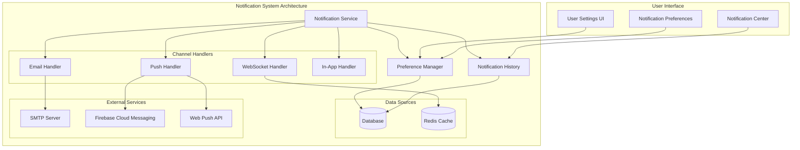

# Notification System Overhaul Plan

## Executive Summary

This document outlines a comprehensive overhaul of the Hackathon Dashboard notification system to implement a modern, multi-channel notification platform with user-configurable preferences. The new system will support email, push notifications, and in-app notifications with granular user control.

## Current System Analysis

### Strengths
- Email notification system is functional and tested
- Basic in-app toast notifications exist
- Internationalization support for emails
- Template system for email content

### Limitations
- No user preferences or opt-out options
- No push notification support
- No persistent notification history
- No real-time delivery for active users
- Limited notification types
- No per-channel configuration

## New System Architecture

### Core Components



### Database Schema Changes

#### New Tables:
1. **`user_notification_preferences`** - User-level notification settings
2. **`notification_types`** - System notification types catalog
3. **`user_notifications`** - Notification history
4. **`push_subscriptions`** - Web Push API subscriptions
5. **`notification_templates`** - Template management

#### Schema Details:
```sql
-- User notification preferences
CREATE TABLE user_notification_preferences (
    id INTEGER PRIMARY KEY AUTOINCREMENT,
    user_id INTEGER NOT NULL,
    notification_type VARCHAR(50) NOT NULL,
    channel VARCHAR(20) NOT NULL, -- 'email', 'push', 'in_app', 'all'
    enabled BOOLEAN DEFAULT TRUE,
    created_at TIMESTAMP DEFAULT CURRENT_TIMESTAMP,
    updated_at TIMESTAMP DEFAULT CURRENT_TIMESTAMP,
    FOREIGN KEY (user_id) REFERENCES users(id) ON DELETE CASCADE,
    UNIQUE(user_id, notification_type, channel)
);

-- Notification types catalog
CREATE TABLE notification_types (
    id INTEGER PRIMARY KEY AUTOINCREMENT,
    type_key VARCHAR(50) UNIQUE NOT NULL,
    category VARCHAR(50) NOT NULL, -- 'team', 'project', 'hackathon', 'system'
    default_channels VARCHAR(100) DEFAULT 'email,in_app',
    description TEXT,
    created_at TIMESTAMP DEFAULT CURRENT_TIMESTAMP
);

-- User notification history
CREATE TABLE user_notifications (
    id INTEGER PRIMARY KEY AUTOINCREMENT,
    user_id INTEGER NOT NULL,
    notification_type VARCHAR(50) NOT NULL,
    title VARCHAR(255) NOT NULL,
    message TEXT NOT NULL,
    data JSON, -- Additional data like entity IDs, URLs
    channels_sent VARCHAR(100), -- Comma-separated channels actually used
    read_at TIMESTAMP,
    created_at TIMESTAMP DEFAULT CURRENT_TIMESTAMP,
    FOREIGN KEY (user_id) REFERENCES users(id) ON DELETE CASCADE
);

-- Push notification subscriptions (Web Push API)
CREATE TABLE push_subscriptions (
    id INTEGER PRIMARY KEY AUTOINCREMENT,
    user_id INTEGER NOT NULL,
    endpoint TEXT NOT NULL,
    p256dh_key TEXT NOT NULL,
    auth_key TEXT NOT NULL,
    user_agent TEXT,
    created_at TIMESTAMP DEFAULT CURRENT_TIMESTAMP,
    updated_at TIMESTAMP DEFAULT CURRENT_TIMESTAMP,
    FOREIGN KEY (user_id) REFERENCES users(id) ON DELETE CASCADE,
    UNIQUE(endpoint)
);
```

### Default Notification Types

| Category | Type Key | Description | Default Channels |
|----------|----------|-------------|------------------|
| Team | `team_invitation_sent` | Invited to join a team | email, push, in_app |
| Team | `team_invitation_accepted` | Invitation accepted | email, in_app |
| Team | `team_member_added` | Added to a team | email, push, in_app |
| Team | `team_created` | Team created (for members) | in_app |
| Project | `project_created` | New project in team | email, push, in_app |
| Project | `project_commented` | Comment on project | email, push, in_app |
| Project | `project_updated` | Project updated | email, in_app |
| Hackathon | `hackathon_registered` | Registered for hackathon | email, in_app |
| Hackathon | `hackathon_starting_soon` | Hackathon starts soon | email, push |
| Hackathon | `hackathon_started` | Hackathon started | email, push, in_app |
| System | `comment_reply` | Reply to your comment | email, push, in_app |
| System | `vote_received` | Received a vote | in_app |
| System | `system_announcement` | System announcement | email, in_app |
| System | `security_alert` | Security alert | email, push |

## Push Notification System

### Components:
1. **Web Push API Integration**
   - Service worker for push handling
   - VAPID key generation and management
   - Subscription management

2. **Push Service (`push_service.py`)**
   - Handles Web Push API communication
   - Manages subscription lifecycle
   - Sends push notifications via webpush library

3. **Frontend Push Manager**
   - Requests push permission
   - Manages service worker registration
   - Handles push subscription updates
   - Processes incoming push notifications

### Service Worker Example:
```javascript
// sw.js
self.addEventListener('push', event => {
    const data = event.data?.json() || {};
    const options = {
        body: data.body,
        icon: data.icon || '/icon-192x192.png',
        badge: data.badge || '/badge-72x72.png',
        data: data.data || {},
        actions: data.actions || []
    };
    
    event.waitUntil(
        self.registration.showNotification(data.title, options)
    );
});

self.addEventListener('notificationclick', event => {
    event.notification.close();
    const url = event.notification.data?.url || '/';
    event.waitUntil(clients.openWindow(url));
});
```

## User Settings UI

### Pages:
1. **Notification Settings** (`/settings/notifications`)
   - Global enable/disable toggle
   - Channel preferences (Email, Push, In-App)
   - Per-category settings
   - Per-notification-type granular controls

2. **Notification Center** (`/notifications`)
   - List of all notifications (read/unread)
   - Mark as read/unread
   - Filter by category/type
   - Clear all/bulk actions

3. **Push Permission Prompt**
   - In-app modal for requesting permission
   - Explanation of benefits
   - One-click enable/disable

### UI Components:
- `NotificationSettings.vue` - Main settings page
- `ChannelPreference.vue` - Individual channel toggle
- `NotificationCategory.vue` - Category-level settings
- `NotificationTypeToggle.vue` - Granular type control
- `NotificationCenter.vue` - Notification history
- `PushPermissionModal.vue` - Permission request

## Implementation Roadmap

### Phase 1: Foundation (Week 1-2)
1. Database Migration
2. Backend Core Services
3. API Endpoints

### Phase 2: Push Notifications (Week 3-4)
1. Web Push Setup
2. Frontend Push Integration
3. Push Delivery Implementation

### Phase 3: User Interface (Week 5-6)
1. Notification Settings Page
2. Notification Center
3. In-App Notifications Enhancement

### Phase 4: Enhanced Features (Week 7-8)
1. Advanced Preferences
2. Analytics & Monitoring
3. Performance Optimization

### Phase 5: Polish & Testing (Week 9-10)
1. Comprehensive Testing
2. Documentation
3. Deployment

## API Endpoints

### Notification Preferences
- `GET /api/me/notification-preferences` - Get user preferences
- `PUT /api/me/notification-preferences` - Update preferences
- `GET /api/notification-types` - List available notification types

### Push Notifications
- `POST /api/push/subscribe` - Subscribe to push notifications
- `DELETE /api/push/unsubscribe` - Unsubscribe from push
- `GET /api/push/public-key` - Get VAPID public key

### Notifications
- `GET /api/notifications` - List user notifications
- `GET /api/notifications/unread-count` - Get unread count
- `PUT /api/notifications/{id}/read` - Mark as read
- `PUT /api/notifications/read-all` - Mark all as read
- `DELETE /api/notifications/{id}` - Delete notification

## Backend Services

### 1. NotificationOrchestratorService
```python
class NotificationOrchestratorService:
    async def send_notification(
        self,
        db: Session,
        user_id: int,
        notification_type: str,
        title: str,
        message: str,
        data: dict = None
    ) -> bool:
        """
        Send notification through appropriate channels based on user preferences
        """
        # 1. Check user preferences
        # 2. Determine which channels to use
        # 3. Send via each channel handler
        # 4. Store in notification history
        # 5. Return success status
```

### 2. PushNotificationService
```python
class PushNotificationService:
    async def send_to_user(
        self,
        db: Session,
        user_id: int,
        title: str,
        body: str,
        data: dict = None
    ) -> bool:
        """
        Send push notification to all of user's devices
        """
        # Get user's push subscriptions
        # Check user preferences
        # Send to each subscription
```

### 3. PreferenceManagerService
```python
class PreferenceManagerService:
    def get_user_preferences(
        self,
        db: Session,
        user_id: int
    ) -> Dict[str, Any]:
        """
        Get comprehensive notification preferences for user
        """
        # Merge default preferences with user overrides
        # Return structured preferences object
```

## Frontend Implementation

### Store Structure:
```typescript
// stores/notifications.ts
interface NotificationStore {
  // State
  notifications: UserNotification[];
  preferences: NotificationPreferences;
  unreadCount: number;
  
  // Actions
  fetchNotifications(): Promise<void>;
  markAsRead(id: string): Promise<void>;
  markAllAsRead(): Promise<void>;
  updatePreferences(prefs: Partial<NotificationPreferences>): Promise<void>;
  requestPushPermission(): Promise<boolean>;
  subscribeToPush(): Promise<void>;
  unsubscribeFromPush(): Promise<void>;
}
```

### Component Hierarchy:
```
App
├── NotificationContainer (toasts)
├── NotificationCenter (full page)
├── NotificationSettings (settings page)
└── PushPermissionModal (conditional)
```

## Security Considerations

1. **Push Notifications**
   - Validate VAPID signatures
   - Secure subscription storage
   - Rate limiting per user
   - Content sanitization

2. **User Preferences**
   - Authorization checks
   - Input validation
   - Audit logging

3. **Data Privacy**
   - Clear opt-in for push
   - Easy opt-out options
   - Data retention policies
   - GDPR compliance

## Performance Optimization

1. **Caching**
   - User preferences cache (Redis)
   - Notification templates cache
   - Push subscription cache

2. **Batching**
   - Batch notification delivery
   - Bulk database operations
   - Queue-based processing

3. **Lazy Loading**
   - Paginated notification history
   - On-demand template loading
   - Deferred preference checks

## Monitoring & Analytics

### Metrics to Track:
- Notification delivery success rates
- User engagement with notifications
- Preference adoption patterns
- Push permission grant rates
- Channel performance comparison

### Logging:
- All notification attempts (success/failure)
- Preference changes
- Push subscription lifecycle
- User interactions with notifications

## Migration Strategy

1. **Backward Compatibility**
   - Keep existing email notifications working
   - Default preferences match current behavior
   - Gradual rollout with feature flags

2. **Data Migration**
   - Script to create default preferences
   - Migrate existing notification data if needed
   - Validate data integrity

3. **User Communication**
   - Announce new features
   - Guide users through setup
   - Provide help documentation

## Testing Plan

### Unit Tests:
- Notification service logic
- Preference management
- Push notification sending
- Template rendering

### Integration Tests:
- End-to-end notification flow
- User preference updates
- Push subscription lifecycle
- Multi-channel delivery

### Browser Compatibility:
- Chrome, Firefox, Safari push support
- Mobile browser testing
- Service worker functionality
- Offline behavior

## Deployment Checklist

### Pre-deployment:
- [ ] Generate VAPID keys
- [ ] Configure SMTP for production
- [ ] Set up Redis cache
- [ ] Create database migrations
- [ ] Update environment variables

### Deployment:
- [ ] Deploy backend services
- [ ] Deploy frontend with service worker
- [ ] Run database migrations
- [ ] Enable feature flags
- [ ] Monitor error rates

### Post-deployment:
- [ ] Verify notification delivery
- [ ] Test user preference updates
- [ ] Monitor performance metrics
- [ ] Gather user feedback
- [ ] Address any issues

## Success Criteria

1. **Functional**
   - All notification types work across channels
   - User preferences are respected
   - Push notifications work on supported browsers
   - Notification history is accessible

2. **Performance**
   - Notifications delivered within 5 seconds
   - System handles peak loads gracefully
   - Push delivery success rate > 95%

3. **User Experience**
   - Intuitive settings interface
   - Clear permission requests
   - Helpful error messages
   - Responsive design

4. **Business**
   - Increased user engagement
   - Reduced support tickets for notifications
   - Positive user feedback
   - Successful adoption of new features

## Future Enhancements

1. **Advanced Features**
   - Smart notification scheduling
   - AI-powered notification prioritization
   - Cross-platform push (mobile apps)
   - Notification templates user editor

2. **Integration**
   - Slack/Discord webhook integration
   - Calendar integration for hackathon reminders
   - External notification providers (OneSignal, etc.)

3. **Analytics**
   - A/B testing for notification content
   - Engagement prediction models
   - ROI analysis per notification type

## Conclusion

This overhaul transforms the notification system from a basic email-only system into a modern, user-centric multi-channel platform. The implementation follows best practices for security, performance, and user experience while maintaining backward compatibility. The phased approach allows for incremental delivery of value while managing risk effectively.

The new system will significantly improve user engagement, provide better control over notification preferences, and establish a foundation for future notification-related features.