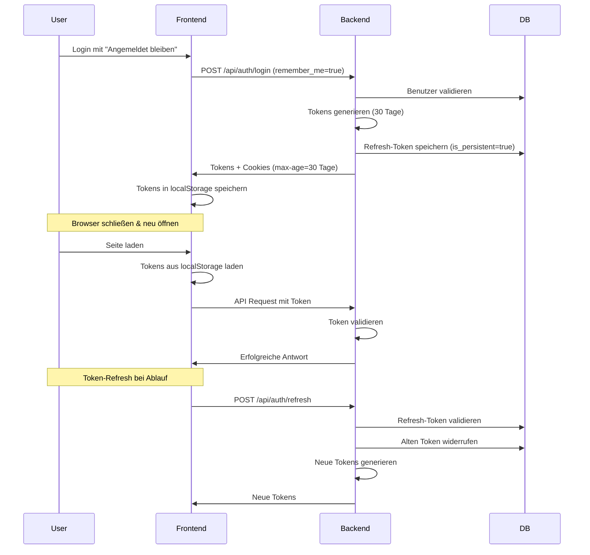

# Implementierungsplan: "Angemeldet bleiben"-Funktion

## Aktuelle Analyse

### Bestehende Architektur
1. **Backend (FastAPI)**:
   - JWT-basierte Authentifizierung mit Access- und Refresh-Tokens
   - Access-Token: 15 Minuten Gültigkeit
   - Refresh-Token: 7 Tage Gültigkeit, in Datenbank gespeichert
   - HTTP-Only Cookies für SSR-Kompatibilität
   - Cookie-Konfiguration: SameSite=Lax, Secure=False (Development)

2. **Frontend (Nuxt 3 / Vue 3)**:
   - Login-Formular mit "Remember Me" Checkbox (bereits vorhanden)
   - Auth-Store speichert Tokens im localStorage/sessionStorage
   - Token-Refresh-Mechanismus implementiert
   - API-Client mit automatischem Token-Refresh

3. **Fehlende Funktionalität**:
   - `remember_me` Parameter wird nicht an Backend übergeben
   - Keine Unterscheidung zwischen Session- und Persistent-Cookies
   - Keine längere Gültigkeitsdauer für "Angemeldet bleiben"-Sitzungen
   - Keine Sitzungsverwaltung für Benutzer

## Anforderungen

### 1. Sicherheit
- Persistente, sichere Sitzungstokens mit JWT + Refresh-Token-Strategie
- Schutz gegen CSRF (SameSite-Flags, HttpOnly, Secure Flags bei HTTPS)
- Schutz gegen XSS (HTTP-Only Cookies)
- Automatische Token-Rotation für anhaltende Sitzungen
- Token-Revocation-Mechanismus

### 2. Benutzerfreundlichkeit
- Klar beschriftete "Angemeldet bleiben" Checkbox im Login-Formular
- Zuverlässige Steuerung des Login-Prozesses basierend auf der Einstellung
- Nahtlose Nutzererfahrung über Browser-Sitzungen hinweg

### 3. Sitzungsverwaltung
- Persistente Sitzungen: 30 Tage Gültigkeit
- Session-Sitzungen: Bis zum Schließen des Browsers
- Benutzer können aktive Sitzungen einsehen
- Remote-Beendigung von Sitzungen möglich

### 4. Datenpersistenz
- Sitzungstokens/Hashes sicher in Datenbank speichern
- Überprüfung und Widerruf ermöglichen
- Device-Informationen für Sitzungsverwaltung speichern

### 5. Logout-Verhalten
- Expliziter Logout führt zur sofortigen Ungültigmachung
- Token-Ablauf führt zur automatischen Bereinigung
- Client- und Serverseitige Datenbereinigung

## Implementierungsplan

### Phase 1: Backend-Änderungen

#### 1.1 Schema-Erweiterungen
- `UserLogin` Schema um `remember_me: bool` Feld erweitern
- `RefreshToken` Modell um `is_persistent: bool` Feld erweitern
- `device_info`, `user_agent`, `ip_address` bereits vorhanden

#### 1.2 Auth-Service Modifikationen
- `login_user()` Methode um `remember_me` Parameter erweitern
- Token-Gültigkeitsdauer basierend auf `remember_me` anpassen:
  - `remember_me=True`: Refresh-Token 30 Tage
  - `remember_me=False`: Refresh-Token 7 Tage (bestehend)
- Cookie-Max-Age entsprechend setzen

#### 1.3 Cookie-Utils Erweiterung
- `set_auth_cookies()` um `persistent: bool` Parameter erweitern
- Bei `persistent=False`: Kein `max_age` setzen (Session-Cookie)
- Bei `persistent=True`: `max_age=30*24*60*60` (30 Tage)

#### 1.4 Token-Rotation-Strategie
- Implementierung von automatischem Token-Rotation bei Refresh
- Alte Refresh-Tokens nach Verwendung widerrufen
- Verhinderung von Token-Reuse

#### 1.5 Sitzungsverwaltungs-Endpoints
- `GET /api/auth/sessions`: Aktive Sitzungen abrufen
- `DELETE /api/auth/sessions/{token_id}`: Spezifische Sitzung beenden
- `DELETE /api/auth/sessions/all`: Alle Sitzungen beenden (außer aktueller)

### Phase 2: Frontend-Integration

#### 2.1 Login-Formular Anpassungen
- `rememberMe` Wert an Backend übergeben
- In `LoginForm.vue`: `remember-me-change` Event bereits vorhanden
- In `login.vue`: `rememberMe` Wert an Auth-Store übergeben

#### 2.2 Auth-Store Modifikationen
- `loginWithEmail()` um `rememberMe` Parameter erweitern
- Tokens entsprechend speichern:
  - `rememberMe=true`: localStorage für Persistenz
  - `rememberMe=false`: sessionStorage für Session-only

#### 2.3 Preferences Store Anpassung
- `auth.setTokens()` um `persistent: bool` Parameter erweitern
- Speicherort basierend auf `persistent` wählen

#### 2.4 Sitzungsverwaltung UI
- Settings-Seite um "Aktive Sitzungen" Sektion erweitern
- Liste aller aktiven Sitzungen mit Device-Info anzeigen
- Möglichkeit zum Beenden einzelner Sitzungen

### Phase 3: Sicherheitsverbesserungen

#### 3.1 CSRF-Schutz
- SameSite=Strict für sensible Endpoints
- CSRF-Tokens für state-changing Operations
- Origin-Header Validierung

#### 3.2 XSS-Schutz
- HTTP-Only Cookies beibehalten
- Content-Security-Policy prüfen
- Secure-Flag in Produktion setzen

#### 3.3 Token-Sicherheit
- JWT Signatur mit starkem Secret
- Token-Invalidation bei Passwort-Änderung
- Rate-Limiting für Login/Refresh-Endpoints

### Phase 4: Testing und Validierung

#### 4.1 Unit Tests
- Backend: Test für `remember_me` Funktionalität
- Frontend: Test für Token-Speicherung basierend auf rememberMe

#### 4.2 Integration Tests
- End-to-End Login mit/ohne "Angemeldet bleiben"
- Token-Refresh-Verhalten
- Sitzungsverwaltung

#### 4.3 Sicherheitstests
- CSRF-Angriffe simulieren
- Token-Leakage Szenarien
- Cookie-Manipulation

## Technische Details

### Backend-Änderungen

#### Schema-Änderungen:
```python
# In app/domain/schemas/user.py
class UserLogin(BaseModel):
    email: str
    password: str
    remember_me: bool = False  # Neu
```

#### Token-Gültigkeitsdauer:
```python
# In app/core/auth.py
REFRESH_TOKEN_EXPIRE_DAYS_PERSISTENT = 30  # Neu
REFRESH_TOKEN_EXPIRE_DAYS_SESSION = 7      # Bestehend

def create_tokens(user_id: int, username: str, remember_me: bool = False):
    refresh_token_days = (
        REFRESH_TOKEN_EXPIRE_DAYS_PERSISTENT if remember_me 
        else REFRESH_TOKEN_EXPIRE_DAYS_SESSION
    )
    # ... bestehende Logik
```

#### Cookie-Setzung:
```python
# In app/utils/cookies.py
def set_auth_cookies(
    response: Response,
    auth_token: str,
    refresh_token: str,
    persistent: bool = True,  # Neu
    max_age: Optional[int] = None,
    # ... bestehende Parameter
):
    if max_age is None:
        max_age = COOKIE_MAX_AGE if persistent else None  # Session-Cookie
    
    # ... bestehende Logik
```

### Frontend-Änderungen

#### Auth-Store:
```typescript
async function loginWithEmail(
    credentials: LoginCredentials, 
    rememberMe: boolean = false
): Promise<boolean> {
    // API-Aufruf mit remember_me Parameter
    const response = await apiClient.post('/api/auth/login', {
        email: credentials.email,
        password: credentials.password,
        remember_me: rememberMe  // Neu
    });
    
    // Tokens speichern basierend auf rememberMe
    if (rememberMe) {
        localStorage.setItem('auth_tokens', JSON.stringify(tokens));
    } else {
        sessionStorage.setItem('auth_tokens', JSON.stringify(tokens));
    }
}
```

## Mermaid Diagramm: "Angemeldet bleiben"-Flow



## Risiken und Gegenmaßnahmen

### Risiko 1: Token-Diebstahl bei persistenten Sitzungen
- **Gegenmaßnahme**: Token-Rotation, kurze Access-Token-Lebensdauer (15 Minuten), Device-Info Tracking

### Risiko 2: CSRF bei persistenten Cookies
- **Gegenmaßnahme**: SameSite=Strict für sensible Endpoints, CSRF-Tokens

### Risiko 3: Browser-Cookie-Limits
- **Gegenmaßnahme**: Token in localStorage mit Refresh-Mechanismus, fallback zu Cookies

### Risiko 4: UX-Probleme bei gemischten Sitzungen
- **Gegenmaßnahme**: Klare UI-Indikatoren, einfache Sitzungsverwaltung

## Erfolgskriterien

1. ✅ Benutzer kann sich mit "Angemeldet bleiben" anmelden und bleibt 30 Tage angemeldet
2. ✅ Benutzer kann sich ohne "Angemeldet bleiben" anmelden und wird beim Schließen des Browsers abgemeldet
3. ✅ Benutzer kann aktive Sitzungen einsehen und verwalten
4. ✅ Tokens sind sicher gegen CSRF und XSS geschützt
5. ✅ Token-Rotation verhindert Missbrauch gestohlener Tokens
6. ✅ Logout beendet Sitzungen sofort und vollständig

## Nächste Schritte

1. Backend-Änderungen implementieren
2. Frontend-Integration durchführen
3. Sicherheitsmaßnahmen validieren
4. Testing abschließen
5. Dokumentation aktualisieren