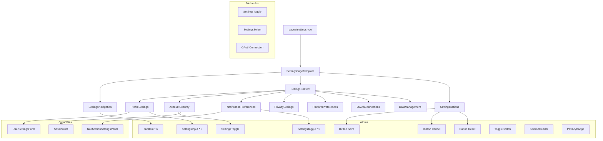

# Frontend-Seitenstruktur und Routing für /settings Seite

## Übersicht
Dieses Dokument beschreibt die Frontend-Struktur, Routing und Komponentenorganisation für die /settings Seite.

## Dateistruktur

### Neue Verzeichnisse und Dateien

```
frontend3/app/
├── pages/
│   ├── settings.vue                    # Haupt-Einstellungsseite
│   └── settings/                       # Unter-Seiten (optional)
│       ├── profile.vue                 # Nur Profil-Einstellungen
│       ├── security.vue                # Nur Sicherheitseinstellungen
│       ├── notifications.vue           # Nur Benachrichtigungseinstellungen
│       ├── privacy.vue                 # Nur Datenschutzeinstellungen
│       └── preferences.vue             # Nur Platform-Einstellungen
├── components/
│   ├── atoms/
│   │   ├── ToggleSwitch.vue           # Neuer Toggle-Switch
│   │   ├── TabItem.vue                # Tab-Navigation Item
│   │   ├── SectionHeader.vue          # Abschnittsüberschrift
│   │   └── PrivacyBadge.vue           # Datenschutz-Level Badge
│   ├── molecules/
│   │   ├── settings/
│   │   │   ├── SettingsToggle.vue     # Label + ToggleSwitch
│   │   │   ├── SettingsSelect.vue     # Label + Select
│   │   │   ├── SettingsInput.vue      # Label + Input
│   │   │   ├── OAuthConnection.vue    # OAuth Verbindungsanzeige
│   │   │   ├── PrivacySetting.vue     # Datenschutzeinstellung
│   │   │   └── NotificationChannel.vue # Benachrichtigungskanal
│   └── organisms/
│       ├── settings/
│       │   ├── SettingsNavigation.vue  # Hauptnavigation
│       │   ├── SettingsContent.vue     # Inhaltscontainer
│       │   ├── SettingsActions.vue     # Aktionen (Speichern/Abbrechen)
│       │   ├── ProfileSettings.vue     # Profil-Einstellungen
│       │   ├── AccountSecurity.vue     # Account-Sicherheit
│       │   ├── NotificationPreferences.vue # Benachrichtigungseinstellungen
│       │   ├── PrivacySettings.vue     # Datenschutzeinstellungen
│       │   ├── PlatformPreferences.vue # Platform-Einstellungen
│       │   ├── OAuthConnections.vue    # OAuth-Verbindungen
│       │   └── DataManagement.vue      # Datenverwaltung
│       └── templates/
│           └── SettingsPageTemplate.vue # Seiten-Template
├── composables/
│   ├── useSettings.ts                  # Zentrale Settings-Logik
│   ├── usePrivacySettings.ts           # Datenschutz-Logik
│   ├── usePlatformPreferences.ts       # Platform-Einstellungen
│   └── useOAuthConnections.ts          # OAuth-Verbindungen
├── types/
│   └── settings-types.ts               # Settings-spezifische Typen
└── stores/
    └── settings.ts                     # Settings Store (optional)
```

## Routing

### Hauptrouten

```typescript
// Nuxt 3 automatisches Routing basierend auf Dateistruktur
// pages/settings.vue → /settings
// pages/settings/profile.vue → /settings/profile
```

### Route-Konfiguration

```typescript
// In nuxt.config.ts oder via Middleware
export default defineNuxtConfig({
  // Bestehende Konfiguration...
  routeRules: {
    '/settings/**': { 
      ssr: true,
      auth: true // Erfordert Authentifizierung
    }
  }
});
```

### Navigation Guards

```typescript
// app/middleware/settings.auth.ts
export default defineNuxtRouteMiddleware((to, from) => {
  const { isAuthenticated } = useAuthStore();
  
  if (!isAuthenticated) {
    return navigateTo('/login', { redirectCode: 401 });
  }
  
  // Zusätzliche Berechtigungsprüfungen wenn nötig
});
```

## Seitenkomponenten

### Hauptseite: `pages/settings.vue`

```vue
<template>
  <SettingsPageTemplate>
    <template #navigation>
      <SettingsNavigation 
        :tabs="tabs"
        :active-tab="activeTab"
        @tab-change="handleTabChange"
      />
    </template>
    
    <template #content>
      <SettingsContent :active-tab="activeTab">
        <!-- Dynamische Inhalte basierend auf activeTab -->
        <ProfileSettings v-if="activeTab === 'profile'" />
        <AccountSecurity v-else-if="activeTab === 'security'" />
        <NotificationPreferences v-else-if="activeTab === 'notifications'" />
        <PrivacySettings v-else-if="activeTab === 'privacy'" />
        <PlatformPreferences v-else-if="activeTab === 'preferences'" />
        <OAuthConnections v-else-if="activeTab === 'connections'" />
        <DataManagement v-else-if="activeTab === 'data'" />
      </SettingsContent>
    </template>
    
    <template #actions>
      <SettingsActions
        :has-unsaved-changes="hasUnsavedChanges"
        :is-saving="isSaving"
        @save="handleSave"
        @cancel="handleCancel"
        @reset="handleReset"
      />
    </template>
  </SettingsPageTemplate>
</template>

<script setup lang="ts">
// Implementierung...
</script>
```

### Template: `SettingsPageTemplate.vue`

```vue
<template>
  <div class="settings-page">
    <!-- Header -->
    <div class="settings-header">
      <h1 class="text-3xl font-bold text-gray-900 dark:text-white">
        {{ title }}
      </h1>
      <p class="mt-2 text-gray-600 dark:text-gray-400">
        {{ description }}
      </p>
    </div>
    
    <!-- Main Layout -->
    <div class="settings-layout">
      <!-- Left Navigation -->
      <aside class="settings-sidebar">
        <slot name="navigation" />
      </aside>
      
      <!-- Main Content -->
      <main class="settings-main">
        <slot name="content" />
      </main>
    </div>
    
    <!-- Actions Footer -->
    <footer class="settings-footer">
      <slot name="actions" />
    </footer>
  </div>
</template>
```

## Komponentenhierarchie (Mermaid)



## State Management

### Composables: `useSettings.ts`

```typescript
export const useSettings = () => {
  const settings = ref<UserSettings | null>(null);
  const isLoading = ref(false);
  const isSaving = ref(false);
  const errors = ref<Record<string, string>>({});
  const hasUnsavedChanges = ref(false);
  
  // Daten laden
  const loadSettings = async () => {
    isLoading.value = true;
    try {
      const { data } = await useFetch('/api/v1/users/me/settings');
      settings.value = data.value;
    } catch (error) {
      console.error('Failed to load settings:', error);
      throw error;
    } finally {
      isLoading.value = false;
    }
  };
  
  // Einstellungen speichern
  const saveSettings = async (updates: Partial<UserSettings>) => {
    isSaving.value = true;
    try {
      const { data } = await useFetch('/api/v1/users/me/settings', {
        method: 'PUT',
        body: updates
      });
      
      settings.value = data.value;
      hasUnsavedChanges.value = false;
      
      // Erfolgsmeldung anzeigen
      useToast().success('Settings saved successfully');
      
      return data.value;
    } catch (error) {
      console.error('Failed to save settings:', error);
      useToast().error('Failed to save settings');
      throw error;
    } finally {
      isSaving.value = false;
    }
  };
  
  // Validierung
  const validate = (section: keyof UserSettings, data: any) => {
    // Validierungslogik
  };
  
  // Reset zu gespeicherten Werten
  const reset = () => {
    // Zurück zu ursprünglichen Werten
  };
  
  return {
    settings,
    isLoading,
    isSaving,
    errors,
    hasUnsavedChanges,
    loadSettings,
    saveSettings,
    validate,
    reset
  };
};
```

### Store: `settings.ts` (optional)

```typescript
export const useSettingsStore = defineStore('settings', () => {
  const activeTab = ref<string>('profile');
  const unsavedChanges = ref<Record<string, any>>({});
  const lastSaved = ref<Date | null>(null);
  
  const setActiveTab = (tab: string) => {
    activeTab.value = tab;
  };
  
  const addUnsavedChange = (section: string, key: string, value: any) => {
    if (!unsavedChanges.value[section]) {
      unsavedChanges.value[section] = {};
    }
    unsavedChanges.value[section][key] = value;
  };
  
  const clearUnsavedChanges = (section?: string) => {
    if (section) {
      delete unsavedChanges.value[section];
    } else {
      unsavedChanges.value = {};
    }
  };
  
  const hasUnsavedChanges = computed(() => {
    return Object.keys(unsavedChanges.value).length > 0;
  });
  
  return {
    activeTab,
    unsavedChanges,
    lastSaved,
    setActiveTab,
    addUnsavedChange,
    clearUnsavedChanges,
    hasUnsavedChanges
  };
});
```

## Responsive Design

### Breakpoints
```css
/* Mobile (default) */
.settings-layout {
  display: flex;
  flex-direction: column;
}

/* Tablet (≥768px) */
@media (min-width: 768px) {
  .settings-layout {
    flex-direction: row;
  }
  
  .settings-sidebar {
    width: 250px;
    flex-shrink: 0;
  }
  
  .settings-main {
    flex: 1;
  }
}

/* Desktop (≥1024px) */
@media (min-width: 1024px) {
  .settings-sidebar {
    width: 300px;
  }
}
```

### Mobile Navigation
Für mobile Geräte:
- Vertikale Tab-Navigation
- Hamburger-Menu für viele Tabs
- Bottom sheet für Aktionen

## Internationalisierung (i18n)

### Übersetzungen
```json
// i18n/locales/en.json
{
  "settings": {
    "title": "Settings",
    "description": "Manage your account settings and preferences",
    "tabs": {
      "profile": "Profile",
      "security": "Security",
      "notifications": "Notifications",
      "privacy": "Privacy",
      "preferences": "Preferences",
      "connections": "Connections",
      "data": "Data"
    },
    "actions": {
      "save": "Save Changes",
      "cancel": "Cancel",
      "reset": "Reset",
      "saving": "Saving...",
      "saved": "Settings saved successfully",
      "unsavedChanges": "You have unsaved changes"
    }
  }
}
```

### Dynamische Übersetzungen
Komponenten sollten Übersetzungsschlüssel als Props akzeptieren:
```vue
<SettingsNavigation
  :tabs="[
    { id: 'profile', label: t('settings.tabs.profile'), icon: 'user' },
    // ...
  ]"
/>
```

## Error Handling

### Fehlerzustände
1. **Ladefehler**: Retry-Button anzeigen
2. **Validierungsfehler**: Inline-Fehlermeldungen
3. **Speicherfehler**: Toast-Nachricht + Retry-Option
4. **Netzwerkfehler**: Offline-Indikator

### Error Boundaries
```vue
<template>
  <ErrorBoundary @error="handleError">
    <SettingsContent />
  </ErrorBoundary>
</template>
```

## Performance Optimierungen

### Lazy Loading
```typescript
// Dynamische Imports für große Komponenten
const ProfileSettings = defineAsyncComponent(() =>
  import('@/components/organisms/settings/ProfileSettings.vue')
);
```

### Debounced Saving
```typescript
const saveDebounced = useDebounceFn(async (updates) => {
  await saveSettings(updates);
}, 1000);
```

### Caching
```typescript
// Settings für 5 Minuten cachen
const { data: settings } = await useFetch('/api/v1/users/me/settings', {
  key: 'user-settings',
  cache: 'default',
  maxAge: 300 // 5 Minuten
});
```

## Testing

### Testabdeckung
1. **Unit Tests**: Einzelne Komponenten
2. **Integration Tests**: Komponenteninteraktion
3. **E2E Tests**: Vollständige User Journeys
4. **Accessibility Tests**: Screen Reader Kompatibilität

### Test-Struktur
```
frontend3/tests/
├── components/
│   ├── atoms/
│   │   └── ToggleSwitch.test.ts
│   ├── molecules/
│   │   └── settings/
│   │       └── SettingsToggle.test.ts
│   └── organisms/
│       └── settings/
│           └── ProfileSettings.test.ts
├── composables/
│   └── useSettings.test.ts
└── e2e/
    └── settings.spec.ts
```

## Deployment Considerations

### Feature Flags
```typescript
// Neue Features können mit Feature Flags gesteuert werden
if (useFeatureFlags().isEnabled('enhanced_settings')) {
  // Neue Settings-Komponenten anzeigen
}
```

### A/B Testing
```typescript
// Unterschiedliche Layouts testen
const variant = useABTest('settings_layout');
const useNewLayout = variant === 'B';
```

## Migration von bestehender Profile-Seite

### Schrittweise Migration
1. Neue `/settings` Seite parallel zur bestehenden `/profile` Seite
2. Redirect von `/profile/edit` zu `/settings#profile`
3. Alte Profile-Edit-Funktionalität als deprecated markieren
4. Nach Migration: Alte Route entfernen oder redirecten

### Kompatibilität
```typescript
// Fallback zu alten APIs wenn neue nicht verfügbar
const useLegacyAPI = !features.settings_v2;
```

## Next Steps
1. Datenmodelle und Validierungsschemata finalisieren
2. UI/UX-Design detaillieren
3. Implementierungsplan erstellen
4. Mit Implementierung beginnen