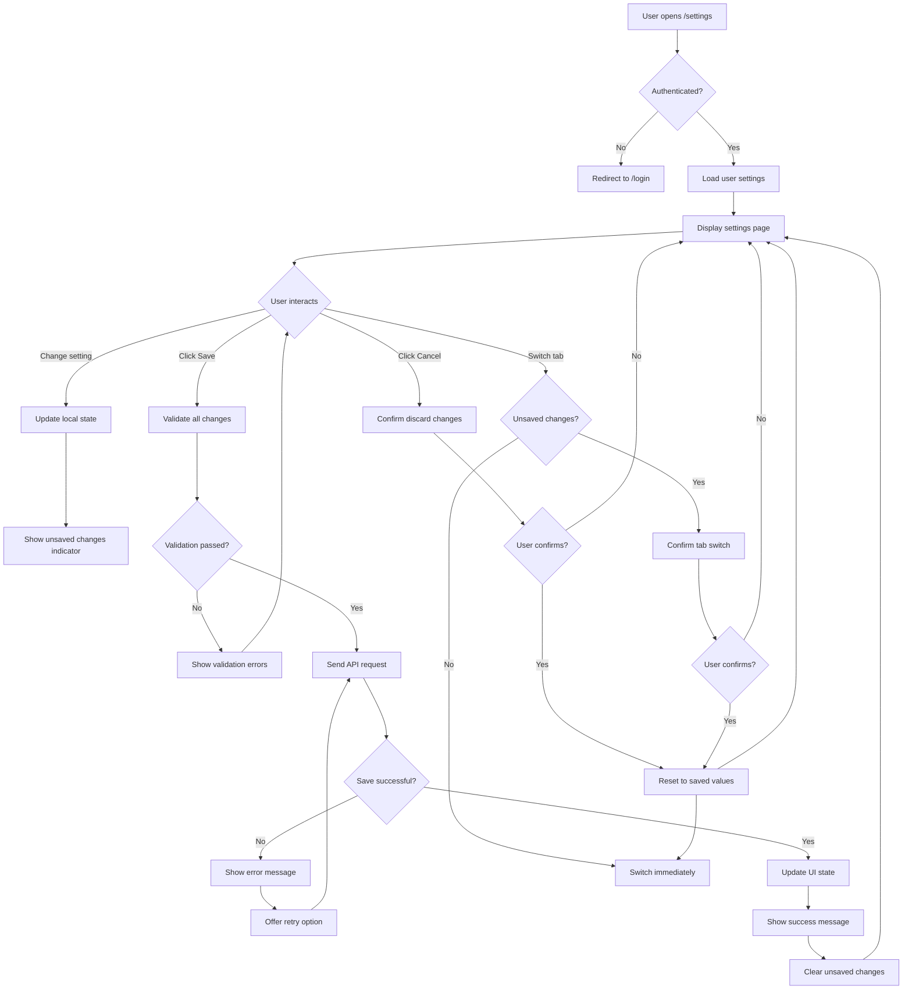

# UI/UX-Design und Layout für /settings Seite

## Übersicht
Dieses Dokument beschreibt das UI/UX-Design, Layout und Interaktionsmuster für die /settings Seite.

## Design-Prinzipien

### 1. Konsistenz mit bestehendem Design-System
- Verwende bestehende Tailwind CSS Klassen und Design Tokens
- Folge dem etablierten Atomic Design Pattern
- Verwende konsistente Farben, Typografie und Abstände

### 2. Klarheit und Einfachheit
- Eine Einstellung pro Zeile
- Klare Labels und Beschreibungen
- Visuelle Hierarchie durch Typografie und Abstände

### 3. Sofortiges Feedback
- Live-Validierung von Eingaben
- Sofortige visuelle Bestätigung bei Änderungen
- Klare Fehlermeldungen

### 4. Accessibility (WCAG 2.1 AA)
- Ausreichender Kontrast (4.5:1)
- Keyboard Navigation
- Screen Reader Unterstützung
- Fokus-Indikatoren

### 5. Responsive Design
- Mobile-first Ansatz
- Adaptive Layouts für alle Bildschirmgrößen
- Touch-friendly Interaktionen

## Layout-Struktur

### Desktop Layout (≥1024px)
```
┌─────────────────────────────────────────────────────┐
│                     Header                          │
│  Settings • Manage your account settings           │
├─────────────┬───────────────────────────────────────┤
│             │                                       │
│  Navigation │            Main Content               │
│             │                                       │
│  • Profile  │  ┌─────────────────────────────┐     │
│  • Security │  │  Profile Settings           │     │
│  • Notif.   │  │  ┌─────────────────────┐   │     │
│  • Privacy  │  │  │ Username: john_doe │   │     │
│  • Pref.    │  │  └─────────────────────┘   │     │
│  • Connect  │  │                             │     │
│  • Data     │  └─────────────────────────────┘     │
│             │                                       │
├─────────────┴───────────────────────────────────────┤
│                 Actions Footer                      │
│  [Cancel]                    [Save Changes]        │
└─────────────────────────────────────────────────────┘
```

### Mobile Layout (<768px)
```
┌─────────────────────────────────────┐
│            Header                   │
│  Settings                          │
├─────────────────────────────────────┤
│  Tab Navigation (Horizontal Scroll) │
│  [Profile][Security][Notif]...      │
├─────────────────────────────────────┤
│                                     │
│        Main Content                 │
│                                     │
│  ┌─────────────────────────┐       │
│  │ Profile Settings        │       │
│  │ ┌───────────────────┐  │       │
│  │ │ Username: john_doe│  │       │
│  │ └───────────────────┘  │       │
│  └─────────────────────────┘       │
│                                     │
├─────────────────────────────────────┤
│        Actions (Sticky Bottom)      │
│  [Cancel]         [Save Changes]    │
└─────────────────────────────────────┘
```

## Komponenten-Design

### 1. SettingsNavigation (Organism)

**Desktop Version:**
- Vertikale Liste von Tabs
- Aktiver Tab: Primärfarbe, fetter Text
- Inaktive Tabs: Grauer Text, hover Effekt
- Icons links vom Text

**Mobile Version:**
- Horizontale Scrollbare Tab-Leiste
- Kompakte Icons (optional Text)
- Aktiver Tab: Unterstrich + Primärfarbe

```vue
<template>
  <nav class="settings-navigation" :class="{ 'mobile': isMobile }">
    <button
      v-for="tab in tabs"
      :key="tab.id"
      :class="[
        'tab-item',
        { 'active': activeTab === tab.id },
        { 'has-changes': hasUnsavedChanges(tab.id) }
      ]"
      @click="$emit('tab-change', tab.id)"
    >
      <Icon :name="tab.icon" class="tab-icon" />
      <span class="tab-label">{{ tab.label }}</span>
      <span v-if="hasUnsavedChanges(tab.id)" class="unsaved-dot"></span>
    </button>
  </nav>
</template>
```

### 2. SettingsToggle (Molecule)

```vue
<template>
  <div class="settings-toggle">
    <div class="toggle-header">
      <label class="toggle-label">{{ label }}</label>
      <ToggleSwitch
        :model-value="value"
        @update:model-value="$emit('update:modelValue', $event)"
        :disabled="disabled"
      />
    </div>
    <p v-if="description" class="toggle-description">{{ description }}</p>
    <p v-if="hint" class="toggle-hint">{{ hint }}</p>
  </div>
</template>
```

**Design:**
```
┌─────────────────────────────────────────┐
│ Enable email notifications       [☐]    │
│                                       │
│ Receive email notifications for       │
│ important updates                     │
└─────────────────────────────────────────┘
```

### 3. SettingsInput (Molecule)

```vue
<template>
  <div class="settings-input">
    <label class="input-label">
      {{ label }}
      <span v-if="required" class="required">*</span>
    </label>
    <Input
      :model-value="value"
      @update:model-value="$emit('update:modelValue', $event)"
      :type="type"
      :placeholder="placeholder"
      :error="!!error"
      :disabled="disabled"
    />
    <p v-if="description" class="input-description">{{ description }}</p>
    <p v-if="error" class="input-error">{{ error }}</p>
  </div>
</template>
```

### 4. PrivacyBadge (Atom)

```vue
<template>
  <span class="privacy-badge" :class="[level, size]">
    <Icon :name="icon" class="badge-icon" />
    <span class="badge-label">{{ label }}</span>
  </span>
</template>
```

**Levels:**
- `public`: Grün, Globe Icon
- `friends_only`: Blau, Users Icon  
- `private`: Grau, Lock Icon

### 5. OAuthConnection (Molecule)

```vue
<template>
  <div class="oauth-connection">
    <div class="connection-header">
      <Avatar :src="avatarUrl" :alt="provider" class="connection-avatar" />
      <div class="connection-info">
        <h4 class="connection-provider">{{ providerLabel }}</h4>
        <p v-if="username" class="connection-username">Connected as {{ username }}</p>
        <p v-else class="connection-status">Not connected</p>
      </div>
    </div>
    <Button
      :variant="connected ? 'outline' : 'primary'"
      :loading="loading"
      @click="$emit(connected ? 'disconnect' : 'connect')"
    >
      {{ connected ? 'Disconnect' : 'Connect' }}
    </Button>
  </div>
</template>
```

## Farbpalette

### Primärfarben (bestehendes Design)
- Primary: `#3B82F6` (Blau)
- Success: `#10B981` (Grün)
- Warning: `#F59E0B` (Orange)
- Danger: `#EF4444` (Rot)

### Settings-spezifische Farben
- Unsaved Changes: `#F59E0B` (Orange)
- Privacy Public: `#10B981` (Grün)
- Privacy Private: `#6B7280` (Grau)
- Disabled: `#9CA3AF` (Grau)

## Typografie

### Schriftgrößen
- Page Title: `text-3xl` (1.875rem)
- Section Title: `text-xl` (1.25rem)
- Setting Label: `text-base` (1rem)
- Description: `text-sm` (0.875rem)
- Hint/Error: `text-xs` (0.75rem)

### Schriftgewichte
- Titles: `font-bold` (700)
- Labels: `font-medium` (500)
- Body: `font-normal` (400)

## Abstände (Spacing)

### Vertikale Abstände
- Between sections: `mb-8` (2rem)
- Between settings: `mb-6` (1.5rem)
- Within setting: `space-y-2` (0.5rem)

### Horizontale Abstände
- Navigation width: `w-64` (16rem)
- Content padding: `px-6` (1.5rem)
- Mobile padding: `px-4` (1rem)

## Interaktionsmuster

### 1. Tab Navigation
- Klick auf Tab: Sofortiger Wechsel
- Hover auf Tab: Leichte Hintergrundänderung
- Aktiver Tab: Primärfarbe + Indikator
- Ungespeicherte Änderungen: Orange Punkt

### 2. Formular-Interaktion
- Live-Validierung beim Tippen
- Auto-save nach 2 Sekunden Inaktivität (optional)
- Manuelles Speichern via Save Button
- Cancel: Zurücksetzen aller Änderungen im aktuellen Tab

### 3. Toggle-Switches
- Sofortige Zustandsänderung
- Hover: Vergrößerter Hit-Bereich
- Focus: Sichtbarer Ring
- Disabled: Grau und nicht klickbar

### 4. Dropdowns/Selects
- Klick: Öffnet Options-Liste
- Hover über Option: Hintergrund-Highlight
- Auswahl: Schließt Dropdown, zeigt Auswahl

## Loading States

### 1. Initial Loading
```
┌─────────────────────────┐
│       Loading...        │
│  ┌─────────────────┐   │
│  │                 │   │
│  │    Spinner      │   │
│  │                 │   │
│  └─────────────────┘   │
│  Loading your settings │
└─────────────────────────┘
```

### 2. Saving State
- Save Button: Loading Spinner + "Saving..."
- Eingabefelder: Disabled
- Navigation: Disabled
- Erfolg: Grüner Checkmark + "Saved!"
- Fehler: Rote Fehlermeldung + Retry Button

### 3. Skeleton Screens
```vue
<template>
  <div class="settings-skeleton">
    <div class="skeleton-navigation">
      <div v-for="i in 7" :key="i" class="skeleton-tab"></div>
    </div>
    <div class="skeleton-content">
      <div class="skeleton-header"></div>
      <div v-for="i in 5" :key="i" class="skeleton-setting"></div>
    </div>
  </div>
</template>
```

## Error States

### 1. Validierungsfehler
- Rote Umrandung des Input-Felds
- Rote Fehlermeldung unter dem Feld
- Save Button disabled bis Fehler behoben

### 2. Netzwerkfehler
- Toast-Nachricht: "Failed to save settings"
- Retry Button neben Fehlermeldung
- Offline-Indikator in Header

### 3. Permission Errors
- Message: "You don't have permission to change these settings"
- Disabled Inputs
- Contact Admin Link

## Success States

### 1. Successful Save
- Grüner Toast: "Settings saved successfully"
- Save Button: Grüner Checkmark für 2 Sekunden
- Ungespeicherte Änderungen Indikator verschwindet

### 2. Auto-save Success
- Diskretes "Saved" Badge in der Ecke
- Verschwindet nach 3 Sekunden

## Accessibility Features

### 1. Keyboard Navigation
- Tab: Durch alle interaktiven Elemente
- Enter/Space: Aktiviert Buttons/Toggles
- Arrow Keys: Navigation zwischen Tabs
- Escape: Schließt Modals/Dropdowns

### 2. Screen Reader Support
- ARIA labels für alle interaktiven Elemente
- Live regions für Status-Updates
- Proper heading hierarchy
- Descriptive link/button text

### 3. Focus Management
- Visible focus rings
- Focus trap in Modals
- Focus zurück zum Ausgangspunkt nach Schließen

## Dark Mode Support

### Design-Tokens für Dark Mode
```css
.settings-toggle {
  @apply bg-white dark:bg-gray-800;
  @apply text-gray-900 dark:text-gray-100;
}

.toggle-label {
  @apply text-gray-900 dark:text-gray-100;
}

.toggle-description {
  @apply text-gray-600 dark:text-gray-400;
}
```

### Dark Mode spezifische Anpassungen
- Reduzierte Kontraste für weniger Augenbelastung
- Dunklere Hintergründe für Formulare
- Angepasste Schatten und Tiefenwirkung

## Responsive Breakpoints

### Breakpoint-Strategie
```css
/* Mobile (default) */
.settings-layout {
  @apply flex-col;
}

/* Tablet (≥768px) */
@screen md {
  .settings-layout {
    @apply flex-row;
  }
  
  .settings-navigation {
    @apply w-56;
  }
}

/* Desktop (≥1024px) */
@screen lg {
  .settings-navigation {
    @apply w-64;
  }
  
  .settings-content {
    @apply px-8;
  }
}

/* Large Desktop (≥1280px) */
@screen xl {
  .settings-layout {
    @apply max-w-7xl mx-auto;
  }
}
```

## Animationen und Übergänge

### 1. Tab-Wechsel
- Fade-Out/Fade-In: 200ms
- Slide-Animation für mobile Tabs

### 2. Formular-Interaktionen
- Focus Ring: 150ms ease-in-out
- Button Hover: 100ms ease-in-out
- Toggle Switch: 200ms ease-in-out

### 3. Status-Änderungen
- Success Toast: Slide-up 300ms
- Error Message: Fade-in 200ms
- Loading Spinner: Continuous rotation

### CSS Transitions
```css
.tab-item {
  transition: all 200ms ease-in-out;
}

.toggle-switch {
  transition: transform 200ms ease-in-out;
}

.toast-message {
  transition: transform 300ms ease-out, opacity 200ms ease-out;
}
```

## Mermaid Diagramm: User Flow



## Prototyping und Testing

### 1. Wireframes
- Low-fidelity Wireframes für alle Breakpoints
- User flow Diagramme
- Interaction specifications

### 2. Usability Testing
- Task completion rates
- Time on task
- Error rates
- User satisfaction (SUS Score)

### 3. A/B Testing Varianten
- Variant A: Single-page mit Tabs
- Variant B: Separate Seiten pro Kategorie
- Variant C: Accordion statt Tabs

## Next Steps
1. Implementierungsplan erstellen
2. Design-System Komponenten implementieren
3. Prototyp erstellen und testen
4. Mit vollständiger Implementierung beginnen