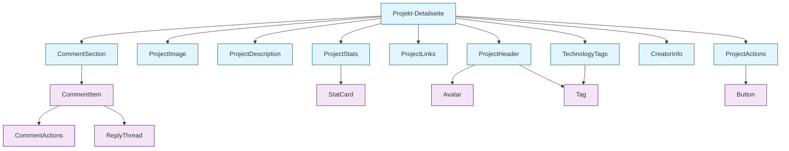

# Thematische Bereiche für Komponenten-Refactoring

## Identifizierte Themenbereiche

### 1. Layout-Komponenten (bereits vorhanden)
- **AppHeader** – Navigation, Logo, Benutzermenü
- **AppFooter** – Footer-Links, Copyright
- **AppSidebar** – Sidebar-Navigation
- **MobileBottomNav** – Mobile Bottom Navigation

### 2. Authentifizierung & Benutzer
- **LanguageSwitcher** – Sprachumschalter
- **Avatar** – Benutzeravatar (fehlt)
- **UserMenu** – Dropdown-Menü (derzeit in AppHeader integriert)

### 3. Projekte-Domain
- **ProjectHeader** – Titel, Besitzer, Metadaten
- **ProjectImage** – Bild mit Platzhalter
- **ProjectDescription** – Beschreibung
- **TechnologyTags** – Technologie-Tags
- **ProjectLinks** – Externe Links
- **ProjectStats** – Statistik-Karten
- **CreatorInfo** – Erstellerinformationen
- **ProjectActions** – Aktionen (Bearbeiten, Löschen)
- **TeamInfo** – Team-Informationen

### 4. Kommentar-System
- **CommentSection** – Container für Kommentare
- **CommentItem** – Einzelner Kommentar
- **CommentForm** – Formular für neuen Kommentar
- **ReplyThread** – Antwort-Thread
- **CommentActions** – Bearbeiten, Löschen, Voting

### 5. Voting-System
- **VoteButtons** – Upvote/Downvote-Buttons (bereits vorhanden)
- **VoteStats** – Anzeige der Voting-Statistiken

### 6. Hackathon-Domain
- **HackathonHeader** – Header mit Bild, Name, Datum
- **HackathonDescription** – Beschreibung
- **PrizeList** – Preisliste
- **RulesSection** – Regeln
- **ParticipantList** – Teilnehmerliste
- **ProjectGallery** – Projektgalerie

### 7. Team-Domain
- **TeamCard** – Team-Karte
- **TeamMemberList** – Mitgliederliste
- **TeamInvitation** – Einladungsverwaltung

### 8. UI-Elemente (Atomic Design)
#### Atoms
- **Button** – Button-Varianten
- **Tag** – Tag/Komponente
- **Avatar** – Benutzeravatar
- **Icon** – Icon-Komponente
- **LoadingSpinner** – Ladeanimation

#### Molecules
- **Card** – Karten-Komponente
- **FormInput** – Formular-Eingabe
- **FormTextarea** – Textarea
- **Dropdown** – Dropdown-Menü

#### Organisms
- **CommentSection** – Kommentarbereich
- **ProjectStats** – Statistik-Block
- **NavigationBar** – Navigationsleiste

### 9. Composable Functions (Logik)
- **useComments** – Kommentar-Logik (Fetch, Post, Edit, Delete)
- **useVoting** – Voting-Logik
- **useProject** – Projekt-Logik
- **useAuth** – Authentifizierungs-Logik (bereits in Store)
- **useNotifications** – Benachrichtigungs-Logik

## Priorisierung

### Phase 1: Hohe Wiederverwendbarkeit & kritische Bereiche
1. **Card-Komponente** – Wird in vielen Bereichen benötigt
2. **CommentSection** – Komplex und in mehreren Seiten verwendbar
3. **ProjectStats** – Einfach zu extrahieren, hohe Sichtbarkeit

### Phase 2: Projekt-spezifische Komponenten
4. **ProjectHeader** – Verbessert Lesbarkeit der Projekt-Detailseite
5. **TechnologyTags** – Einfache Extraktion
6. **ProjectLinks** – Einfache Extraktion

### Phase 3: Domänenübergreifende Komponenten
7. **Avatar** – Wird in vielen Komponenten verwendet
8. **Button-Varianten** – Konsistente Buttons
9. **LoadingSpinner** – Standardisierte Ladeanimation

### Phase 4: Weitere Domänen
10. **Hackathon-Komponenten**
11. **Team-Komponenten**

## Visualisierung der Komponenten-Hierarchie

## Nächste Schritte

1. **Refactoring-Plan erstellen** mit detaillierten Aufgaben für jede Phase
2. **Todo-Liste für Implementierung** vorbereiten
3. **Komponenten-Schnittstellen (Props, Events)** definieren
4. **Test-Strategie** überlegen (z.B. Komponententests mit Vitest)